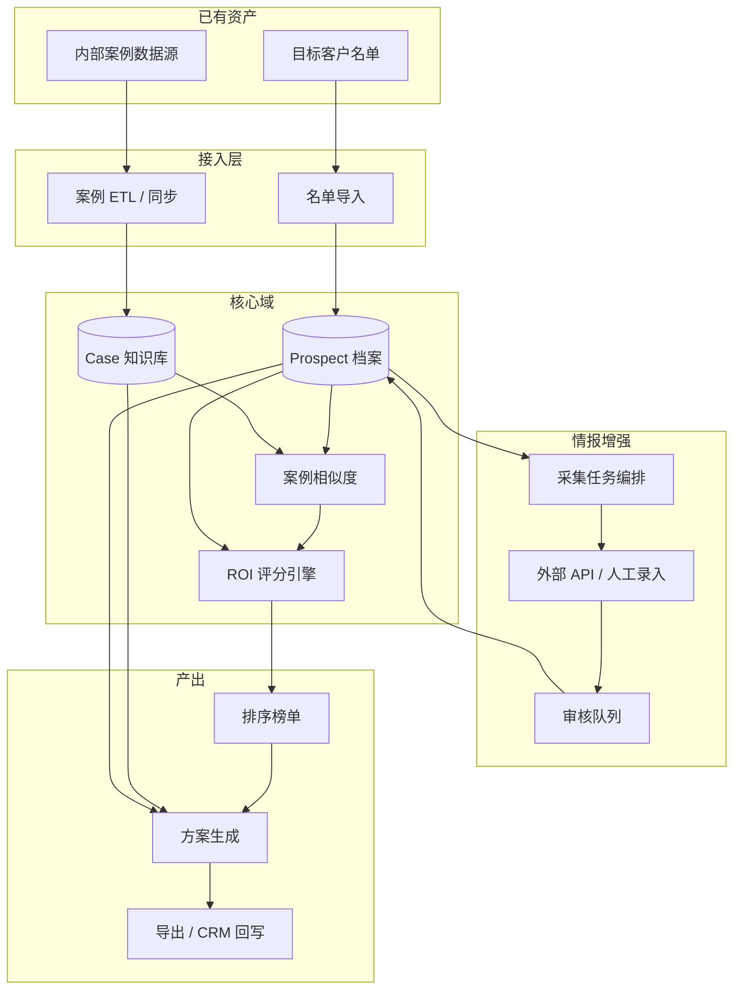

# 架构与数据流草案

> **版本**：v0.1 · 讨论用，非最终实现

---

## 1. 逻辑架构



---

## 2. 模块职责

| 模块 | 职责 | 关键技术选型（待定） |
|------|------|----------------------|
| **接入层** | 案例同步、名单导入、幂等去重 | Airbyte / 自研 cron / Fivetran |
| **档案服务** | Prospect CRUD、版本、来源元数据 | Postgres + JSONB 扩展字段 |
| **案例服务** | Case 索引、标签、向量检索 | pgvector / Elasticsearch |
| **评分引擎** | 可配置 ROI 公式、批处理、解释因子 | 规则引擎 + 可选 ML 回归（二期） |
| **相似度** | 行业/渠道/受众/预算多维匹配 | Embedding + 硬规则过滤 |
| **采集编排** | 任务队列、限流、失败重试 | Temporal / BullMQ / 云函数 |
| **方案生成** | 模板填充 + LLM 扩写 + 引用校验 | Agent + 结构化 JSON Schema |
| **工作台 UI** | 列表、档案、排序、方案编辑器 | Web SPA（React 等） |

---

## 3. 核心数据模型（概念）

```
Prospect
  - id, legal_name, industry, region, tags[]
  - roi_score, roi_model_id, confidence
  - status: new | enriching | ready | archived

ProspectFact
  - prospect_id, fact_type, payload JSON
  - source, confidence, collected_at, verified_by?

Case
  - id, client_industry, channels[], budget_range
  - metrics: { impressions, spend, roas, ... }
  - creative_summary, deliverables[]

CaseMatch
  - prospect_id, case_id, similarity, explanation

Proposal
  - prospect_id, version, sections JSON, status: draft | approved
  - referenced_case_ids[], generated_at, editor_id
```

---

## 4. 三条主流程

### 4.1 情报收集

1. 导入名单 → 创建 `Prospect`（状态 `new`）。  
2. 触发 enrichment 流水线：工商 API → CRM 拉合作史 →（可选）新闻/社媒。  
3. 低置信或冲突数据进入 **审核队列**；通过后状态 `ready`。

### 4.2 筛选排序

1. 加载全量或筛选子集 `Prospect`。  
2. 对每个客户计算 **CaseMatch Top-K** → 代入 ROI 模型 → 得 `roi_score`。  
3. 持久化得分快照（带 `scored_at`），支持历史对比。  
4. UI 展示榜单 + 因子分解 + 相似案例卡片。

### 4.3 方案设计

1. 用户选择 Top N 或勾选客户 → 创建 `Proposal` 任务。  
2. 检索器拉取：Prospect 档案 + Top 案例全文/摘要。  
3. LLM 按 **固定 JSON Schema** 生成各 section；后置校验：  
   - 引用的 `case_id` 必须存在；  
   - 数值字段需有 `source` 或标为「估算」。  
4. 策划在线编辑 → 定稿 → 导出。

---

## 5. AI 使用边界（建议写进产品原则）

| 适合 AI | 需人工/规则兜底 |
|---------|------------------|
| 方案叙述、创意方向发散 | 合同金额、未核实 ROAS |
| 多源信息摘要 | 是否构成商业诋毁的竞品描述 |
| 相似案例自然语言解释 | 是否可联系该客户（合规名单） |
| 邮件/简报初稿 | 对外承诺的 KPI |

---

## 6. 部署形态（PoC vs 生产）

| 形态 | 说明 |
|------|------|
| **PoC** | 单机 Docker：Postgres + 一个 Worker + 简单 React 前台；案例 CSV 导入 |
| **生产** | 前后端分离；对象存储放附件；密钥进 Vault；分环境 |

---

## 7. 与需求文档的映射

| 需求章节 | 架构模块 |
|----------|----------|
| §4.1 信息收集 | ingest + enrich + Prospect |
| §4.2 筛选排序 | MATCH + SCORE + RANK |
| §4.3 方案设计 | PROP + Case 检索 |

详细待确认项见 [open-questions.md](./open-questions.md)。

**落地实现**（表结构、API、worker、分期人日）见 [tech/](./tech/) 目录。
