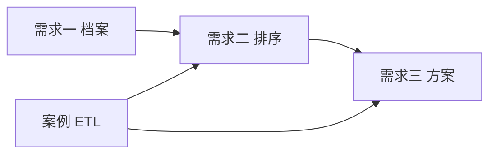

# 共享技术平台（三项需求共用）

> **版本**：v0.3 · 编排层（工作流/Agent）+ 零知识启动  
> **关联**：[工作流 vs Agent 选型](./05-workflow-vs-agent.md) · [AI 零知识总纲](./04-ai-zero-knowledge.md) · [需求一](./01-intelligence-collection.md) · [需求二](./02-roi-scoring-and-ranking.md) · [需求三](./03-proposal-generation.md)

---

## 1. 推荐技术栈（默认可落地组合）

| 层级 | PoC（2–4 周） | MVP（6–10 周） |
|------|---------------|----------------|
| **前端** | React 18 + Vite + TanStack Query | + shadcn/ui、表格虚拟滚动（名单 1 万） |
| **API** | Fastify 4 + TypeScript + Zod | 同一服务，拆 `api` / `worker` 进程 |
| **数据库** | PostgreSQL 16 | + pgvector 扩展 |
| **队列** | pg-boss（仅 Postgres，少组件） | 或 BullMQ + Redis（任务量大时） |
| **对象存储** | 本地 `uploads/` | MinIO / 阿里云 OSS |
| **编排** | **Dify 自建**（PoC 首选） | Agent + Workflow；**业务无 LLM SDK** |
| **Tool** | `tools-service` | 搜索/抓取/内部库；供 Dify 工具调用 |
| **批处理** | n8n（P1）或 Dify 循环 | `score_batch`、案例同步 |
| **检索** | pgvector + 全文 `tsvector` | 案例 >5k 时可加 Elasticsearch（非首期必须） |
| **部署** | `docker compose up` 单机 | 云主机 2C4G 起 +  nightly 备份 |

**选型原则**：PoC 尽量少 moving parts（Postgres + 一个 API 进程 + pg-boss）；三项需求共用同一库、同一鉴权，避免三套系统。

---

## 2. 仓库与进程划分

```
ad-intel/                    # 建议独立仓库名
  apps/
    web/                     # React 工作台
    api/                     # HTTP + Webhook
    worker/                  # enrichment / scoring / proposal 消费者
  packages/
    db/                      # Drizzle schema + migrations
    orchestrator-client/     # 仅 HTTP 调 Dify Agent/Workflow
    scoring/                 # ROI 公式（供工作流 HTTP 节点调用）
    connectors/              # 可选加速器：案例 ETL、CRM
  services/
    tools-service/           # web_search, fetch_page, query_internal
  docker-compose.yml
```

| 进程 | 职责 |
|------|------|
| `api` | REST、导入上传、触发任务、查询榜单与档案 |
| `worker` | 入队 → 调 Dify Agent/Workflow → 处理回调写库 |
| `tools-service` | 编排层工具 endpoint（不持业务用户会话） |
| `web` | 静态资源，反向代理到 api |

---

## 3. 共享数据表（核心）

```sql
-- 客户主档
CREATE TABLE prospect (
  id            UUID PRIMARY KEY DEFAULT gen_random_uuid(),
  legal_name    TEXT NOT NULL,
  uscc          TEXT,                    -- 统一社会信用代码，去重键
  industry_code TEXT,                    -- 国标或内部枚举
  region        TEXT,
  status        TEXT NOT NULL DEFAULT 'new',  -- new|enriching|ready|archived
  tags          TEXT[] DEFAULT '{}',
  created_at    TIMESTAMPTZ NOT NULL DEFAULT now(),
  updated_at    TIMESTAMPTZ NOT NULL DEFAULT now(),
  UNIQUE NULLS NOT DISTINCT (uscc)       -- PG15+；无 uscc 时用 name+region 软匹配
);

-- 原子事实（需求一主表）
CREATE TABLE prospect_fact (
  id            UUID PRIMARY KEY DEFAULT gen_random_uuid(),
  prospect_id   UUID NOT NULL REFERENCES prospect(id),
  fact_type     TEXT NOT NULL,           -- registry|partnership|campaign_metric|news|competitor|manual
  payload       JSONB NOT NULL,
  source        TEXT NOT NULL,           -- crm|tianyancha|manual|case_db|news_api
  confidence    REAL NOT NULL CHECK (confidence BETWEEN 0 AND 1),
  collected_at  TIMESTAMPTZ NOT NULL DEFAULT now(),
  verified_at   TIMESTAMPTZ,
  verified_by   UUID,
  superseded_by UUID REFERENCES prospect_fact(id)
);

-- 内部案例（与 prospect 解耦）
CREATE TABLE case_study (
  id              UUID PRIMARY KEY DEFAULT gen_random_uuid(),
  external_id     TEXT,                  -- 源系统主键
  title           TEXT NOT NULL,
  client_industry TEXT,
  channels        TEXT[] DEFAULT '{}',
  budget_min      BIGINT,
  budget_max      BIGINT,
  metrics         JSONB,                 -- { roas, spend, impressions, ... }
  creative_summary TEXT,
  narrative       TEXT,                  -- 长文本，用于 embedding
  embedding       vector(1536),          -- 维度随 embedding 模型调整
  source_synced_at TIMESTAMPTZ,
  UNIQUE (external_id)
);

-- 任务队列（pg-boss 或自研 job 表）
CREATE TABLE job (
  id            UUID PRIMARY KEY DEFAULT gen_random_uuid(),
  type          TEXT NOT NULL,           -- enrich_prospect|score_batch|generate_proposal|sync_cases
  payload       JSONB NOT NULL,
  status        TEXT NOT NULL DEFAULT 'pending',
  attempts      INT NOT NULL DEFAULT 0,
  run_after     TIMESTAMPTZ NOT NULL DEFAULT now(),
  finished_at   TIMESTAMPTZ,
  error         TEXT
);
```

---

## 4. 鉴权与权限（RBAC）

| 角色 | `prospect_fact` 含 PII | 导出 | 配置 ROI |
|------|------------------------|------|----------|
| sales | 读（含联系人） | 需审批 | 否 |
| planner | 读（脱敏联系人） | 是 | 否 |
| ops | 全读 | 是 | 是 |
| admin | 全读写 | 是 | 是 |

实现：**JWT + 路由级 scope**；`contact_phone` 等字段放在 `payload` 内，API 层按角色过滤 JSON 键。

---

## 5. 可观测与运维

| 指标 | 采集方式 |
|------|----------|
| enrichment 成功率 | `job` 按 `type` 聚合 |
| 单客户刷新耗时 | OpenTelemetry span：`enrich_prospect` |
| LLM 成本 | `proposal` 表记录 `tokens_in/out` |
| 排序采纳率 | UI 事件 `rank_export` / `proposal_approved` → 简单 `analytics_event` 表 |

日志：结构化 JSON；**禁止**日志打印完整 PII。

---

## 6. 三项需求的依赖关系



- **案例 ETL** 在需求一同期上线（至少只读同步），否则需求二、三无参照。  
- 需求三 **强依赖** 需求一的 `prospect_fact` 与需求二的 `score_snapshot` + `case_match`。

---

## 7. 分期交付总表（AI 零知识路径）

| 里程碑 | 需求一 | 需求二 | 需求三 |
|--------|--------|--------|--------|
| **P0** | **AI 探索** + citation + 审核 + 信源发现 | `inferred_opportunity_v1` + LLM 理由 | 冷启动方案 MD + 强制 data_gaps |
| **P1** | source_registry + 案例/CRM 加速器 | case_transfer + 向量相似 + 榜单 | 案例引用校验 + TipTap + docx |
| **P2** | 自动审核阈值、批量夜间探索 | 结案反哺权重 | 批量方案 + 飞书通知 |

**P0 不再要求**：预置连接器、案例 mapping、行业 Excel。

各需求细节见对应 `tech/0x-*.md` 文档。
