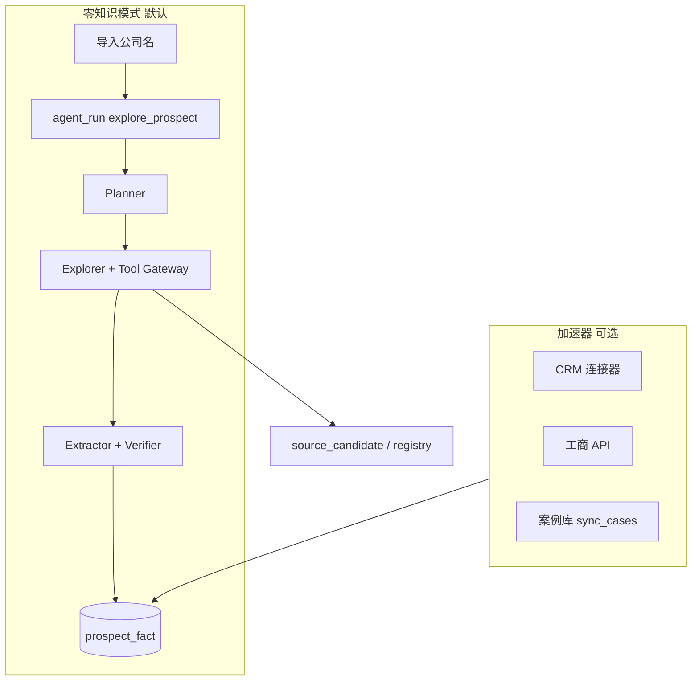

# 技术方案 · 需求一：目标客户信息收集

> **版本**：v0.2（AI 探索 + 零知识启动）  
> **对应需求**：[requirements.md §4.1](../requirements.md)  
> **编排**：[05-workflow-vs-agent.md](./05-workflow-vs-agent.md)（探索=**Agent**，校验=**工作流**） · **平台**：[00-platform.md](./00-platform.md)

---

## 1. 目标与边界（更新）

| 项目 | 说明 |
|------|------|
| **用户最小输入** | 仅 `legal_name`（+ 可选地区）；CSV 可以 **只有一列公司名** |
| **核心能力** | **AI 自行探索信息源** → 结构化 `prospect_fact` + 可追溯 citation |
| **输出** | 档案时间线、信源发现记录、审核队列 |
| **加速器（可选）** | 工商 API、CRM、案例 ETL——**有则更快更准，无则零知识可跑** |
| **不做** | 绕过 Policy 抓登录墙/私信；未审核的敏感负面定性自动入库 |

---

## 2. 双模式架构



| 模式 | 何时用 |
|------|--------|
| **零知识探索** | Day 0；无 mapping、无 API 合同 |
| **加速器** | 已有案例库/CRM；探索完成后 **合并** 内部事实，不替换公网 fact |

---

## 3. 探索主路径：**Dify Agent**（非业务直连 LLM）

| 组件 | ID | 类型 |
|------|-----|------|
| 情报探索 | `ag_prospect_explore` | **Agent** |
| 单页抽取 | `wf_fetch_and_extract` | **工作流**（Agent 工具调用） |
| 入库校验 | `wf_verify_facts` | **工作流**（探索结束时触发） |

### 3.1 业务触发（只调编排客户端）

```http
POST /prospects
{ "legal_name": "某某美妆有限公司", "region_hint": "上海" }
→ 201 { "prospect_id", "agent_run_id" }

# worker 内部
orchestrator.runAgent('ag_prospect_explore', { prospect_id, legal_name, region_hint })
```

### 3.2 Agent 行为（在 Dify 控制台配置，非 app 内写循环）

- 系统提示：调研目标、 citation 规则、调用 `finish_exploration` 条件。  
- 工具：`web_search`、`fetch_page`（→ 可调 `wf_fetch_and_extract`）、`save_fact_draft`、`list_approved_sources`、`finish_exploration`。  
- `finish_exploration` → tools-service 调业务 API 异步启动 **`wf_verify_facts`**。

业务 **不实现** Explorer for 循环；Policy（域名、次数上限）在 **tools-service** 硬编码 + Dify 对话轮数限制。

### 3.3 Fact 必须带 citation

```typescript
type ProspectFactInsert = {
  fact_type: string;
  payload: Record<string, unknown>;
  source: string;           // domain 或 'internal:case_db'
  confidence: number;
  citations: Array<{
    url: string;
    quote: string;          // ≤300 字摘录
    accessed_at: string;
  }>;
};
```

Verifier 规则：**无 citation 的数值型 payload 字段删除** 或整条 fact 进审核。

### 3.4 `research_plan` 存储

```sql
ALTER TABLE agent_run ADD COLUMN plan JSONB;
-- plan.queries[], plan.stop_when, plan.completed_queries[]
```

UI **调研计划** 页：展示 AI 打算搜什么、已搜什么、为何停止（可人工追加 query 后 `resume`）。

---

## 4. 信源自发现（客户诉求重点）

| 表 | 作用 |
|----|------|
| `source_candidate` | 本次 run 发现的高价值域名/URL 模式 |
| `source_registry` | 审核通过 → 全局优先复用，降低 token |
| `fetched_page` | URL hash → 正文缓存，避免重复抓取 |

**运营工作流**：审核台 Tab「信源」→ 批准/屏蔽域名 → 下次 Planner prompt 注入 `approved_domains`。

**零知识启动时** `source_registry` 可为空；Planner 仅用通用策略（官网、新闻、招聘、行业媒体关键词）。

---

## 5. 数据模型（保留 + 增量）

### 5.1 `prospect` 导入

| 源列 | 目标 | 零知识 |
|------|------|--------|
| 公司名 / name / 客户名称 | `legal_name` | **唯一必填** |
| 其他列 | 可选映射 | 有则作 `region_hint` 或 `tags` |

去重策略不变（`uscc` > 名称模糊）。

### 5.2 `prospect_fact` 类型（AI 可自动归类）

| fact_type | 典型来源 |
|-----------|----------|
| `registry` | 工商页、企业信息站 |
| `partnership` | 新闻、官网 case、**内部案例反查** |
| `campaign_metric` | 报道中的投放/活动规模（标 `estimated`） |
| `marketing_event` | 代言人、大促、新品 |
| `competitor` | 竞品列表、份额描述 |
| `org_chart_signal` | 招聘页、高管变动 |
| `ai_inference` | 仅当 Verifier 标为推断且无硬数字 |

### 5.3 完整度

```
completeness_score =
  0.15 * has_registry +
  0.25 * has_partnership_or_campaign +
  0.20 * has_marketing_event +
  0.20 * has_competitor +
  0.20 * min(1, citation_count / 5)
```

≥0.45 且 ≥3 条带 citation 的 fact → 可标 `ready`（若开启自动审核）。

---

## 6. 加速器连接器（降级为可选）

原固定 ETL 连接器保留，通过 **同一 Extractor** 转成 fact：

| 连接器 | 触发 | 与 AI 关系 |
|--------|------|------------|
| `sync_cases` | 定时 | `query_internal` 工具读库；Explorer 不重复爬 |
| `TianyanchaConnector` | 有 Key | 替代「搜天眼查网页」，提高 registry 置信度 |
| `CrmWebhookConnector` | 有 OAuth | 直接写 fact，`source=crm`，confidence=0.95 |
| `ManualFactForm` | UI | 策划补数 |

**合并策略**：同 `fact_type` + 相似 payload → Verifier 比 confidence，高者为主，低者 `superseded_by`。

---

## 7. API 契约（更新）

| 方法 | 路径 | 说明 |
|------|------|------|
| `POST` | `/prospects` | 零知识创建 + 自动 `explore_prospect` |
| `POST` | `/imports/prospects` | 单列公司名批量 |
| `GET` | `/prospects/:id/timeline` | facts + citations 展开 |
| `GET` | `/prospects/:id/research` | 当前/历史 `agent_run`、plan、步骤日志 |
| `POST` | `/prospects/:id/explore` | 重新探索；`{ extra_queries?, force? }` |
| `POST` | `/agent-runs/:id/resume` | 人工追加 query 后继续 |
| `GET/POST` | `/admin/sources` | `source_registry` CRUD |
| `PATCH` | `/review-items/:id` | 事实/信源审核 |

---

## 8. 前端（零知识优先）

| 页面 | 重点 |
|------|------|
| **快速启动** | 文本框粘贴公司名（每行一个）→ 立即探索 |
| **调研实况** | 流式展示 `agent_run_step`（搜了什么、打开了哪页） |
| **档案时间线** | 每条 fact 可点 citation 原文 |
| **信源管理** | 批准域名，屏蔽误判源 |
| **审核台** | 无 citation 数字、低置信推断 |

---

## 9. Policy 配置（`config/policy.yaml`）

```yaml
explore:
  max_queries_per_run: 10
  max_fetch_per_run: 15
  token_budget: 80000
  allowed_tlds: [".com", ".cn", ".com.cn"]
  blocked_domains: []
  allow_pii: false
  respect_robots: true
  auto_approve_facts: false   # 冷启动 false
```

---

## 10. 分期交付

| 阶段 | 内容 | 人日（估） |
|------|------|------------|
| **P0** | Tool Gateway + explore Agent + 审核 + 时间线 | 18–22 |
| **P1** | source_registry 学习 + query_internal + 加速器 CRM/案例 | +12–15 |
| **P2** | 流式 UI、自动审核阈值、批量夜间探索 | +8 |

**P0 验收（零知识）**：只上传 20 家公司名，**无需配置任何 API**，≥70% 公司有 ≥3 条带 URL citation 的 fact，且调研计划可在 UI 回放。

---

## 11. 风险与对策

| 风险 | 对策 |
|------|------|
| AI 编造投放数据 | Verifier 剔除无 citation 数字；KPI 仅 `estimated` |
| 探索成本不可控 | `token_budget` + `max_fetch` 硬截止 |
| 信源质量参差 | `source_registry` + 人工屏蔽 |
| 客户以为完全无人值守 | 产品文案强调 **「AI 初研 + 人审」**，非「零人工」 |
