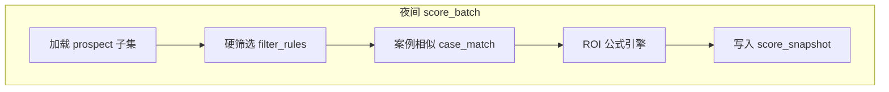

# 技术方案 · 需求二：案例驱动客户筛选与 ROI 排序

> **版本**：v0.2（支持零知识冷启动 + 案例库增强）  
> **对应需求**：[requirements.md §4.2](../requirements.md)  
> **依赖**：需求一 `prospect_fact`（AI 探索即可）；`case_study` **可选**  
> **编排**：[05-workflow-vs-agent.md](./05-workflow-vs-agent.md)（**工作流** `wf_score_*`，无 Agent） · **平台**：[00-platform.md](./00-platform.md)

---

## 1. 目标与边界

| 项目 | 说明 |
|------|------|
| **输入** | `prospect` + AI/人工 `prospect_fact`；有案例库时加 `case_study` |
| **输出** | `score_snapshot` + 榜单 + **自然语言排序理由**（LLM 基于 factors 生成） |
| **核心指标** | `roi_score` 降序；`confidence` 与 citation 覆盖率挂钩 |
| **零知识** | 无案例库时用 `inferred_opportunity_v1`；接入后 **自动切换** 分支公式 |

---

## 2. 处理流水线



**单客户刷新**：`POST /prospects/:id/score` → 入队 `score_one`，逻辑与批量相同。

---

## 3. 数据表

```sql
CREATE TABLE case_match (
  id            UUID PRIMARY KEY DEFAULT gen_random_uuid(),
  prospect_id   UUID NOT NULL REFERENCES prospect(id),
  case_id       UUID NOT NULL REFERENCES case_study(id),
  similarity    REAL NOT NULL,
  explanation   JSONB NOT NULL,    -- 可读因子，见 §5.3
  scored_at     TIMESTAMPTZ NOT NULL DEFAULT now()
);

CREATE TABLE roi_rule_set (
  id            UUID PRIMARY KEY,
  name          TEXT NOT NULL,
  version       INT NOT NULL,
  formula_json  JSONB NOT NULL,    -- 见 §4
  is_active     BOOLEAN DEFAULT false
);

CREATE TABLE score_snapshot (
  id            UUID PRIMARY KEY,
  prospect_id   UUID NOT NULL REFERENCES prospect(id),
  rule_set_id   UUID NOT NULL REFERENCES roi_rule_set(id),
  roi_score     REAL NOT NULL,
  confidence    REAL NOT NULL,
  rank          INT,                 -- 批次内排名，快照写入时计算
  factors       JSONB NOT NULL,      -- 解释性分解
  scored_at     TIMESTAMPTZ NOT NULL DEFAULT now()
);

CREATE INDEX idx_score_latest ON score_snapshot (rule_set_id, scored_at DESC, prospect_id);
```

---

## 4. ROI 评分引擎（可配置、可单测）

### 4.1 冷启动公式：`inferred_opportunity_v1`（零知识默认）

**无 `case_study` 或 Top-K 相似度全 &lt; 0.35 时启用。**

在 **`wf_score_prospect`** 的 Dify **LLM 节点**配置结构化输出（tier / signals / reasoning）；业务 API `/internal/score/apply-inferred` 将 JSON 转为 `roi_score` 并写库。**业务进程不 import LLM SDK。**

`factors` 存 `{ model: 'inferred_opportunity_v1', tier, signals, reasoning }`。

### 4.2 默认公式（有案例库）：`case_transfer_v1`

适用于 **无本公司结案、但有案例库向量/规则相似** 的目标客户。

```
similarity_i = case_match.similarity  (Top-K, 默认 K=5)
weight_i     = similarity_i / sum(similarity)
roas_i       = case_study.metrics->>'roas'  (缺失则行业基准表)

base_score   = sum(weight_i * roas_i)
industry_adj = industry_benchmark[prospect.industry_code]  (默认 1.0)
strategic    = prospect.tags 含 'strategic' ? 1.2 : 1.0

roi_score    = base_score * industry_adj * strategic
confidence   = min(1, completeness_score * 0.5 + avg(similarity) * 0.5)
```

`completeness_score` 来自需求一 aggregate 步骤。

### 4.3 公式：`historical_roas_v1`

当 `prospect_fact` 存在 `fact_type=campaign_metric` 且 `data_quality=verified`：

```
roi_score = weighted_avg(roas from facts, weight by recency)
confidence = 0.9
```

**优先级**：同一客户若满足 historical，则 **覆盖** case_transfer（规则引擎内用 `if` 分支，见 `formula_json`）。

### 4.4 `formula_json` 结构（存库，UI 可切换 active rule_set）

```json
{
  "id": "default_v2",
  "branches": [
    {
      "when": { "has_verified_campaign_metric": true },
      "expr": "historical_roas_v1"
    },
    {
      "when": { "has_case_match_above": 0.35 },
      "expr": "case_transfer_v1"
    },
    {
      "when": { "always": true },
      "expr": "inferred_opportunity_v1"
    }
  ],
  "params": {
    "top_k": 5,
    "industry_benchmark_table": "industry_benchmark",
    "strategic_multiplier": 1.2
  }
}
```

**实现**：`packages/scoring` 纯函数 + 单元测试；**不用**运行时 eval 任意字符串，仅注册表驱动 `expr` 名称，避免注入。

### 4.4 行业基准表

```sql
CREATE TABLE industry_benchmark (
  industry_code TEXT PRIMARY KEY,
  median_roas   REAL NOT NULL,
  updated_at    TIMESTAMPTZ
);
```

P0：运营 Excel 导入；P1：从结案案例按月重算中位数。

---

## 5. 案例相似度（混合检索）

### 5.1 两阶段检索

| 阶段 | 方法 | 作用 |
|------|------|------|
| **硬过滤** | SQL `WHERE` | `industry_code` 相同或父子类；`budget` 落在 prospect 预估区间 ±50% |
| **软排序** | 向量 + 加权特征 | Top-K |

### 5.2 向量

- 文本：`embedding = model(case_study.narrative + channels + industry)`  
- 查询：同结构，用 `prospect` 的 fact 拼成 `prospect_profile_text`：

```
{legal_name} 行业:{industry} 渠道偏好:{从 campaign_metric 聚合} 备注:{tags}
```

SQL（pgvector）：

```sql
SELECT id, 1 - (embedding <=> :query_vec) AS sim
FROM case_study
WHERE client_industry = :industry OR :industry IS NULL
ORDER BY embedding <=> :query_vec
LIMIT 20;
```

### 5.3 可解释 `explanation` JSON

```json
{
  "matched_on": ["industry", "channel_douyin", "budget_tier_M"],
  "industry": { "prospect": "美妆", "case": "美妆", "weight": 0.35 },
  "channel_overlap": { "channels": ["抖音", "小红书"], "weight": 0.25 },
  "vector_similarity": { "value": 0.82, "weight": 0.40 },
  "summary": "同行业美妆 + 抖音种草 + 预算档 500–800 万"
}
```

**最终 similarity**：

```
sim = 0.4 * vector_sim + 0.35 * industry_match + 0.25 * channel_jaccard
```

权重写入 `roi_rule_set`，便于 A/B。

---

## 6. 硬筛选（榜单前置）

配置表 `filter_preset`（UI 保存）：

```json
{
  "industries": ["beauty", "fmcg"],
  "regions": ["华东"],
  "exclude_tags": ["blacklist"],
  "min_completeness": 0.3,
  "min_roi_score": null,
  "min_similarity": 0.55
}
```

SQL 生成：`prospect` JOIN 最新 `score_snapshot` WHERE …

---

## 7. API 契约

| 方法 | 路径 | 说明 |
|------|------|------|
| `POST` | `/scoring/run` | body: `{ filter_preset_id?, rule_set_id? }` → 入队 `score_batch` |
| `GET` | `/rankings/latest` | 分页榜单：`roi_score`, `confidence`, `rank`, `prospect` 摘要 |
| `GET` | `/prospects/:id/score` | 最新 snapshot + `factors` + `case_match` Top-K |
| `GET` | `/prospects/:id/score/explain` | 仅返回 factors 与自然语言 summary（缓存） |
| `PUT` | `/admin/roi-rule-sets/:id` | ops 更新公式（版本 +1） |

**榜单响应片段**：

```json
{
  "items": [{
    "rank": 1,
    "prospect_id": "...",
    "legal_name": "某某美妆",
    "roi_score": 3.42,
    "confidence": 0.71,
    "factors": { "case_transfer": 3.1, "strategic": 1.2 },
    "top_case_title": "2024XX 种草战役"
  }],
  "rule_set": { "name": "case_transfer_v1", "scored_at": "2026-05-21T02:00:00Z" }
}
```

---

## 8. 批处理与性能

| 规模 | 策略 |
|------|------|
| &lt;2k prospect | 单 worker 串行，约 2–5s/客户（含 embedding 查询） |
| 2k–10k | `score_batch` 分片：`prospect_id hash % 10` → 10 并行 job |
| embedding | 案例预计算；prospect 侧按 enrich 后缓存 `prospect.embedding` |

**排名写入**：批次全部完成后，窗口函数 `ROW_NUMBER() OVER (ORDER BY roi_score DESC)` 更新 `rank`。

---

## 9. 前端

| 组件 | 说明 |
|------|------|
| **排行榜** | 可排序列、筛选器、导出 CSV |
| **解释抽屉** | 因子条形图 + Top3 案例卡片 + `summary` 文案 |
| **规则管理** | ops 切换 `roi_rule_set`、上传 industry_benchmark |

---

## 10. P0 / P1 砍 scope

| 能力 | P0（零知识） | P1 |
|------|----------------|-----|
| ROI | **`inferred_opportunity_v1` + LLM 理由** | + `case_transfer` / `historical` 自动分支 |
| 相似案例 | 无或 LLM 文字类比 | pgvector + `case_match` |
| 打分触发 | 探索完成后自动 `score_prospect` | 夜间 `score_batch` |
| 快照历史 | 只保留最新 | 保留 90 天对比曲线 |

---

## 11. 交付清单（人日）

| 任务 | 人日 |
|------|------|
| case_match 规则版 | 3 |
| scoring 包 + 单测 | 3 |
| score_batch worker | 2 |
| snapshot + rankings API | 2 |
| 榜单 + 解释 UI | 4 |
| pgvector + embed 管道 | 4 |
| roi_rule_set 管理 | 2 |

**验收**：Top20 盲评 ≥70%；任意客户 `/explain` 返回 ≥3 个可读因子。

---

## 12. 与需求三的接口

需求三读取：

- `GET /rankings/latest?limit=10`  
- `GET /prospects/:id/score` → `case_match` 与 `factors`  

不要在方案生成时重新算分，避免口径不一致。
