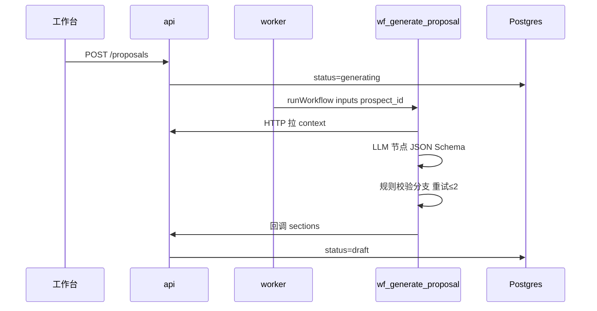

# 技术方案 · 需求三：头部客户广告营销方案设计

> **版本**：v0.2（零知识可出草案；案例库增强引用）  
> **对应需求**：[requirements.md §4.3](../requirements.md)  
> **依赖**：需求一 facts（AI 探索即可）；需求二分数 **推荐**；案例库 **可选**  
> **编排**：[05-workflow-vs-agent.md](./05-workflow-vs-agent.md)（**工作流** `wf_generate_proposal`） · **平台**：[00-platform.md](./00-platform.md)

---

## 1. 目标与边界

| 项目 | 说明 |
|------|------|
| **输入** | 选中 `prospect_id`（来自 Top N 或勾选）、关联 facts、Top-K 案例全文 |
| **输出** | `proposal` 结构化章节 + 可编辑正文 + 导出 |
| **原则** | 数值必有 `source` 或标 `estimated`；`case_id` 引用可校验 |

---

## 2. 生成架构（**Dify 工作流**，非 Agent）



业务 **不调用** `llm.chat`；Prompt 版本在 Dify 应用内管理。

---

## 3. 数据表

```sql
CREATE TABLE proposal (
  id              UUID PRIMARY KEY DEFAULT gen_random_uuid(),
  prospect_id     UUID NOT NULL REFERENCES prospect(id),
  score_snapshot_id UUID REFERENCES score_snapshot(id),
  version         INT NOT NULL DEFAULT 1,
  status          TEXT NOT NULL DEFAULT 'generating',
  -- generating | draft | in_review | approved | archived
  sections        JSONB,                -- 见 §4 Schema
  referenced_case_ids UUID[] DEFAULT '{}',
  model_id        TEXT,
  tokens_in       INT,
  tokens_out      INT,
  generated_at    TIMESTAMPTZ,
  edited_at       TIMESTAMPTZ,
  approved_by     UUID,
  created_by      UUID NOT NULL
);

CREATE TABLE proposal_revision (
  id            UUID PRIMARY KEY,
  proposal_id   UUID REFERENCES proposal(id),
  sections      JSONB NOT NULL,
  editor_id     UUID,
  created_at    TIMESTAMPTZ DEFAULT now()
);
```

---

## 4. 章节 Schema（LLM 必须遵守）

```json
{
  "$schema": "proposal-sections-v1",
  "sections": {
    "executive_summary": {
      "title": "客户与机会摘要",
      "body": "markdown string",
      "citations": [{ "fact_id": "uuid", "quote": "..." }]
    },
    "objectives_kpi": {
      "title": "目标与 KPI 建议",
      "kpis": [{
        "name": "ROAS",
        "target": "3.0-3.5",
        "basis": "case_reference",
        "case_id": "uuid",
        "source_label": "verified|estimated|benchmark"
      }]
    },
    "audience_insight": { "title": "受众与洞察", "body": "..." },
    "channel_plan": {
      "title": "渠道与预算",
      "channels": [{ "name": "抖音", "budget_range_wan": [500, 800], "rationale": "..." }],
      "total_budget_wan": [600, 900]
    },
    "creative_direction": {
      "title": "创意方向",
      "body": "...",
      "reference_cases": [{ "case_id": "uuid", "title": "...", "lessons": "..." }]
    },
    "timeline": {
      "milestones": [{ "phase": "预热", "week": "W1-W2", "deliverables": [] }]
    },
    "risks_open_questions": {
      "data_gaps": ["缺少 verified 投放数据"],
      "risks": ["竞品 X 近期加大投放"]
    }
  }
}
```

Zod 在 worker 内校验；不通过则 **不写入** `draft`，保持 `generating` 并记 `job.error`。

---

## 5. Context Pack 构建（控制 token）

| 块 | 来源 | 上限 |
|----|------|------|
| `prospect_core` | legal_name, industry, tags, completeness | 500 tokens |
| `facts_digest` | 各 fact_type Top3 最新，**含 citations 摘要** | 1500 tokens |
| `score_explain` | 需求二 `factors` + `reasoning` | 400 tokens |
| `cases_full` | Top3 `case_match`（**无则省略**） | 0–3000 tokens |
| `industry_playbook` | 内置 Prompt 片段（美妆/FMCG/汽车…） | 800 tokens，零知识时补足 |

**零知识模式**：`cases_full` 为空时，System prompt 声明 `data_mode=cold_start`，`risks_open_questions` 必须含「未引用内部结案案例」。

**截断策略**：按 `similarity` 降序；超长用「摘要 job」（P2）预生成 `case_study.summary`。

---

## 6. Prompt 与模型策略

### 6.1 System prompt 要点

- 角色：资深广告策划；语气专业、可提案。  
- **硬约束**：禁止编造 `source_label=verified` 的数字；无数据用 `estimated` 并写入 `data_gaps`。  
- 必须输出 **仅 JSON**，符合 Schema。  
- 引用案例只可使用 context 中出现的 `case_id`。

### 6.2 Dify 工作流节点

| 节点 | 类型 |
|------|------|
| load_context | HTTP Request → `GET /internal/proposals/context` |
| generate | LLM，开启 JSON Schema / 结构化输出 |
| validate | 若支持：Code 节点；否则 HTTP → `POST /internal/proposals/validate` |
| retry_branch | 条件变量 `retry_count < 2` |

模型、`temperature` 仅在 Dify 应用配置。

### 6.3 校验器 `validateProposal`（业务 API，供工作流 HTTP 调用）

| 规则 | 失败动作 |
|------|----------|
| `referenced_case_ids` ⊆ context 案例集 | 重试 LLM |
| 每个 `kpi` 带 `source_label` | 重试 |
| `case_id` 存在于 DB | 剔除无效 id 或重试 |
| `body` 无未替换占位符 `{{` | 重试 |

最多 **2 次**修复轮；仍失败 → `status=failed`，UI 提示人工从模板创建。

---

## 7. API 契约

| 方法 | 路径 | 说明 |
|------|------|------|
| `POST` | `/proposals` | `{ prospect_id, mode: "standard"|"deep" }`；deep 多一轮「竞品扩展」可选 |
| `POST` | `/proposals/batch` | `{ prospect_ids[], concurrency: 3 }` → 多个 job（P1） |
| `GET` | `/proposals/:id` | 含 `sections`、状态 |
| `PATCH` | `/proposals/:id` | 保存编辑 → 写 `proposal_revision` |
| `POST` | `/proposals/:id/approve` | planner；锁定版本 |
| `GET` | `/proposals/:id/export.docx` | P1：docx 模板渲染 |

---

## 8. 前端：编辑与导出

| 能力 | 技术 |
|------|------|
| 章节导航 | 左侧 outline 绑定 `sections` 键 |
| 正文编辑 | TipTap（Markdown 存储） |
| 案例引用 | 输入 `[[case:uuid]]` 自动补全 |
| 版本对比 | `proposal_revision` diff（jsondiffpatch） |
| P0 导出 | 前端 `sections` → 拼接 Markdown → 下载 `.md` |
| P1 导出 | `docxtemplater`：上传公司 `.docx` 模板，占位符 `{{executive_summary.body}}` |

---

## 9. 批量生成（P1）

```json
// job: generate_proposal_batch
{
  "prospect_ids": ["..."],
  "rule_set_id": "active",
  "concurrency": 3
}
```

worker 内 `p-limit(3)`；失败单项不阻塞其余；汇总通知（飞书 webhook P2）。

**触发方式**：榜单页「为 Top10 生成方案」→ 调 `POST /proposals/batch`。

---

## 10. 脱敏与权限

| 场景 | 处理 |
|------|------|
| 案例对外不可示原名 | `case_study.public_title` 替代；context 注入脱敏名 |
| 销售导出 | `approved` 前禁止 export.docx |
| 审计 | 记录 `model_id`、`tokens`、操作者 |

---

## 11. P0 / P1 范围

| 能力 | P0 | P1 |
|------|----|----|
| 生成 | 单客户、Markdown 下载 | 批量 + docx |
| 编辑 | 仅 API PATCH（可用简单 textarea） | TipTap |
| 校验 | case_id + source_label | + 竞品敏感词规则 |
| 深度模式 | 无 | 第二 prompt 扩展竞品章节 |

---

## 12. 交付清单（人日）

| 任务 | 人日 |
|------|------|
| proposal 表 + job worker | 2 |
| context_pack + prompt 调优 | 4 |
| Zod schema + validate + 重试 | 3 |
| GET/PATCH API | 2 |
| 方案页 UI（只读+下载 md） | 3 |
| TipTap + revision | 4 |
| docx 导出 | 3 |

**验收**：策划修改定稿时间较纯人工节省 ≥40%（试点填表）；每个 `case_id` 在 UI 可点击跳转案例库。

---

## 13. 成本估算（运维参考）

假设单案 context ~5k tokens，输出 ~2k tokens，DeepSeek 类价位：

- 单方案约 ¥0.05–0.2 / 次（视模型）  
- Top10 批量一夜 &lt; ¥2  

需在 `proposal` 表记录 token，ops 仪表盘按月汇总。
