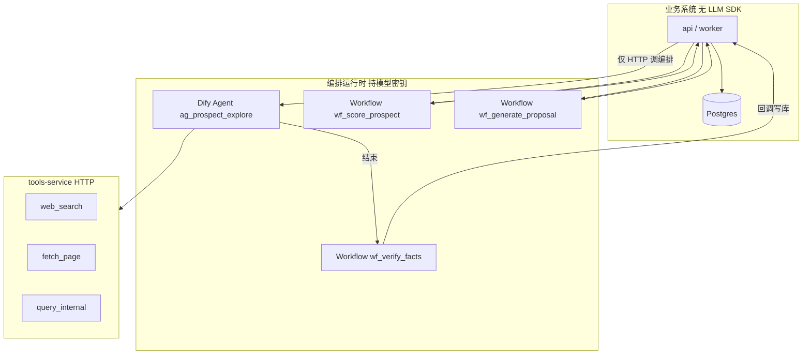

# AI 优先 · 零知识启动架构

> **版本**：v0.3  
> **客户诉求**：大量工作由 AI 完成；**无需预先配置数据源/字段映射** 即可启动（尤其需求一：AI 自行探索信息源）。  
> **编排原则**：业务代码 **不直连 LLM API**；探索用 **Agent 运行时**，打分/方案/校验用 **工作流**。详见 [05-workflow-vs-agent.md](./05-workflow-vs-agent.md)。  
> **关联**：[需求一](./01-intelligence-collection.md) · [需求二](./02-roi-scoring-and-ranking.md) · [需求三](./03-proposal-generation.md)

---

## 1. 「零知识启动」在产品上的含义

| 传统做法（上一版方案） | 客户期望（本版） |
|------------------------|------------------|
| 先配 CRM、工商 API、案例 `mapping.yaml` | **只给公司名/名单** 即可跑第一条情报任务 |
| 连接器开发排期阻塞上线 | AI **自主规划调研路径**、发现可用页面/API |
| 运营维护行业枚举、字段映射 | AI 从原文 **抽取并归一化**；枚举可后置学习 |
| 案例库未接入则不能排序 | 冷启动用 **公网情报 + LLM 行业推断**；案例接入后自动加权 |

**零知识 ≠ 零配置 forever**，而是：

1. **Day 0**：无内部系统对接也能产出第一版档案；  
2. **Day N**：接入案例库/CRM 后，AI **自动合并** 新源，不推翻旧流程；  
3. **越用越省**：被采纳的信源模式写入 `source_registry`，减少重复探索 token。

---

## 2. 总体架构：编排层 + Tool 服务 + 事实层



| 逻辑角色 | 实现载体 | 选型 |
|----------|----------|------|
| Planner / Explorer 动态调研 | **Agent** | Dify `ag_prospect_explore` |
| 单页抽取、事实校验 | **工作流** | `wf_fetch_and_extract`、`wf_verify_facts` |
| ROI、方案、排序理由 | **工作流** | `wf_score_*`、`wf_generate_proposal` |

**与旧方案关系**：固定连接器（工商 API、CRM）降为 **「加速器」**——由 tools-service 暴露，Agent/工作流均可调用。

---

## 3. 业务侧运行记录（不实现 LLM，只跟踪编排调用）

```typescript
type OrchestratorKind = 'agent' | 'workflow';

type AgentRunType =
  | 'explore_prospect';      // 仅此项走 Agent

type WorkflowRunType =
  | 'verify_facts'
  | 'score_prospect' | 'score_batch'
  | 'generate_proposal' | 'generate_proposal_batch';

type RunStatus =
  | 'queued' | 'running' | 'awaiting_review' | 'completed' | 'failed' | 'cancelled';
```

业务表 `agent_run` 存 **Dify conversation_id / workflow_run_id**，用于 UI 回放与对账，**不在此进程内调模型**。

表 `agent_run` / `agent_run_step`（审计、回放、计费）：

```sql
CREATE TABLE agent_run (
  id            UUID PRIMARY KEY,
  type          TEXT NOT NULL,
  prospect_id   UUID REFERENCES prospect(id),
  status        TEXT NOT NULL,
  model_profile TEXT NOT NULL,     -- explore|extract|verify 可不同模型
  token_budget  INT,
  tokens_used   INT DEFAULT 0,
  started_at    TIMESTAMPTZ DEFAULT now(),
  finished_at   TIMESTAMPTZ
);

CREATE TABLE agent_run_step (
  id            UUID PRIMARY KEY,
  run_id        UUID REFERENCES agent_run(id),
  step_index    INT NOT NULL,
  agent_role    TEXT NOT NULL,     -- planner|explorer|extractor|verifier
  tool_calls    JSONB,             -- [{ tool, input, output_ref }]
  llm_messages  JSONB,            -- 可脱敏存储
  outcome       TEXT,              -- ok|retry|blocked_by_policy
  created_at    TIMESTAMPTZ DEFAULT now()
);
```

---

## 4. 需求一：AI 自行探索信息源（核心）

### 4.1 最小输入

```json
{
  "legal_name": "某某美妆有限公司",
  "region_hint": "上海",          
  "research_goals": ["default"]   
}
```

`research_goals` 默认展开为内置清单（无需用户配置）：

- 主体与工商概况  
- 历史广告/市场活动线索  
- 疑似竞品与行业位置  
- 近年投放或营销支出线索（公开报道口径）  
- 与本公司案例库的潜在关联（若 `query_internal` 可用）

### 4.2 四段式 Agent 流水线

| 阶段 | 职责 | 输出 |
|------|------|------|
| **Planner** | 根据公司名生成 5–10 条 **搜索 query** + 预期信息类型 + 停止条件 | `research_plan.json` |
| **Explorer** | 调用 `web_search` → 选 URL → `fetch_url`；发现高价值域名时写入 `source_candidate` | 原始摘录 + URL 列表 |
| **Extractor** | 从摘录抽 `prospect_fact`，**每条必须带 citation** `{ url, quote, accessed_at }` | fact 草稿 |
| **Verifier** | 多源交叉：一致则提高 confidence；冲突则 `review_item`；幻觉检测（数字无 citation 则剔除） | 入库或待审 |

### 4.3 信源「自发现」与沉淀

```sql
CREATE TABLE source_candidate (
  id            UUID PRIMARY KEY,
  prospect_id   UUID,
  domain        TEXT NOT NULL,
  url_pattern   TEXT,
  source_type   TEXT,              -- official_site|news|registry|social|report
  discovered_by UUID REFERENCES agent_run(id),
  usefulness    REAL,              -- Verifier 打分
  status        TEXT DEFAULT 'pending'  -- pending|approved|blocked
);

CREATE TABLE source_registry (
  id            UUID PRIMARY KEY,
  domain        TEXT UNIQUE,
  source_type   TEXT,
  trust_tier    INT,               -- 1=优先复用 2=可用 3=需审核
  notes         TEXT,
  approved_by   UUID,
  use_count     INT DEFAULT 0
);
```

**学习闭环**：运营在审核台把 `source_candidate` 标为 `approved` → 晋升 `source_registry` → 下次 Explorer **优先** 搜这些域名（`org_memory` 工具返回模式）。

### 4.4 Tool Gateway（可落地工具列表）

| 工具 | 零知识期 | 说明 |
|------|----------|------|
| `web_search` | ✅ 必须 | Serper / Bing / 博查 等；query 由 Planner 生成 |
| `fetch_url` | ✅ 必须 | Readability 正文提取；遵守 robots + 速率限制 |
| `summarize_page` | ✅ | 长文压缩再抽取，省 token |
| `query_internal` | 可选 | 自然语言 → SQL/向量：案例库、已有 CRM；**无库时跳过** |
| `registry_lookup` | 可选 | 有 API Key 时精确工商；**无则 Planner 改搜「天眼查 公司名」类公开页** |
| `upload_file` | 可选 | 用户扔 PDF/剪报 → 直接 Extract |

**Policy 护栏（非可选）**：

- 域名黑白名单（默认禁：登录墙后的个人社交私信）  
- 单 run 最大 fetch 次数（如 15）、最大 token（如 80k）  
- PII 抽取需 `allow_pii=false` 时剥离手机/身份证  
- 所有对外访问记 `agent_run_step` 审计

### 4.5 人机边界（零知识仍要合规）

| 自动入库 | 默认进审核 |
|----------|------------|
| 官网「关于我们」、新闻报道摘要 | 未验证的 ROAS/销售额数字 |
| 行业标签推断（confidence≥0.7） | 竞品负面定性表述 |
| 活动名称、代言人（有 citation） | 首次发现的陌生域名 |

**冷启动建议**：前 50 家客户 `auto_approve=false`，全局改 `true` 当误判率 &lt; 阈值。

### 4.6 Prompt 骨架（Planner 示例）

```
你是 B2B 情报规划师。输入：{legal_name}、{region_hint}。
输出 JSON：{
  "queries": [{ "q": "...", "intent": "partnership|campaign|registry|competitor" }],
  "stop_when": ["≥3 facts with citation", "or 8 queries exhausted"],
  "avoid": ["未经证实的财务预测"]
}
不得假设已接入 CRM；内部库可用时再在 plan 中加 query_internal 步骤。
```

---

## 5. 需求二：零知识下的筛选与 ROI（**工作流**）

| 能力 | 无案例库 | 有案例库后 |
|------|----------|------------|
| 行业/规模 | 工作流内 **LLM 节点**归一 `industry_code`（输入 facts） | 不变 |
| 相似案例 | 跳过向量；冷启动走 `inferred` 分支 | `wf_score` 内代码分支 → `case_transfer` |
| ROI | 工作流 **`wf_score_prospect`** 单 LLM 节点输出 tier | 公式节点，无 Agent |

**`inferred_opportunity_v1`** 在 Dify 工作流中实现为 **「结构化输出」LLM 节点**，业务 API 只解析返回 JSON 并写 `score_snapshot`。

探索完成后由业务 worker 入队 `wf_score_prospect`（24h 内已有 snapshot 可跳过）。

---

## 6. 需求三：零知识方案生成（**工作流**）

即使 **无案例库、无 ROI 历史**：

1. Agent 探索产出 facts；  
2. 业务触发 **`wf_generate_proposal`**（固定 DAG：拉 context → LLM 生成 JSON → 规则校验 → 重试≤2）；  
3. `risks_open_questions` 在 Prompt 模板中强制「未接入内部案例」。

有案例库后，context 节点多传 `case_match`；校验节点启用 `case_id` 规则。**不使用 Agent 写方案。**

---

## 7. 技术栈增量（相对 00-platform）

| 组件 | 选型 |
|------|------|
| **编排（持密钥）** | **PoC：Dify 自建**；MVP：Dify + n8n 批处理；备选：LangGraph + Temporal |
| **业务 → 编排** | `packages/orchestrator-client`（仅 HTTP，无 model SDK） |
| **Tool 实现** | `tools-service`：搜索/抓取/写库/查案例 |
| 搜索 | Serper / 博查（仅在 tools-service 配置） |
| 缓存 | `fetched_page` 表按 URL hash 24h |

详见 [05-workflow-vs-agent.md](./05-workflow-vs-agent.md) 分项表与 Dify 应用清单。

---

## 8. 分期（AI 零知识路径）

| 阶段 | 交付 | 用户感知 |
|------|------|----------|
| **P0** | 上传一列公司名 → Agent 探索 → 审核台 → 时间线 | 「不用接 CRM 也能先看档案」 |
| **P1** | `source_registry` 学习 + 案例库 `query_internal` + ROI 榜单 | 越用越快、分数更准 |
| **P2** | 自动审核阈值 + 批量探索 + 方案 docx | 规模化 |

**P0 不再依赖**：`case-mapping.yaml`、工商 API 合同、行业 Excel。

---

## 9. 成本与风控（给客户看的实话）

| 项 | 量级 |
|----|------|
| 单客户探索 | 约 15–40 次 tool call，约 30k–80k tokens |
| 100 家冷启动 | 建议分批 + 夜间；预算需预留 **数百元–千元级** LLM+搜索 API（视模型） |
| 风险 | 公网信息过时/错误 → **citation + 审核** 必选；法务需确认可爬域名范围 |

---

## 10. 与 Kuroneko 复用点

| Kuroneko 能力 | 映射 |
|---------------|------|
| InnerBrain EXECUTE + tools | 可 **替代 Dify Agent** 做 `ag_prospect_explore`（仍不直连 API 到业务 app） |
| 外脑 BLOCK / 人工审核 | 对齐 `review_item` 与 `awaiting_review` |
| Zod 校验 | 业务 API 校验工作流回写 JSON；Dify 内用 Schema 约束输出 |

独立仓库仍推荐；编排优先 **Dify** 以降低 PoC 人日。

---

## 11. 待客户确认的 3 条（零知识专用）

1. **公网调研范围**：仅中国大陆中文源？是否含 LinkedIn/境外年报？  
2. **审核策略**：冷启动是否 **100% 人工过审** 才给销售看？  
3. **搜索 API 预算**：月额度上限（决定单客户 query 条数上限）。

见 [open-questions.md §G](../open-questions.md)。
