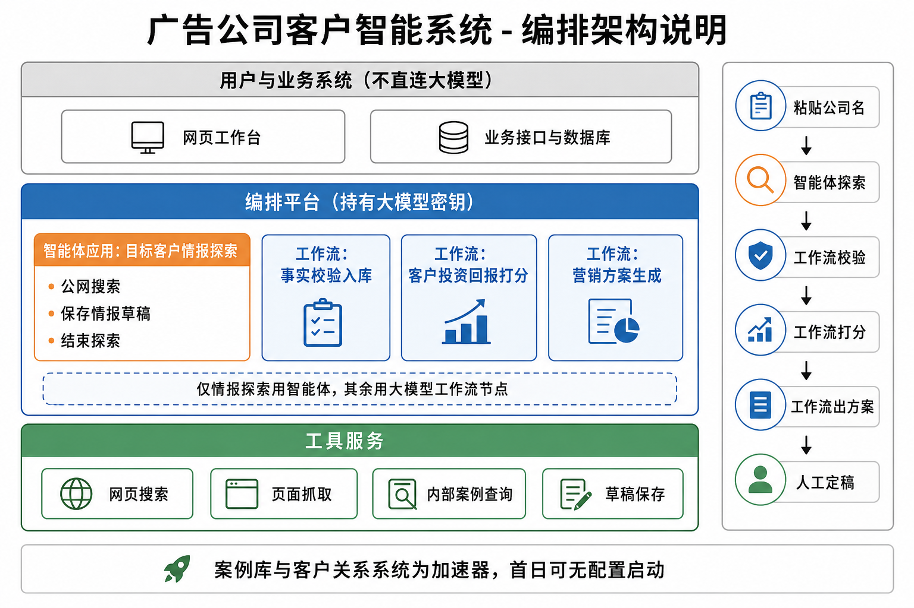
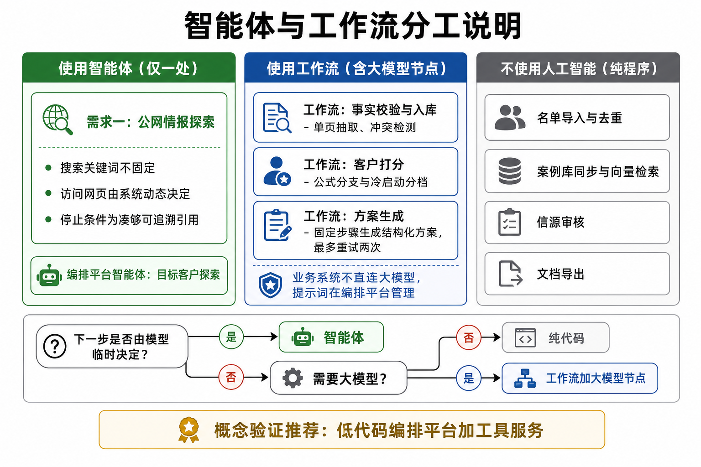
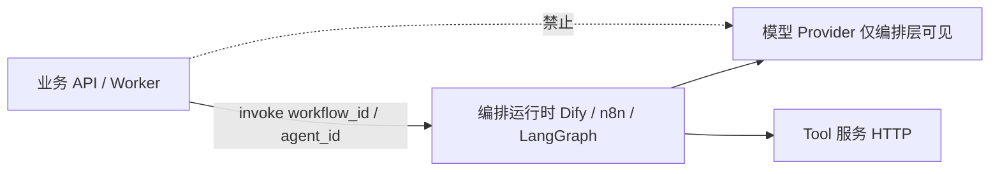
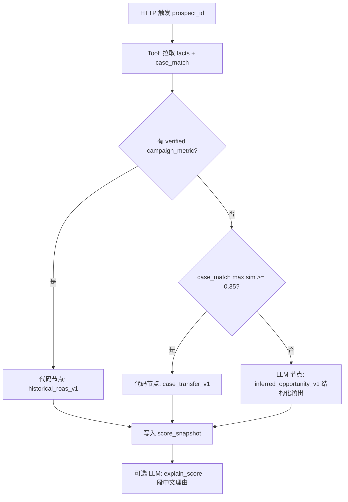

# 编排选型：工作流 vs Agent（不直连 LLM API）

> **版本**：v0.3  
> **原则**：业务服务（`api` / `worker`）**禁止**直接调用 OpenAI/通义/DeepSeek SDK；所有模型调用发生在 **工作流引擎** 或 **Agent 运行时** 内，由编排平台统一管理 Prompt、模型、密钥与审计。  
> **关联**：[04-ai-zero-knowledge.md](./04-ai-zero-knowledge.md) · [00-platform.md](./00-platform.md)





---

## 1. 边界定义

| 概念 | 特征 | 适用 |
|------|------|------|
| **工作流（Workflow）** | 步骤、分支、重试次数 **事先定义**；路径可预测；易审计、易测 | 固定管道、批处理、校验环、人工审批节点 |
| **Agent** | **动态**决定下一步工具；停止条件由目标/预算决定；步数不固定 | 开放调研、信源探索、query 不可预知 |



**业务库职责**：`prospect` / `prospect_fact` / `job` 状态机；编排层通过 **Webhook 回调** 或 **同步 HTTP 响应** 写回结果。

---

## 2. 分项选型总表

| 业务能力 | 选型 | 编排形态 | 推荐运行时（首选 → 备选） |
|----------|------|----------|---------------------------|
| 名单导入、去重 | **无 AI** | 应用内 cron / Temporal Activity | 纯代码 |
| 案例 ETL、embedding | **无 AI** | 工作流 | n8n 或 pg-boss 链 |
| **需求一：情报探索** | **Agent** | ReAct / Plan-and-Execute | **Dify Agent** → LangGraph ReAct 子图 |
| 单页正文抽取（给定 URL） | **工作流** | 单 DAG 节点链 | Dify Workflow 子流程（Agent 当 **工具** 调用） |
| 事实校验、冲突合并 | **工作流** | 规则 + 可选 1 个 LLM 节点 | Dify Workflow `verify_facts` |
| 信源审核晋升 registry | **无 AI** | 工作流 | api + DB，人工 Webhook |
| **需求二：向量相似** | **无 AI** | 工作流 | SQL + pgvector |
| **需求二：冷启动 ROI 分档** | **工作流** | 固定 3 步 + 1 LLM 结构化节点 | Dify Workflow `score_inferred` |
| **需求二：案例迁移 ROI** | **工作流** | 公式分支，无 LLM | 纯代码 Activity |
| **需求二：排序理由文案** | **工作流** | 1 LLM 节点，输入 factors JSON | Dify Workflow `explain_score` |
| 夜间 `score_batch` | **工作流** | 批处理 DAG | n8n / Dify Workflow + 队列 |
| **需求三：方案生成** | **工作流** | Context→Generate→Validate→重试≤2 | Dify Workflow `generate_proposal` |
| 方案人工编辑、导出 docx | **无 AI** | 应用内 | 纯代码 |
| 批量「Top10 方案」 | **工作流** | 并行子工作流 map | n8n SplitInBatches / Dify 迭代节点 |

**结论一句话**：

- **只有「公网情报探索」用 Agent**；  
- **打分、方案、校验、解释** 用 **工作流**（其中冷启动/解释/生成含 **少量** LLM 节点，但仍不直连 API）；  
- **ETL、向量、审核、导出** 不用 AI。

---

## 3. 推荐技术栈（可落地组合）

### 3.1 PoC 推荐：**Dify 自建 + 业务 API**

| 组件 | 选型 | 理由 |
|------|------|------|
| Agent（探索） | **Dify Agent 应用** `ag_prospect_explore` | 工具可视化配置、对话/trace 内置、国内部署多 |
| 工作流 | **Dify Workflow** 多个独立应用 | `wf_verify_facts` / `wf_score` / `wf_proposal` |
| 业务系统 | Fastify + Postgres | 只 `POST` Dify API（`workflows/run` / `chat-messages`） |
| Tool 实现 | 独立 `tools-service`（Fastify） | `web_search` / `fetch_url` / `query_internal` 供 Dify OpenAPI 工具调用 |
| 队列 | pg-boss | 业务侧入队 → 调 Dify → 回调写库 |

**密钥**：仅 Dify 环境变量配置模型；业务 `.env` **无** `OPENAI_API_KEY`。

### 3.2 MVP 增强：**n8n + Dify 分工**

| 组件 | 选型 | 理由 |
|------|------|------|
| 批处理、CRM Webhook、定时 | **n8n** | 集成生态好，适合 `score_batch`、案例同步 |
| 含 LLM 的语义步骤 | **调用 Dify Workflow HTTP** | 避免 n8n 里散落 Prompt |
| Agent 探索 | 仍 **Dify Agent** | 保持 trace 一致 |

### 3.3 研发自控：**LangGraph Server + Temporal**

| 组件 | 选型 | 理由 |
|------|------|------|
| Agent | LangGraph `create_react_agent` 部署为 HTTP 服务 | 探索逻辑可单测 |
| 工作流 | Temporal Workflow 定义 DAG | 长任务、重试、版本化强 |
| 适用 | 团队有 TS/Python 编排经验、不愿依赖 Dify 控制台 | 人日高于 Dify |

### 3.4 与 Kuroneko 同组织：**InnerBrain 作 Agent 运行时（备选）**

| 组件 | 选型 | 理由 |
|------|------|------|
| 探索 | `spawn_inner_brain(goal=调研某公司)` + 工具 `web_search` / `read_url` | 复用现有 EXECUTE 循环，**模型已在 server 适配器** |
| 打分/方案 | 仍建议 **Dify Workflow** 或外置固定 DAG | Pi-mono 偏目标驱动，不适合严格 JSON 方案校验 |

**注意**：即使用 Kuroneko，业务 `api` 仍只调 **OuterBrain/InnerBrain RPC**，不直接 `llm.chat()`。

---

## 4. 需求一：情报探索 — **Agent**（具体设计）

### 4.1 为何不是工作流

- 搜索 query 条数、访问 URL 顺序 **无法预先画死**；  
- 停止依赖「是否已凑够带 citation 的事实」；  
- 符合 **Agent + 工具** 模型。

### 4.2 推荐：**Dify Agent `ag_prospect_explore`**

**工具注册（OpenAPI / 自定义 API）**：

| 工具名 | 实现方 | 说明 |
|--------|--------|------|
| `web_search` | tools-service | 博查/Serper |
| `fetch_page` | tools-service | 正文 + 缓存 |
| `save_fact_draft` | tools-service | 写 staging 表，非终库 |
| `list_approved_sources` | tools-service | 读 `source_registry` |
| `finish_exploration` | tools-service | 触发 **工作流** `wf_verify_facts` |

**Agent 系统指令要点**：必须调用 `save_fact_draft` 时带 `url`+`quote`；预算内调用 `finish_exploration`。

**业务触发**：

```http
POST https://dify.example/v1/chat-messages
Authorization: Bearer {DIFY_APP_KEY}
{
  "inputs": { "legal_name": "某某美妆", "region_hint": "上海", "prospect_id": "uuid" },
  "query": "开始调研",
  "response_mode": "blocking",
  "user": "prospect_uuid"
}
```

异步改 `streaming` + 业务 Webhook 收 `message_end`。

### 4.3 Agent 内的「固定子流程」用工作流

以下 **不要** 放进 Agent 自由发挥，做成 Dify **Workflow 工具**（Agent 调用工具 = 触发子工作流）：

| 子工作流 | 步骤 |
|----------|------|
| `wf_fetch_and_extract` | fetch_page → LLM 结构化抽取（单页） → 返回 JSON |
| `wf_verify_facts` | 规则去重 → LLM 冲突检测 → 写 `prospect_fact` / `review_item` |

这样 **单页抽取** 可测、可版本化；Agent 只负责 **选哪一页**。

### 4.4 状态回写

| 事件 | 业务库 |
|------|--------|
| Agent 运行中 | `agent_run.status=exploring` |
| `finish_exploration` | 调 `wf_verify_facts` → `completed` / `awaiting_review` |
| Dify trace URL | 存 `agent_run.dify_trace_id` 供运营复盘 |

---

## 5. 需求二：筛选与 ROI — **工作流为主**

### 5.1 工作流 `wf_score_prospect`（Dify）



- **代码节点**：用 Dify「HTTP Request」调业务 API `/internal/compute-roas`，或 **预置 Python 节点**（若允许）。  
- **仅 1–2 个 LLM 节点**，非 Agent。

### 5.2 批处理 `wf_score_batch`（n8n 或 Dify 循环）

1. 业务 API 返回待打分 `prospect_ids[]`  
2. **SplitInBatches** 并发 5  
3. 每条调用 `wf_score_prospect`  
4. 汇总后业务 API `POST /internal/rankings/rebuild`

### 5.3 为何冷启动不用 Agent

分档输入是 **已探索 facts**；输出是 **固定 JSON Schema**（tier 1–5）；无工具选择 → **工作流 + 单 LLM 节点** 更便宜、可回归测试。

---

## 6. 需求三：方案生成 — **工作流**（非 Agent）

### 6.1 工作流 `wf_generate_proposal`

| 步骤 | 类型 | 说明 |
|------|------|------|
| 1. load_context | HTTP → 业务 API | facts + score + cases（可为空） |
| 2. generate | **LLM 节点** | 输出 `proposal-sections-v1` JSON |
| 3. validate | **代码/规则节点** | case_id 存在性、source_label、无占位符 |
| 4. branch | 条件 | 失败且 retry&lt;2 → 回到 2；否则 failed |
| 5. persist | HTTP | `PATCH /internal/proposals/:id` |

**不用 Agent 的原因**：步骤固定、重试上限明确、不需浏览网页；Agent 会增加不可控篇幅与成本。

### 6.2 批量 `wf_generate_proposal_batch`

n8n：读 Top10 → 循环调用 `wf_generate_proposal` → 飞书通知（P2）。

---

## 7. 业务层集成契约（统一）

```typescript
// packages/orchestrator-client — 业务唯一 AI 入口
interface OrchestratorClient {
  runWorkflow(id: 'wf_score_prospect' | 'wf_generate_proposal' | ..., input: Record<string, unknown>): Promise<WorkflowRunResult>;
  runAgent(id: 'ag_prospect_explore', input: Record<string, unknown>): Promise<AgentRunResult>;
}

// 实现类：DifyOrchestratorClient — 内部 fetch Dify API，业务无 model SDK
```

环境变量：

```bash
DIFY_BASE_URL=https://dify.internal
DIFY_KEY_EXPLORE=app-xxx
DIFY_KEY_SCORE=app-yyy
DIFY_KEY_PROPOSAL=app-zzz
# 无 OPENAI_API_KEY
```

---

## 8. 选型决策树（实施时 30 秒判断）

```
是否需动态决定「下一步访问哪个 URL / 搜什么」？
  ├─ 是 → Agent（仅探索）
  └─ 否 → 是否调用 LLM？
        ├─ 否 → 纯代码 / n8n 无 AI 节点
        └─ 是 → 输出 JSON 是否固定 Schema？
              ├─ 是 → 工作流 + 单/双 LLM 节点
              └─ 否且需多轮工具 → 再考虑 Agent（本项目仅探索）
```

---

## 9. 分期与交付物

| 阶段 | 编排交付 |
|------|----------|
| **P0** | Dify：`ag_prospect_explore` + `wf_verify_facts` + `wf_score_prospect` + `wf_generate_proposal`；tools-service 3 个工具 |
| **P1** | n8n：`sync_cases`、`score_batch`；Dify 子工作流 `wf_fetch_and_extract` |
| **P2** | 可选迁 LangGraph；或 Kuroneko InnerBrain 接探索，工作流仍 Dify |

---

## 10. 文档与实现对齐

| 文档 | 变更 |
|------|------|
| **[workflows-detailed-design.md](./workflows-detailed-design.md)** | **三工作流节点、API、Prompt、分支、测试用例（实施主文档）** |
| [04-ai-zero-knowledge.md](./04-ai-zero-knowledge.md) | 编排层术语；去掉「业务直接 llm.chat」 |
| [01-intelligence-collection.md](./01-intelligence-collection.md) | 探索 = Dify Agent + 子工作流 |
| [02-roi-scoring-and-ranking.md](./02-roi-scoring-and-ranking.md) | 打分 = wf_score_* |
| [03-proposal-generation.md](./03-proposal-generation.md) | 方案 = wf_generate_proposal |
| [00-platform.md](./00-platform.md) | 增加 `orchestrator-client`、`tools-service` |

---

## 11. 待确认（给客户 / 实施）

1. 编排平台是否允许 **私有化 Dify**（客户 IT 常已有）？  
2. `tools-service` 是否可访问公网搜索 API？  
3. 探索 Agent 用 **blocking** 还是 **streaming + Webhook**（影响 UI 实况）？
