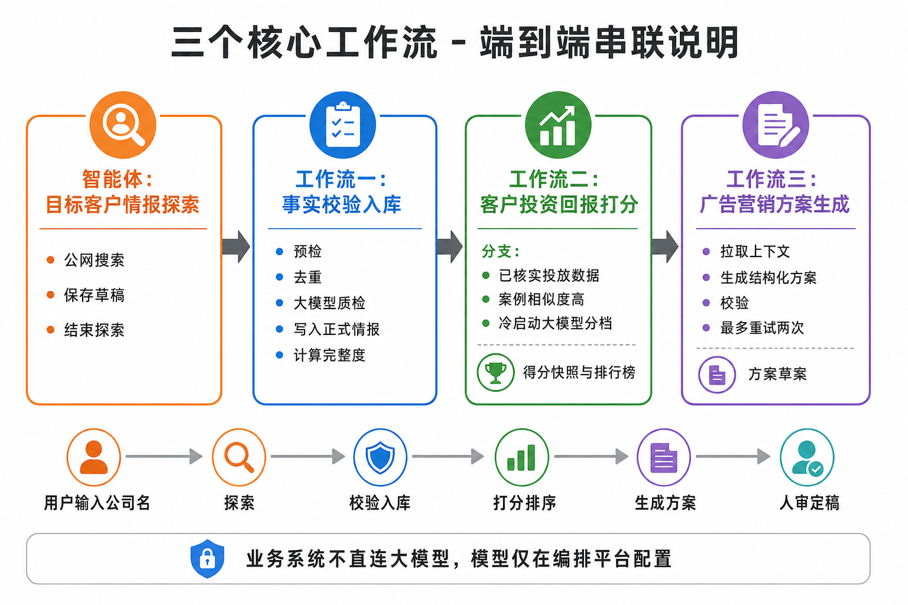
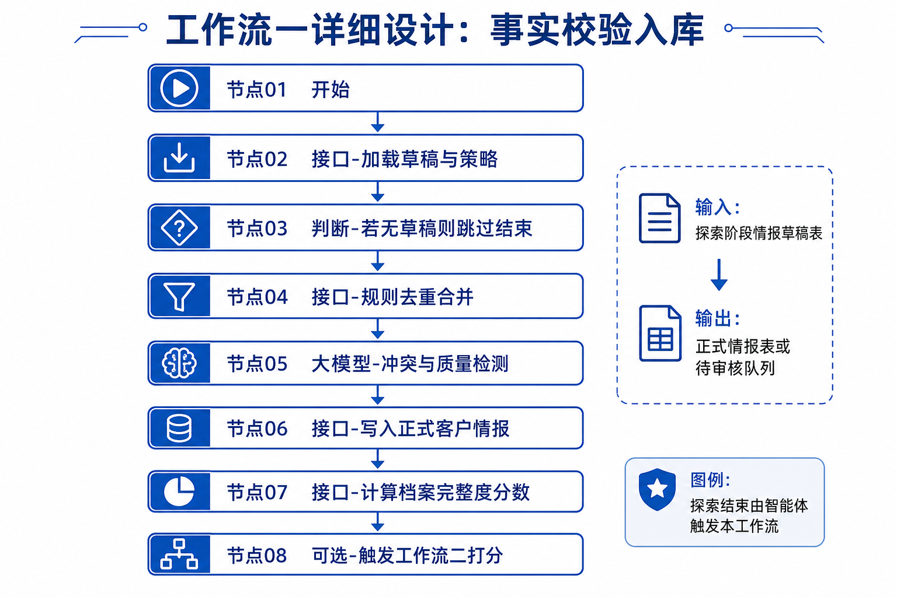
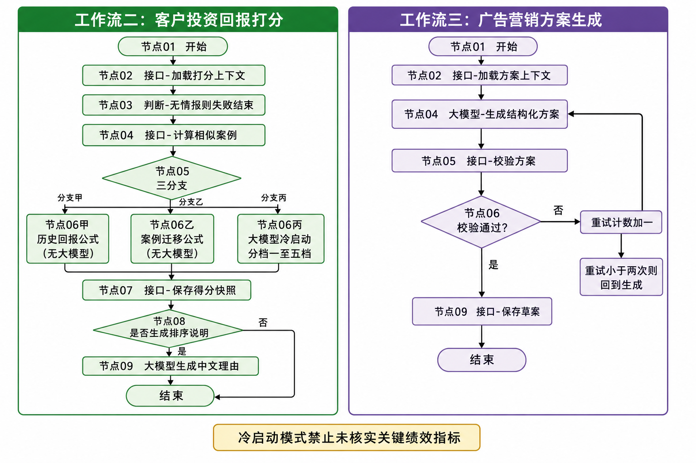
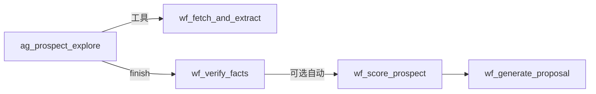
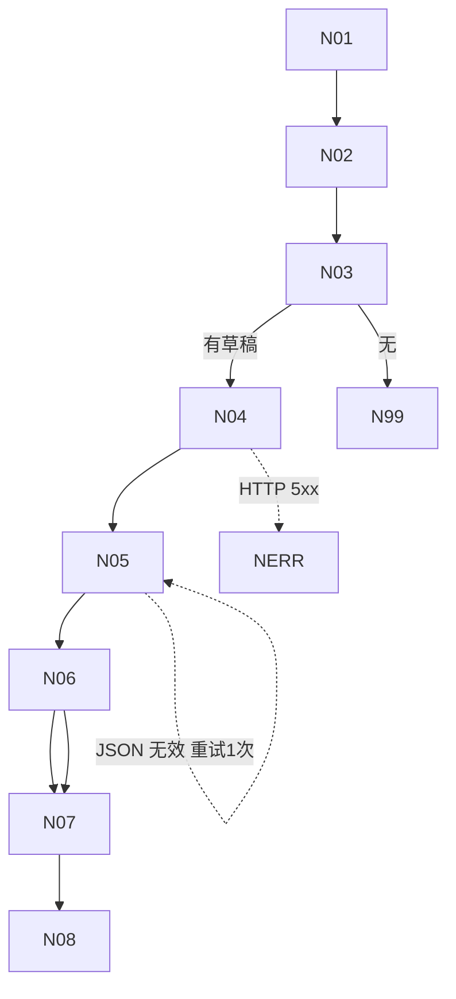
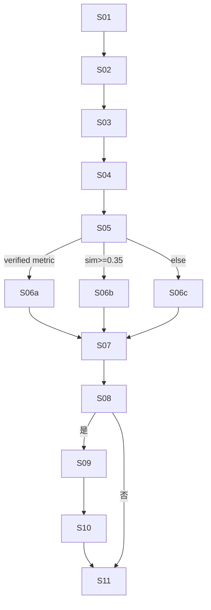
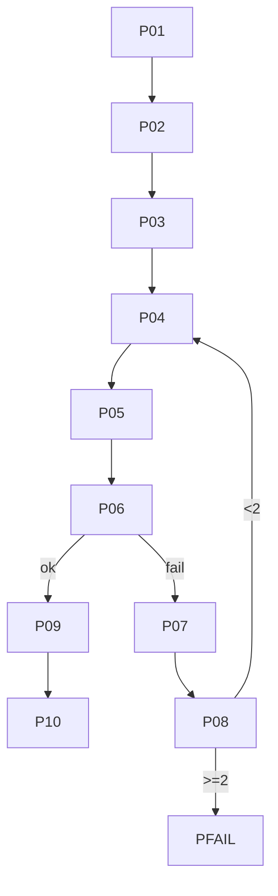
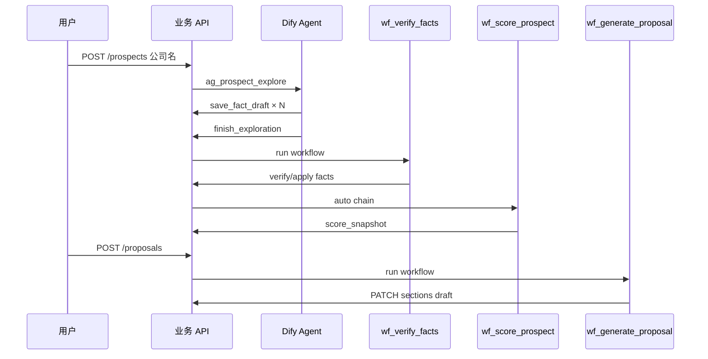

# 三个核心工作流 · 详细设计（Dify Workflow）

> **版本**：v1.0  
> **平台**：Dify 自建（Workflow 应用）  
> **原则**：业务 `api` 只通过 `orchestrator-client` 触发；工作流内 LLM/HTTP 节点持有模型与 Prompt。  
> **关联**：[05-workflow-vs-agent.md](./05-workflow-vs-agent.md) · [01](./01-intelligence-collection.md) · [02](./02-roi-scoring-and-ranking.md) · [03](./03-proposal-generation.md)

## 示意图

**端到端串联（智能体探索 + 三个工作流）**



**工作流一：事实校验入库**



**工作流二与三：客户打分、方案生成**



---

## 0. 总览

| 工作流 ID | 名称 | 触发方 | 上游依赖 | 下游 |
|-----------|------|--------|----------|------|
| `wf_verify_facts` | 事实校验入库 | `finish_exploration` / 人工「重新校验」 | Agent 写入 `fact_draft` | `wf_score_prospect`（可自动链式） |
| `wf_score_prospect` | 客户 ROI 打分 | 探索完成 / 手动 / `wf_score_batch` | `prospect_fact` 已存在 | 榜单 UI、`wf_generate_proposal` |
| `wf_generate_proposal` | 营销方案生成 | 勾选客户 / Top N 批量 | `score_snapshot` 推荐有 | 人审、导出 |

**子工作流（Agent 工具，非「三个」之一，但实现依赖）**：

| ID | 说明 |
|----|------|
| `wf_fetch_and_extract` | 给定 URL → 抓页 → 单页 LLM 抽取 → 返回 JSON（不写终库） |



---

## 共用约定

### 0.1 Dify 调用方式（业务侧）

```http
POST {DIFY_BASE}/v1/workflows/run
Authorization: Bearer {DIFY_KEY_<WF>}
Content-Type: application/json

{
  "inputs": { ... },
  "response_mode": "blocking",
  "user": "{prospect_id 或 proposal_id}"
}
```

异步：`response_mode: streaming` + 业务 Webhook `POST /webhooks/dify/workflow`（推荐 P1）。

### 0.2 业务内部 API 鉴权

工作流 HTTP 节点 Header：

```
Authorization: Bearer {INTERNAL_SERVICE_TOKEN}
X-Workflow-Run-Id: {{workflow_run_id}}
X-Dify-App: wf_verify_facts
```

### 0.3 工作流运行记录表

```sql
CREATE TABLE workflow_run (
  id              UUID PRIMARY KEY DEFAULT gen_random_uuid(),
  dify_run_id     TEXT,
  workflow_key    TEXT NOT NULL,  -- wf_verify_facts | wf_score_prospect | wf_generate_proposal
  prospect_id     UUID,
  proposal_id     UUID,
  status          TEXT NOT NULL,  -- running|completed|failed
  inputs          JSONB,
  outputs         JSONB,
  error           TEXT,
  started_at      TIMESTAMPTZ DEFAULT now(),
  finished_at     TIMESTAMPTZ
);
```

### 0.4 环境变量（Dify 应用级）

| 变量 | 说明 |
|------|------|
| `API_BASE` | `https://ad-intel.internal/api` |
| `INTERNAL_TOKEN` | 服务间 JWT |
| `DEFAULT_RULE_SET_ID` | 活跃 ROI 规则 UUID |

---

# 工作流一：`wf_verify_facts`

## 1.1 目标

将探索阶段写入 **`fact_draft`** 的草稿，经 **规则去重 → LLM 冲突检测 → 合规过滤** 后，写入 **`prospect_fact`** 或 **`review_item`**，并更新 `prospect.status` / `completeness_score`。

## 1.2 触发与前置条件

| 触发源 | inputs |
|--------|--------|
| tools-service `finish_exploration` | `prospect_id`, `agent_run_id` |
| 运营「重新校验」 | `prospect_id`, `agent_run_id?`, `force=true` |

**前置**：`fact_draft` 中 `prospect_id` 至少 1 条 `status=draft`；无草稿时 **短路径成功**（`skipped=true`）。

## 1.3 输入 / 输出变量（Dify Workflow Variables）

| 变量 | 类型 | 入参 | 出参 |
|------|------|------|------|
| `prospect_id` | string | ✅ | |
| `agent_run_id` | string | ✅ | |
| `force` | boolean | optional | |
| `policy_auto_approve` | boolean | 从 API 拉取 | |
| `draft_count` | number | | ✅ |
| `facts_approved` | number | | ✅ |
| `facts_pending_review` | number | | ✅ |
| `prospect_status` | string | | ✅ |
| `completeness_score` | number | | ✅ |
| `error_code` | string | | ✅ |

## 1.4 节点清单（按执行顺序）

| 节点 ID | Dify 类型 | 名称 | 说明 |
|---------|-----------|------|------|
| N01 | Start | 开始 | 映射 inputs |
| N02 | HTTP Request | 加载草稿与策略 | `GET /internal/verify/preflight` |
| N03 | If/Else | 无草稿? | `draft_count==0` → N99 |
| N04 | HTTP Request | 规则去重合并 | `POST /internal/verify/dedupe` |
| N05 | LLM | 冲突与质量检测 | 结构化 JSON，见 §1.6 |
| N06 | HTTP Request | 应用裁决写库 | `POST /internal/verify/apply` |
| N07 | HTTP Request | 聚合档案分数 | `POST /internal/prospects/:id/aggregate` |
| N08 | If/Else | 自动链式打分? | `policy_auto_score` → 调 `wf_score`（P1） |
| N99 | End | 跳过结束 | outputs `skipped=true` |
| NERR | End | 失败 | `error_code` |



## 1.5 业务 API 契约

### `GET /internal/verify/preflight`

Query: `prospect_id`, `agent_run_id?`

Response:

```json
{
  "prospect_id": "uuid",
  "legal_name": "某某美妆有限公司",
  "draft_count": 12,
  "policy": {
    "auto_approve": false,
    "auto_score_after_verify": true,
    "min_citation_per_fact": 1
  },
  "drafts_preview": [
    {
      "draft_id": "uuid",
      "fact_type": "marketing_event",
      "payload": {},
      "citations": [{ "url": "https://...", "quote": "..." }],
      "source": "news.example.com",
      "confidence": 0.75
    }
  ]
}
```

### `POST /internal/verify/dedupe`

Body: `{ "prospect_id", "agent_run_id" }`

逻辑（纯代码，无 LLM）：

- 相同 `fact_type` + payload 指纹相同 → 保留 `confidence` 最高一条  
- 同 type 下互斥字段（如 `roas`）差值 &gt;30% → 打标 `conflict_group_id`  
- 无 `citations[]` 或 citations 空 → 打标 `reject_reason=no_citation`

Response:

```json
{
  "groups": [
    {
      "group_id": "g1",
      "draft_ids": ["d1", "d2"],
      "conflict": true,
      "merged_candidate": { ... }
    }
  ],
  "rejected_draft_ids": ["d9"],
  "clean_draft_ids": ["d3", "d4"]
}
```

### `POST /internal/verify/apply`

Body:

```json
{
  "prospect_id": "uuid",
  "agent_run_id": "uuid",
  "llm_verdict": {
    "approve": [{ "draft_id": "d3", "adjusted_confidence": 0.85 }],
    "review": [{ "draft_id": "d1", "reason": "roas_conflict" }],
    "reject": [{ "draft_id": "d9", "reason": "no_citation" }],
    "source_candidates": [
      { "domain": "brand.com", "source_type": "official_site", "usefulness": 0.9 }
    ]
  }
}
```

Response:

```json
{
  "facts_approved": 8,
  "facts_pending_review": 2,
  "prospect_status": "ready",
  "completeness_score": 0.62
}
```

## 1.6 LLM 节点 N05（冲突与质量检测）

| 项 | 配置 |
|----|------|
| 模型 | `deepseek-chat` / 通义 `qwen-plus`（Dify 控制台） |
| 温度 | 0.1 |
| 输出 | **结构化输出** / JSON Schema |

**System（摘要）**：

```
你是广告情报质检员。输入为去重后的 fact 草稿 groups。
任务：
1. 对 conflict=true 的组，判断保留哪条或均送 review。
2. 剔除无 citation 支撑的数字断言。
3. 竞品负面表述若无权威报道 → review。
4. 输出严格 JSON，符合 schema verdict_v1。
禁止编造草稿中不存在的事实。
```

**User 模板**：

```
公司：{{legal_name}}（{{prospect_id}}）
草稿 groups：
{{dedupe_groups_json}}
策略：auto_approve={{policy_auto_approve}}
```

**输出 Schema `verdict_v1`**：

```json
{
  "approve": [{ "draft_id": "string", "adjusted_confidence": 0.0 }],
  "review": [{ "draft_id": "string", "reason": "string" }],
  "reject": [{ "draft_id": "string", "reason": "string" }],
  "source_candidates": [{
    "domain": "string",
    "source_type": "official_site|news|registry|social|report",
    "usefulness": 0.0
  }]
}
```

**重试**：Dify 节点「失败时重试」1 次；仍失败 → N06 仅应用规则层结果（`apply` 带 `llm_fallback=true`）。

## 1.7 `fact_draft` 表（探索阶段）

```sql
CREATE TABLE fact_draft (
  id            UUID PRIMARY KEY,
  prospect_id   UUID NOT NULL REFERENCES prospect(id),
  agent_run_id  UUID NOT NULL,
  fact_type     TEXT NOT NULL,
  payload       JSONB NOT NULL,
  citations     JSONB NOT NULL DEFAULT '[]',
  source        TEXT NOT NULL,
  confidence    REAL NOT NULL,
  status        TEXT NOT NULL DEFAULT 'draft',
  created_at    TIMESTAMPTZ DEFAULT now()
);
```

Agent 工具 `save_fact_draft` 只写此表；**终库**仅 `wf_verify_facts` 写入。

## 1.8 后置条件与错误码

| `prospect_status` | 条件 |
|-------------------|------|
| `ready` | `completeness_score≥0.45` 且 ≥3 条已批准 fact |
| `enriching` | 未达标 |
| `awaiting_review` | 存在 open `review_item` 且 `auto_approve=false` |

| error_code | 含义 |
|------------|------|
| `PREFLIGHT_FAILED` | N02 HTTP 失败 |
| `LLM_VERDICT_INVALID` | N05 两次 JSON 无效 |
| `APPLY_FAILED` | N06 写库失败 |

## 1.9 测试用例

| # | 场景 | 期望 |
|---|------|------|
| T1 | 12 条草稿、2 组冲突 | 8 approve + 2 review |
| T2 | 全无 citation | 全 reject，`enriching` |
| T3 | `draft_count=0` | N99，`skipped=true` |
| T4 | `auto_approve=true` 且无冲突 | 全 approve，`ready` |

---

# 附录 A：子工作流 `wf_fetch_and_extract`（Agent 工具）

| 节点 | 类型 | 说明 |
|------|------|------|
| A1 | Start | inputs: `url`, `prospect_id`, `intent` |
| A2 | HTTP | `POST tools-service/fetch_page` |
| A3 | If/Else | `page.status==ok` |
| A4 | LLM | 单页抽取 `extract_v1` JSON |
| A5 | End | 返回 `{ facts[], page_title }` |

**LLM 输出 `extract_v1`**：`facts[]` 每项含 `fact_type`, `payload`, `quote`, **不得含未在正文中出现的数字**。

Agent 将返回的 facts 再调 `save_fact_draft`（带同一 `url` citation）。

---

# 工作流二：`wf_score_prospect`

## 2.1 目标

对单一 `prospect_id` 计算 **ROI 得分**、**置信度**、**factors**，写入 `score_snapshot`；可选生成 **中文排序理由**；刷新 `case_match`（有案例库时）。

## 2.2 触发

| 触发源 | inputs |
|--------|--------|
| `wf_verify_facts` 链式（N08） | `prospect_id` |
| `POST /prospects/:id/score` | `prospect_id`, `rule_set_id?` |
| n8n `wf_score_batch` 子调用 | `prospect_id` |

**前置**：至少 1 条 `prospect_fact`；零 fact 时结束 `error_code=NO_FACTS`（不调用 LLM）。

## 2.3 输入 / 输出变量

| 变量 | 入参 | 出参 |
|------|------|------|
| `prospect_id` | ✅ | |
| `rule_set_id` | optional | |
| `skip_explain` | optional boolean | |
| `branch_used` | | ✅ `historical_roas_v1` \| `case_transfer_v1` \| `inferred_opportunity_v1` |
| `roi_score` | | ✅ |
| `confidence` | | ✅ |
| `factors` | | ✅ object |
| `explain_text` | | ✅ |
| `snapshot_id` | | ✅ |

## 2.4 节点清单

| 节点 ID | 类型 | 名称 |
|---------|------|------|
| S01 | Start | 开始 |
| S02 | HTTP | 加载评分上下文 `GET /internal/score/context` |
| S03 | If/Else | `fact_count==0` → ERR |
| S04 | HTTP | 计算/刷新 case_match `POST /internal/score/case-match` |
| S05 | If/Else | 分支选择（见 §2.5） |
| S06a | HTTP | `POST /internal/score/compute-historical` |
| S06b | HTTP | `POST /internal/score/compute-transfer` |
| S06c | LLM | 冷启动分档 `inferred_opportunity_v1` |
| S07 | HTTP | 合并写 snapshot `POST /internal/score/persist` |
| S08 | If/Else | `skip_explain==false` |
| S09 | LLM | 生成 `explain_text` |
| S10 | HTTP |  PATCH snapshot 附加 explain |
| S11 | End | 成功 |
| SERR | End | 失败 |



## 2.5 分支条件 S05（与业务 API 对齐）

业务在 **S02** 返回 `branch_hint`（工作流也可本地 If）：

```json
{
  "fact_count": 14,
  "has_verified_campaign_metric": true,
  "max_case_similarity": 0.52,
  "completeness_score": 0.62,
  "branch_hint": "historical_roas_v1"
}
```

| 优先级 | 条件 | 节点 |
|--------|------|------|
| 1 | `has_verified_campaign_metric` | S06a |
| 2 | `max_case_similarity >= 0.35` | S06b |
| 3 | 默认 | S06c LLM |

## 2.6 业务 API

### `GET /internal/score/context?prospect_id=`

返回：`legal_name`, `industry_code`, `tags`, `facts_digest[]`, `completeness_score`, `branch_hint`, 活跃 `rule_set_id`。

### `POST /internal/score/case-match`

Body: `{ "prospect_id", "top_k": 5 }`  
无案例库时返回 `matches: []`, `max_similarity: 0`。

### `POST /internal/score/compute-historical` / `compute-transfer`

纯代码计算，Response：

```json
{
  "roi_score": 3.42,
  "confidence": 0.88,
  "factors": {
    "model": "case_transfer_v1",
    "base_score": 2.85,
    "industry_adj": 1.0,
    "strategic_mult": 1.2,
    "top_cases": [{ "case_id": "...", "similarity": 0.52, "roas": 3.1 }]
  }
}
```

### `POST /internal/score/persist`

Body: `{ prospect_id, rule_set_id, roi_score, confidence, factors, branch_used }`  
Response: `{ snapshot_id }`；异步 job 重建榜单 rank（或 n8n 批量后一次重建）。

## 2.7 LLM 节点 S06c（冷启动 `inferred_opportunity_v1`）

**输入**：`facts_digest` + `citations` 摘要（禁止传全文网页）

**输出 Schema `inferred_v1`**：

```json
{
  "opportunity_tier": 1,
  "signals": [
    { "text": "近一年抖音种草活动频繁", "fact_id": "uuid" }
  ],
  "reasoning": "基于公开报道与官网动态，行业投放活跃…"
}
```

**业务映射**（HTTP S07 前 Code 节点或 persist 内）：

```
tier 1..5 → roi_score [0.8, 1.2, 2.0, 3.0, 4.5]
confidence = min(1, 0.5*completeness + 0.5*min(1, citation_count/5))
```

**约束**：`signals` 至少 2 条且每条含 `fact_id`；否则 LLM 节点重试并附加错误提示。

## 2.8 LLM 节点 S09（排序理由 `explain_score`）

| 项 | 值 |
|----|-----|
| 输入 | `factors` + `branch_used` + `legal_name` |
| 输出 | 纯文本 120–200 字，无新数字 |
| 温度 | 0.3 |

示例输出：

> 「某某美妆」与内部 2024 种草案例相似度 0.52，参照 ROAS 3.1 加权后机会分 3.42；置信度中等，建议补充 verified 投放数据。

## 2.9 批处理编排 `wf_score_batch`（n8n，非 Dify 内）

| 步骤 | 节点 |
|------|------|
| 1 | Cron 02:30 |
| 2 | HTTP `GET /internal/score/batch-targets?filter_preset_id=` |
| 3 | Split In Batches, size=5 |
| 4 | HTTP Dify `wf_score_prospect` |
| 5 | 汇总后 `POST /internal/rankings/rebuild` |

## 2.10 错误码与 SLA

| error_code | 说明 |
|------------|------|
| `NO_FACTS` | 未探索先打分 |
| `CASE_MATCH_FAILED` | S04 可降级为空 matches |
| `LLM_INFERRED_INVALID` | S06c 两次失败 → 用 tier=3 默认 + `confidence=0.3` 并标 `degraded` |
| `PERSIST_FAILED` | 写库失败 |

单客户 blocking 目标：**P95 &lt; 45s**（含 1 次 LLM）。

---

# 工作流三：`wf_generate_proposal`

## 3.1 目标

基于档案、得分、相似案例（可为空），生成 **`proposal-sections-v1` JSON**，校验通过后写入 `proposal.sections`，状态 `draft`。

## 3.2 触发

| 触发源 | inputs |
|--------|--------|
| UI `POST /proposals` | `proposal_id`, `prospect_id`, `mode` |
| 批量 | `proposal_id` 列表（n8n 循环） |

**前置**：`proposal.status=generating`；`prospect` 存在。

## 3.3 输入 / 输出变量

| 变量 | 入参 | 出参 |
|------|------|------|
| `proposal_id` | ✅ | |
| `prospect_id` | ✅ | |
| `mode` | `standard` \| `deep` | |
| `data_mode` | | ✅ `cold_start` \| `with_cases` |
| `retry_count` | 工作流内 | |
| `sections` | | ✅ object |
| `validation_errors` | | ✅ string[] |
| `proposal_status` | | ✅ `draft` \| `failed` |

## 3.4 节点清单

| 节点 ID | 类型 | 名称 |
|---------|------|------|
| P01 | Start | 开始 |
| P02 | HTTP | 拉取 context `GET /internal/proposals/:id/context` |
| P03 | Code / 变量赋值 | 设 `data_mode`, `retry_count=0` |
| P04 | LLM | 生成方案 JSON `proposal_sections_v1` |
| P05 | HTTP | 校验 `POST /internal/proposals/:id/validate` |
| P06 | If/Else | `validation.ok` |
| P07 | 变量 | `retry_count += 1` |
| P08 | If/Else | `retry_count < 2` → 回 P04（User 附 errors） |
| P09 | HTTP | 持久化 `PATCH /internal/proposals/:id` |
| P10 | End | 成功 `draft` |
| PFAIL | HTTP | 标记 failed + End |



## 3.5 `GET /internal/proposals/:id/context`

Response（控制 token，已截断）：

```json
{
  "proposal_id": "uuid",
  "prospect": {
    "legal_name": "某某美妆有限公司",
    "industry_code": "beauty",
    "tags": ["strategic"]
  },
  "data_mode": "cold_start",
  "completeness_score": 0.62,
  "facts_digest": "…markdown…",
  "score": {
    "roi_score": 3.42,
    "confidence": 0.71,
    "branch_used": "case_transfer_v1",
    "factors": {},
    "explain_text": "…"
  },
  "cases": [],
  "industry_playbook_snippet": "美妆行业常见渠道组合：抖音种草…",
  "schema_version": "proposal-sections-v1"
}
```

`cases` 非空时 `data_mode=with_cases`，并带 `case_id`, `title`, `narrative_excerpt`, `metrics`。

## 3.6 LLM 节点 P04

### 模型配置

| 项 | 值 |
|----|-----|
| 模型 | 偏大模型（方案质量），如 `deepseek-chat` / `gpt-4o-mini` |
| 温度 | 0.4 |
| 输出 | JSON / 结构化输出 |

### System Prompt（完整要点）

```
你是资深广告策划。根据 context 生成营销方案草案 JSON。
规则：
1. 严格输出 proposal-sections-v1，不要 markdown 包裹。
2. data_mode=cold_start 时：禁止 source_label=verified；risks.data_gaps 必须含「未引用内部结案案例」。
3. data_mode=with_cases 时：reference_cases 的 case_id 只能来自 context.cases。
4. 所有 KPI 数字必须带 source_label: verified|estimated|benchmark。
5. 无依据的数字改为区间或删除，并写入 data_gaps。
6. mode=deep 时多写 competitor 与 风险段（仍禁止编造）。
```

### User Prompt 模板

```
=== context ===
{{context_json}}

=== 若为重试 ===
上次校验错误：
{{validation_errors_json}}
请仅修复错误字段，保持其余章节 ID 稳定。
```

### `mode=deep` 差异

P02 后增加条件：若 `mode==deep`，在 context 中附加 `POST /internal/proposals/competitor-scan` 摘要（工作流 HTTP 节点 P02b，P1）。

## 3.7 校验 API `POST /internal/proposals/:id/validate`

Body: `{ "sections": { ... } }`

Response:

```json
{
  "ok": false,
  "errors": [
    { "path": "sections.objectives_kpi.kpis[0].case_id", "code": "CASE_NOT_IN_CONTEXT" },
    { "path": "sections.objectives_kpi.kpis[0].source_label", "code": "MISSING_SOURCE_LABEL" }
  ]
}
```

| code | 规则 |
|------|------|
| `CASE_NOT_IN_CONTEXT` | case_id ∉ context.cases |
| `MISSING_SOURCE_LABEL` | kpi 缺 source_label |
| `VERIFIED_WITHOUT_BASIS` | cold_start 出现 verified |
| `PLACEHOLDER_LEAK` | body 含 `{{` |
| `EMPTY_REQUIRED_SECTION` | 缺 executive_summary 等 |

## 3.8 持久化 `PATCH /internal/proposals/:id`

Body:

```json
{
  "sections": { ... },
  "referenced_case_ids": ["uuid"],
  "status": "draft",
  "dify_workflow_run_id": "{{run_id}}",
  "tokens_in": 5200,
  "tokens_out": 3100
}
```

失败路径 PFAIL：`status=failed`, `last_error=validation_errors`。

## 3.9 章节 Schema 字段清单（校验用）

| 章节 key | 必填 | 备注 |
|----------|------|------|
| `executive_summary` | ✅ | body + citations[] |
| `objectives_kpi` | ✅ | kpis[] |
| `audience_insight` | ✅ | body |
| `channel_plan` | ✅ | channels[], total_budget_wan |
| `creative_direction` | ✅ | reference_cases[] 可空 |
| `timeline` | ✅ | milestones[] |
| `risks_open_questions` | ✅ | data_gaps[], risks[] |

## 3.10 批量 `wf_generate_proposal_batch`（n8n）

| 步骤 | 说明 |
|------|------|
| 1 | `GET /internal/rankings/latest?limit=10` |
| 2 | 对每个 prospect `POST /proposals` → 得 `proposal_id` |
| 3 | 并发 3 路调用 Dify `wf_generate_proposal` |
| 4 | 飞书 Webhook 汇总成功/失败数（P2） |

## 3.11 错误码与测试

| error_code | 说明 |
|------------|------|
| `CONTEXT_LOAD_FAILED` | P02 失败 |
| `GENERATION_INVALID_JSON` | P04 非 JSON |
| `VALIDATION_MAX_RETRY` | 2 次仍失败 → failed |
| `PERSIST_FAILED` | P09 失败 |

| # | 测试场景 |
|---|----------|
| T1 | cold_start，无 cases → 无 verified KPI，data_gaps 含提示 |
| T2 | with_cases，引用非法 case_id → 重试后修复 |
| T3 | 校验 2 次失败 → status=failed |
| T4 | standard 模式 P95 &lt; 90s |

---

## 4. 三流联动时序（端到端）



---

## 5. Dify 控制台配置检查表

| 工作流 | 应用名 | 发布 | API Key 环境变量 |
|--------|--------|------|------------------|
| wf_verify_facts | 事实校验入库 | ✅ | `DIFY_KEY_VERIFY` |
| wf_score_prospect | 客户 ROI 打分 | ✅ | `DIFY_KEY_SCORE` |
| wf_generate_proposal | 营销方案生成 | ✅ | `DIFY_KEY_PROPOSAL` |
| wf_fetch_and_extract | 单页抽取（工具） | ✅ | `DIFY_KEY_FETCH` |

每个应用：

- [ ] 开启「工作流 API」  
- [ ] HTTP 节点超时：连接 5s，读取 60s（P04 可 120s）  
- [ ] LLM 节点开启结构化输出并粘贴对应 Schema  
- [ ] 失败通知 Webhook 指向 `POST /webhooks/dify/workflow`  

---

## 6. 文档索引

| 文档 | 内容 |
|------|------|
| 本文 | 三工作流节点级设计 + 内部 API |
| [05-workflow-vs-agent.md](./05-workflow-vs-agent.md) | 为何选 Workflow / Agent |
| [01](./01-intelligence-collection.md) | 探索 Agent 与 draft 表 |
| [02](./02-roi-scoring-and-ranking.md) | ROI 公式细节 |
| [03](./03-proposal-generation.md) | 方案章节与编辑 |
