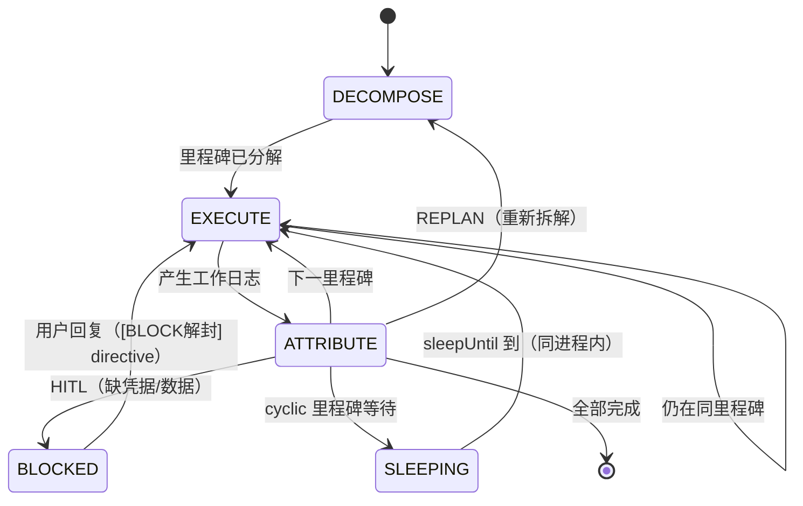
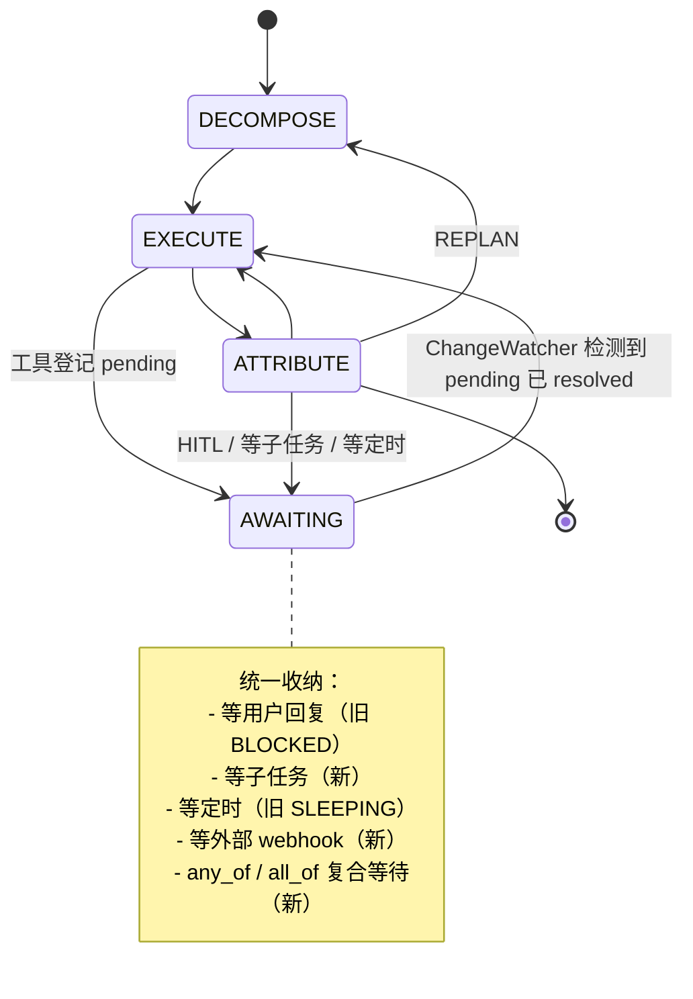

# Agent 数据状态机：核心架构（宪法）

> **本文档的地位**：这是 ultraKuroneko agent loop 的奠基性设计文档。后续所有对 agent 能力的扩展（异步、定时、子任务、协作、UI 交互……）必须按本文档第 §5 的"扩展协议"进行——**即：定义新的数据字段 + 定义新的状态机转移规则**，而不是新增进程、新增长连接、新增内存态。
>
> 本文档先确立设计、再驱动实施。先有共同语言，再改代码。
>
> **撰写日期**：2026-05-16 · **状态**：奠基 + P0–P4、P6 部分已落地（见 §10 路线图）

> **实施状态（2026-05-16）**：
> - ✅ `.brain/pendings.json` 数据契约（`packages/server/src/openkuroneko/pendings/`）
> - ✅ `ControllerMode.AWAITING` + tick 入口数据演进（`controller.ts`）
> - ✅ 异步工具 `ask_user` / `wait_timer` / `wait_signal`（`tools/definitions/async-wait.ts`）
> - ✅ BLOCKED / SLEEPING 自动迁移为 AWAITING + pending
> - ✅ ChangeWatcher 服务（`pi-mono/change-watcher.ts`，1s 轮询；timer 到期 resolve）
> - ⏳ **IM 入站确定性 resolve**（宪法 §6.2 IMWatcher → ADL `awaitingInboundResolver`，见 [`structurizr/INNER-BRAIN-AWAITING-LIFECYCLE.md`](./structurizr/INNER-BRAIN-AWAITING-LIFECYCLE.md)）
> - ⏳ **registry↔workDir 对账**（`is_post_complete` 时 registry 必须 DONE → `registryLifecycleReconcile`）
> - ✅ `GitBackedBrainFS`（isomorphic-git，`brain/git-store.ts`），workspace 每 tick 自动 commit
> - ✅ InnerBrainRegistry 加 `AWAITING` 状态；KPI hook 跳过 AWAITING 的 idle streak
> - ✅ 外脑 `send_directive(feedback)` 数据驱动直接 resolve `ask_user` pending
> - ✅ **`PendingItem.intent` 拟人意图**（§4.3.1）：LLM 挂 pending 时记下"内心独白",唤醒时回注上下文
> - ✅ cyclic 超限路径补 `safeArchive`（与 BLOCK / REPLAN_LIMIT 对齐）
> - ⏳ **P5 LLM round 级幂等**（`.brain/llm-history.json`，下一阶段）
> - ⏳ P6 跨 workspace 的 `kind=subtask` 与 SubtaskWatcher
> - ⏳ P8 reflexion 基于 git diff 重写

---

## 0. TL;DR

| 一句话 | 展开 |
|------|------|
| **数据是 agent 的本体** | Workspace 文件系统就是 agent。进程/loop 只是数据演化的一次投影。 |
| **进程是 stateless reducer** | `tick(state, event) → state'`，结束就退。不长持有任何状态。 |
| **数据演化即信号** | 数据文件变化本身就是"唤醒"。无需独立的唤醒/信号机制。 |
| **能力 = 字段 + 转移** | 异步、定时、子任务等所有"新能力"，都是给数据加字段 + 给状态机加转移规则。 |
| **Git = 演化史** | Workspace 是 git repo，每次 tick 提交一次。可回滚、可分叉、可对比。 |
| **不限制 LLM 用 git** | 故意允许 LLM 通过 shell 自由修改自身的 git 历史，期待自指涌现。 |

---

## 1. 核心哲学

### 1.1 重新定义 agent

**传统视角（错）**：
> Agent = 一个长跑的 loop 进程，loop 在内存里维护对话/计划/工具调用上下文，靠唤醒信号决定何时执行下一步。

**本架构（对）**：
> Agent = 一个 workspace（文件树）。  
> Loop / 进程 = 一次时间片的投影，它读取 workspace 现状、计算下一态、把下一态写回 workspace、退出。  
> 「现在 agent 处于哪种状态」= 直接读 workspace 文件。  
> 「agent 应该做什么」= 由 workspace 的当前数据决定，进程只是执行者。

### 1.2 一切都是 reducer

形式化：

```
tick : (S, e) → S'
```

其中：
- `S` = workspace 文件系统的当前快照（数据本体）
- `e` = 一个事件（用户消息、定时器到期、子任务返回、外部 webhook、上一次 tick 的产出……）
- `S'` = 演化后的新快照

进程做的事**只有这一件**：算出 `S'`，写盘，退出。

### 1.3 五条推论

| 推论 | 含义 |
|------|------|
| **进程零生命周期** | 进程不"运行中"也不"挂起"。开起来就跑一段 tick，结束就退。重启不丢任何东西，因为没东西在内存里。 |
| **唤醒 = 数据变化** | 不存在"唤醒信号"。数据变了，就有 watcher 起一段 tick；数据没变，整个系统是静默的。 |
| **持久化是 free** | 状态在磁盘上不是"持久化策略"，是默认行为。 |
| **水平扩展是 free** | 任何节点都能 pick up 任何 workspace 跑下一段 tick。 |
| **审计/回滚是 free** | Workspace 是 git repo，整个演化史可查、可分叉。 |

### 1.4 与"算法/进程视角"的对照

| 维度 | 进程视角（要避免） | 数据视角（本架构） |
|------|------|------|
| 等待外部回复 | 进程挂起、回调唤醒 | 写 pending 数据，进程退出，回复到达时写数据 → watcher 起新 tick |
| 定时任务 | 进程内 setTimeout 长持有 | 写 `execute_at` 字段，时钟扫描器到点改数据 → watcher 起新 tick |
| 失败恢复 | 进程崩了重连续点 | 进程崩了无所谓，最坏丢一帧 tick；磁盘永远是真相 |
| 多实例 | 共享内存/锁 | 同一 workspace 同一时刻只 spawn 一个 tick（文件锁），互不打扰 |
| 调试 | attach + 内存断点 | `git log` 一打开就是完整历史 |

---

## 2. 现状审计：我们已经走了多远

下表是 ultraKuroneko 现状对照本架构的目标差距。

### 2.1 已对齐 ✓

| 已做到 | 实现位置 |
|------|------|
| Phase 级状态机（`mode`） | `brain-fs.ts:ControllerState`、`controller.ts:tick()` |
| 每次 tick 先 readState 再 writeState | `controller.ts` 各 phase handler |
| 战略/战术/归因/约束/技能/知识 全在文件 | `.brain/*.md` + `.brain/*.json`（BrainFS） |
| EXECUTE→ATTRIBUTE 之间用 `execution-context.json` 持久传递 | `BrainFS.{read,write}ExecutionContext` |
| 服务器重启可恢复 in-flight 任务 | `autoResumeStaleTasks`（启动时扫注册表） |
| 工具副作用（创建/修改文件）天然持久 | tools 直接写盘 |
| KPI / Reflexion 链路 | `kpi-registry.json` + `<workDir>/.brain/reflexion.json` |

### 2.2 仍属进程视角 ✗（本文档要消除）

| 仍未对齐 | 现状 | 问题 |
|------|------|------|
| BLOCK 等用户回复 | `mode=BLOCKED` + 自由字符串 `blockedReason` | 没有结构化的 "等什么 / 等到何时 / 超时怎么办 / 结果落哪" |
| SLEEPING 定时 | `sleepUntil` 字段存在 | **没人扫**；只有同一进程活着才能 wake，进程退了就死在那 |
| EXECUTE 内层工具循环 | `runExecutor` 自己的 LLM round 循环全在内存 | tick 中途崩 = 当前 round 的"应该看到什么"丢失（工具副作用还在，但 LLM 视角断了） |
| 异步交互 | 只有 BLOCK 一种语义 | LLM 要问 3 个问题 = 3 次 BLOCK = 3 次"卡住找人"，很丑 |
| Git 历史 | 完全没有 | 没法回滚、没法分叉、没法对比 burst |
| ChangeWatcher | 不存在（只有 push-loop / 定时拉） | 数据变化没有统一驱动，依赖各路 ad-hoc 触发 |

### 2.3 结论

我们走了大约一半。Phase 级状态机的骨架是对的，但还有 4 个洞要补：
1. **统一的 pending 数据结构**（替代 BLOCK / SLEEPING 的散装实现）
2. **ChangeWatcher**（替代"靠进程活着维持等待"）
3. **Git 演化历史**（替代"只能往前不能回头"）
4. **LLM round 级幂等**（替代"tick 内层有内存态"）

---

## 3. 数据契约：什么构成 agent 的"身体"

`<workDir>/` 之下的全部文件构成一个 agent 的身体。下表枚举每个文件/字段的**语义、写入者、读取者、是否进入 git**。

### 3.1 战略层（外脑可写、内脑只读）

| 文件 | 语义 | 写入者 | 读取者 | git |
|------|------|------|------|-----|
| `.brain/goal.md` | 任务目标 | OuterBrain (`set_goal`)、自更新流程 | Decomposer / Executor / Attributor 全员 | ✓ |
| `.brain/identity.md` | Agent 身份/灵魂 pack | 启动时一次写入 | 全员 | ✓ |

### 3.2 战术层（内脑可写）

| 文件 | 语义 | 写入者 | 读取者 | git |
|------|------|------|------|-----|
| `.brain/milestones.md` | 当前里程碑分解 | Decomposer | Executor / Attributor | ✓ |
| `.brain/execution-context.json` | EXECUTE 阶段的临时工作区 | Executor | Attributor（下一 tick） | ✓ |
| `.brain/llm-history.json` *(规划)* | LLM round 级对话快照 | Executor / Attributor 每 round | 下一 round | ✓ |

### 3.3 归因层（Attributor 累加，长期资产）

| 文件 | 语义 | 写入者 | 读取者 | git |
|------|------|------|------|-----|
| `.brain/constraints.md` | 红线/失败教训 | Attributor | 后续所有任务 | ✓ |
| `.brain/knowledge.md` | 环境事实 | Attributor | 后续所有任务 | ✓ |
| `.brain/skills.md` + `.brain/skills/**` | 可复用技能 | Attributor + Drive9 同步 | 后续所有任务 | ✓ |

### 3.4 状态机层

| 文件 | 语义 | 写入者 | 读取者 | git |
|------|------|------|------|-----|
| `.brain/controller-state.json` | `mode` / `replanCount` / `cycleCount` / `sleepUntil` / `blockedReason` | Controller | Controller | ✓ |
| `.brain/pendings.json` *(规划)* | **所有挂起项**：等用户 / 等子任务 / 等定时 / 等外部 | Controller + ChangeWatcher | Controller + ChangeWatcher | ✓ |
| `.brain/reflexion.json` | 本次 burst 的反思摘要 | `runReflexion` | KPI hook + decomposer | ✓ |

### 3.5 IO 与产物层

| 文件 | 语义 | 写入者 | 读取者 | git |
|------|------|------|------|-----|
| `.brain/inbox.json` *(规划)* | 入站事件队列：用户回复、子任务返回、webhook | ChangeWatcher | Executor | ✓ |
| `<tempDir>/deliverables.json` | 本次 burst 显式登记的产物路径 | Executor (`register_deliverable`) | 外脑 onExit | ✓ |
| `.run/status.json` | 给外脑看的状态摘要 | Controller `syncStatus` | 外脑 / Dashboard | ✗ (frequent) |
| `.run/telemetry/trace.jsonl` | 调试日志 | 各路 | 调试 | ✗ |
| `.run/pi-mono/output` | 内外脑消息通道 | Controller | InnerBrainWorker → 外脑 | ✗ |

### 3.6 不进 git 的东西

`.run/`（高频小写）、临时 LLM 调试快照、原始 stdout/stderr 等。原则：

- 进 git 的：**真相**（state 的本体，回滚能用上的）
- 不进 git 的：**派生物**（可重算的、调试用的）

---

## 4. 状态机定义

### 4.1 当前 mode（已实现）



### 4.2 目标 mode（实施后）



**核心变化**：`BLOCKED` 与 `SLEEPING` 合并为统一的 `AWAITING`。区别只在 `.brain/pendings.json` 中各 pending 的 `kind` 字段。

### 4.3 Pending 数据结构

```jsonc
// .brain/pendings.json
[
  {
    "id": "pend-2026-05-16-001",
    "kind": "ask_user",
    "ctxRef": "tool_call:tc_abc123",
    "spec": {
      "prompt": "我需要 OAuth token，请提供",
      "channel": "discord:1234"
    },
    "deadline": "2026-05-17T10:00:00Z",
    "on_timeout": { "action": "block", "reason": "无 token 无法继续" },
    "status": "pending",
    "result": null
  },
  {
    "id": "pend-2026-05-16-002",
    "kind": "timer",
    "spec": { "execute_at": "2026-05-16T18:00:00Z" },
    "on_timeout": { "action": "resolve" },
    "status": "pending",
    "result": null
  },
  {
    "id": "pend-2026-05-16-003",
    "kind": "any_of",
    "children": ["pend-...001", "pend-...002"],
    "status": "pending",
    "result": null
  }
]
```

| 字段 | 说明 |
|------|------|
| `id` | workspace 内唯一 |
| `kind` | `ask_user` / `timer` / `subtask` / `http_poll` / `signal` / `any_of` / `all_of` |
| `ctxRef` | 关联回 LLM 的 tool_call_id（resume 时把 result 喂给 LLM） |
| `spec` | kind-specific 参数 |
| `deadline` / `on_timeout` | 兜底超时策略（`block` / `resolve_with_default` / `cancel`） |
| `status` | `pending` / `resolved` / `timed_out` / `cancelled` |
| `result` | resolved 后写入；下一次 tick 由 Executor 喂给 LLM |
| `intent` | **拟人意图**（可选）：LLM 创建 pending 时留下的"内心独白"，唤醒后回注 |

### 4.3.1 `intent` 字段：拟人映射的关键

**问题**：异步等待 / 定时巡检本质上是"跨多次 LLM 调用的连续思考"。
如果只把"结果"喂回 LLM、却丢掉"当初为什么这么挂"，LLM 每次唤醒都要**从零重新评估**——
这就既花钱又容易决策漂移。

**人类是怎么做的**：
人类设闹钟时，**当下**就在心里盘算"我设 10 分钟，是因为估计 Shiro 那时大概跑完编译；
醒来要看 tick 数有没有推进；如果没推进我就去翻 log"。
**不是闹钟响了再重新思考**——预案在设的时候就想好了。

**做法**：在 `PendingItem` 上加可选的 `intent` 字段，让 LLM **在调 `ask_user` / `wait_timer` /
`wait_signal` 时**就一并写入：

```jsonc
{
  "id": "pend-...",
  "kind": "wait_timer",
  "spec": { "execute_at": "..." },
  "intent": {
    "expectation": "估计 Shiro 10 分钟跑完编译",
    "success_signal": "Shiro tick 数 > 上次记录的值",
    "fallback": "连续 3 次未推进则升级为 ask_user"
  }
}
```

唤醒时，executor 把 `intent` 拼进 `## 等待已 resolved 的事件` 章节注入下一轮 LLM 上下文：

```
### pending=pend-... kind=timer status=resolved
  result: { "fired_at": "2026-05-16T18:00:00Z" }
  挂起时的意图(你当时的内心独白):
    - expectation: 估计 Shiro 10 分钟跑完编译
    - success_signal: Shiro tick 数 > 上次记录的值
    - fallback: 连续 3 次未推进则升级为 ask_user
```

并在 prompt 里**强制 LLM 按 expectation → success_signal → fallback 的顺序处理**。

**关键属性**：
- 不引入额外 LLM 调用（intent 就是 LLM 自己写的，唤醒时只是回注）
- 不引入新状态（`intent` 是 PendingItem 的可选字段，状态机不变）
- 完全符合 §5 能力扩展协议（只加数据字段，不加进程）
- 工具描述里**强烈建议**LLM 调用时填 intent；不填也能用，只是失去前后呼应

### 4.4 模式判定规则

```
读 pendings.json:
  - 全部 status != 'pending' 且 .controller-state.mode != AWAITING:
      → 按原 mode 走
  - 存在 status == 'pending' 的项 且 deadline 未过:
      → mode = AWAITING, hadWork = false, 进程退出
  - 存在 status == 'resolved' 的项 未消费:
      → mode = EXECUTE, 把 result 喂回 LLM
  - 存在 status == 'timed_out' 的项:
      → 按 on_timeout 策略走（可能进 BLOCKED / DECOMPOSE）
```

---

## 5. 能力扩展协议（最重要的一节）

**所有未来对 agent loop 的扩展，必须遵循以下模板**：

### 5.1 模板

> 引入一个新能力 `X`，等价于：
> 1. 定义新的数据字段（在 `.brain/` 下某个文件中），用以**承载** X 的状态；
> 2. 定义状态机的新转移规则，用以**演化** X 的状态；
> 3. 不引入任何**长持有的进程**、**内存态**、**外部唤醒信号**。

如果一个能力扩展的设计稿里出现"新起一个长跑进程"、"在内存里维护 X 的注册表"、"用 socket 推送信号"，**它就不符合本架构，要打回重设计**。

### 5.2 实例 A：异步问询（替代 BLOCK 的"找人"语义）

| 步骤 | 数据演化 | 状态机转移 |
|------|------|------|
| 1. LLM 调 `ask_user` 工具 | 写 pendings.json: 新增 `kind=ask_user` 项 | EXECUTE → AWAITING |
| 2. 进程退出 | — | — |
| 3. 用户回复（IM） | ChangeWatcher 把回复写进 inbox.json，找到对应 pending，写 `status=resolved` + `result` | — |
| 4. ChangeWatcher spawn 新 tick | — | AWAITING → EXECUTE |
| 5. Executor 读 pending result | 注入 LLM 对话（按 `ctxRef` 关联 tool_call_id） | continue EXECUTE |

**关键**：LLM 视角上这是一次同步工具调用（`tool_call` 然后下次 round 看到 `tool_result`）；但底层是跨进程的。

### 5.3 实例 B：定时任务（替代 SLEEPING）

| 步骤 | 数据演化 | 状态机转移 |
|------|------|------|
| 1. LLM 决定 1 小时后重新观察 | 写 pendings.json: `kind=timer`, `execute_at=now+3600s` | EXECUTE → AWAITING |
| 2. 进程退出 | — | — |
| 3. 时钟 ChangeWatcher 到点 | 写 `status=resolved` | — |
| 4. spawn 新 tick | — | AWAITING → EXECUTE |

**注意**：不存在"全局心跳每 N 秒扫一次"。时钟 ChangeWatcher 用**最小堆 + setTimeout** 实现，到点才触发，无空转。

### 5.4 实例 C：常态化任务（监督 Shiro）

外脑给 Kuroneko 一个 KPI：「持续监督 Shiro 的工作」。Kuroneko 内脑：

```
DECOMPOSE: 拆出里程碑 "每 10 分钟检查一次 Shiro 状态"
EXECUTE: 调用 shiro_status 工具读一次 → 调用 timer pending（10 分钟）→ 退出
AWAITING (10 min) → EXECUTE: 看到 timer resolved → 再调一次 shiro_status → 再 timer → ...
```

这个 loop 可以**永远跑下去**，进程一次只活几秒，期间 workspace 静静躺在磁盘上等下次时钟唤醒。**完全没有任何"心跳"或"长跑 cron"**。

### 5.5 实例 D：并行子任务

| 步骤 | 数据演化 | 状态机转移 |
|------|------|------|
| 1. LLM 调 `spawn_subtask`，3 个并行 | 写 pendings.json: 3 个 `kind=subtask` + 1 个 `kind=all_of` 引用前 3 个 | EXECUTE → AWAITING |
| 2. 3 个子任务（其实是 3 个独立 workspace）跑起来 | 每个子 workspace 独立演化 | — |
| 3. 每个子任务完成 | 父 workspace 的 pendings.json 对应项 `status=resolved` | — |
| 4. `all_of` 自动 resolved | — | — |
| 5. ChangeWatcher spawn 父 tick | 注入 3 个 result | AWAITING → EXECUTE |

### 5.6 实例 E：外部 webhook 触发

| 步骤 | 数据演化 |
|------|------|
| 1. LLM 注册一个 webhook URL（mode: 等支付到账） | 写 pendings.json: `kind=signal`, `signal_name=payment_received` |
| 2. 外部支付完成，HTTP POST 进来 | webhook handler 是 ChangeWatcher 的一种：把对应 pending `status=resolved` |
| 3. spawn 新 tick | 继续 |

### 5.7 实例 F：UI 双向交互（未来）

| 步骤 | 数据演化 |
|------|------|
| 1. LLM 调 `request_ui_form`，schema 写 spec | 写 pendings.json: `kind=ui_form` |
| 2. Dashboard 看到该 pending，渲染表单 | — |
| 3. 用户填完提交 | Dashboard 写 `status=resolved` + `result` |
| 4. spawn 新 tick | 继续 |

**这套模板对所有"等外部"的扩展都适用**，且**不需要改 controller 核心代码**——只需要扩 `kind` 枚举和 ChangeWatcher 的检测分支。

---

## 6. ChangeWatcher：数据驱动的唯一引擎

### 6.1 职责

ChangeWatcher 的全部职责：

> 监听数据变化（文件 / 时钟 / 外部事件），**修改 pendings.json 让某些项 status 变 resolved**，然后 spawn 一段 tick。

它**不持有 agent 状态**，不知道任何业务逻辑。它只是一个"数据触发器"。

### 6.2 多种触发源

**实现分工（2026-05-27 ADL，见 [`structurizr/INNER-BRAIN-AWAITING-LIFECYCLE.md`](./structurizr/INNER-BRAIN-AWAITING-LIFECYCLE.md)）**：

| 子模块（概念） | ADL 组件 | v1 实现 | 做啥 |
|------|----------|---------|------|
| **RegistryReconcile** | `registryLifecycleReconcile` | ⏳ 待实现 | `is_post_complete` 或已无 async 等待 → registry **DONE** |
| **TimerWatcher** | `changeWatcher`（tick 内） | ✅ 1s poll + `expireOverdue` | 到点把 timer pending 改 resolved |
| **IMWatcher** | `awaitingInboundResolver` | ⏳ 待实现（兜底：`send_directive`） | 人 IM → 同 thread 的 `ask_user` → resolved |
| **SpawnOrchestrator** | `changeWatcher` | ✅ `unconsumed resolved` → spawn | **不**在 IM 路径直接 spawn，避免双 spawn |
| SubtaskWatcher | — | ⏳ P6 | 子 workspace 完成 → 父 pending resolved |
| HTTPWatcher | — | ⏳ | webhook → pending resolved |

> **注意**：TimerWatcher 在宪法初稿写「最小堆」；当前实现为 **轮询**，ADL 已标注 v1 poll，后续可优化。

### 6.3 并发与锁

- 同一 workspace 同一时刻**至多一个 tick 在跑**（文件锁 `<workDir>/.brain/tick.lock`）
- ChangeWatcher 在 spawn tick 之前先取锁，取不到就放进延迟队列
- Tick 自己也会 spawn 出新 tick（如果当前 tick 结束时检测到还有未消费的 resolved），所以并发问题靠"串行 spawn"自然解决

### 6.4 为什么不是"心跳"

| 心跳方案 | ChangeWatcher |
|------|------|
| 每 N 秒扫一次，空转浪费 | 事件驱动，无事件就完全静默 |
| 单点 cron，挂了就死 | 多 watcher 互不依赖，任何一个挂了只影响一种事件源 |
| 错过 tick 难补偿 | 即使整段时间宕机，下次启动时扫 pendings.json `execute_at <= now` 即可补单 |
| 频率难选（高=浪费，低=延迟） | 频率由数据决定，下一个 timer 多远 setTimeout 多远 |

---

## 7. Git 作为数据演化史

### 7.1 设计要点

| 决策 | 原因 |
|------|------|
| 每个 workspace 是独立 git repo（`<workDir>/.git`） | 隔离、易删、不冲突 |
| 每次 `writeState` 之后自动 commit | 一次 tick = 一个 commit，对应一次数据演化 |
| Commit message 含 `mode / milestoneIndex / burstId / kpiId` | `git log` 即"执行历史" |
| `.brain/**` 全部进 git；`.run/**` 进 `.gitignore` | 真相进，派生物不进 |
| `secrets / tokens` 在 `.gitignore` | 安全 |
| **不限制 LLM 通过 shell 调本机 git** | 故意——见 §7.4 |

### 7.2 自动 commit 的实现切口

只需要包一层 `BrainFS`：

```ts
class GitBackedBrainFS extends BrainFS {
  override writeState(s: ControllerState, meta?: TickMeta) {
    super.writeState(s);
    this.git.commitAll(this.formatMsg(s, meta));
  }
}
```

实现用 `isomorphic-git`（纯 Node，跨平台，不依赖系统 git；与本机的 `hutao` 规则无冲突，因为这是 workspace 内部的 git，不涉及推送）。

### 7.3 解锁的能力

| 能力 | 用法 |
|------|------|
| **回滚** | 用户："昨天 17:00 那个决定不对" → `git revert <commit>` → 自动 spawn 一段 tick 让 agent 看到回滚后的世界 |
| **分叉** | Decomposer 想尝试 3 个方案 → 3 个分支并行跑 → 谁先 deliver merge 回 main |
| **对比** | Reflexion 看 `git diff <burst-1>..<burst-3> -- .brain/knowledge.md`，比读摘要强 |
| **审计** | 整段 `git log` 就是自然语言版的"agent 在干啥" |
| **复现** | clone workspace 给开发机，完整状态可重放 |
| **跨机器** | `git push/pull` workspace（如果以后要分布式） |

### 7.4 **不限制 LLM 用 git 的决定**（设计原则）

> LLM 在 EXECUTE 阶段可以调 `shell_exec` 工具，能执行任意 shell 命令，包括 `git`。**我们不打算限制它**。

理由：
1. **限不住**：任何沙箱都能被 exec 绕过（LLM 可以写脚本、改 PATH、用 node 调 isomorphic-git）。与其搞复杂的"安全 git API"，不如认了。
2. **自指可能涌现有趣行为**：让 agent 能修改自己的演化史，可能催生我们设计阶段想不到的策略（比如自己整理历史、自己 squash、自己开分支做实验）。
3. **可观测性补偿**：我们的自动 commit 会留下"框架视角"的 commit；LLM 自己的 git 操作也是 commit，作者可以区分（`Author: agent-self-modification`）。事后可审计。

**注意事项**（不是限制，是契约）：
- LLM 改 git 历史时，**不要硬删 commit**——它如果 force-push 自己的主分支，下一次 tick 启动时框架会检测 HEAD 跳变并记录到 `.brain/git-anomaly.log`，但不会阻止。
- 如果 LLM 把 workspace 玩坏了，由 reflexion / 外脑 / 用户来回收，不在框架层兜底。

### 7.5 关于 `hutao` 规则

本工作站约定 `git` 命令统一用 `hutao`（见 `.cursor/rules/git-use-hutao.mdc`）。这条规则**只约束开发者本人**（在 workspace 之外操作仓库时）。

- Workspace 内部的 git（用 isomorphic-git 实现）**不调用系统 `git` 或 `hutao`**，不受该规则影响。
- LLM 通过 `shell_exec` 调 git 时，用 `git` 还是 `hutao` 由 LLM 自己决定；workspace 内的 git repo 都是本地 repo，不涉及 push，两者等价。

---

## 8. LLM Round 级幂等（消除 tick 内的内存态）

### 8.1 问题

当前 `runExecutor` 内层有一个 LLM round 循环：

```
while (未到 stop_reason):
  call LLM
  执行 tool_calls
  把 tool results 喂回 LLM
```

整个循环的对话历史**只在内存里**。如果 tick 在循环中途崩了：
- 工具的文件副作用都还在（OK）
- 但 LLM 接下来"应该看到什么对话上下文"丢了
- 重启后 Executor 只能从头跑一遍这个里程碑的所有工具调用 → 重复副作用

### 8.2 解决

每个 LLM round 完成后立即落盘：

```jsonc
// .brain/llm-history.json
{
  "currentMilestone": "M2",
  "currentPhase": "EXECUTE",
  "rounds": [
    { "role": "system", "content": "..." },
    { "role": "user", "content": "<goal + context>" },
    { "role": "assistant", "tool_calls": [{ "id": "tc_1", "name": "read_file", ... }] },
    { "role": "tool", "tool_call_id": "tc_1", "content": "..." },
    { "role": "assistant", "tool_calls": [{ "id": "tc_2", ... }] },
    { "role": "tool", "tool_call_id": "tc_2", "content": "..." }
  ],
  "in_flight_pending": null   // 如果有 async pending,记录 tool_call_id
}
```

每完成一对 `(assistant, tool[*])` 就 append 写一次 + git commit 一次。重启时直接从 `rounds[]` 末尾续。

### 8.3 跟 pending 的衔接

当 LLM 调一个 pending 工具（比如 `ask_user`）：

1. 工具立刻返回一个 `{ status: "pending", pending_id: "..." }` 占位 result
2. 这个占位 result 也进 `llm-history.json`
3. Controller 把 `in_flight_pending` 设为 `tool_call_id`，pendings.json 新增一项
4. 进程退出，mode=AWAITING
5. ChangeWatcher 回来时，把 pending 的真实 result **覆盖** `llm-history.json` 中对应 `tool_call_id` 的 tool message
6. LLM 看不出区别，以为是一次正常的同步工具调用

---

## 9. 与现有子设计的对照

### 9.1 KPI / Reflexion

`packages/server/docs/kpi-reflexion-design.md` 已落地的 Phase A–D 完全符合本架构：

- `reflexion.json` 是数据
- `kpi-registry.json` 是数据
- Reflexion 触发完全由 burst onExit 这个"数据状态变化"驱动
- Meta reflexion burst 是另一段 spawn，不是常驻进程

将来的 Phase F/G 也按本文档 §5 模板做。

### 9.2 内外脑协议

`doc/inner-outer-protocol.md` §3.5 描述的 BLOCK（HITL）将退化成 `pendings.json` 的 `kind=ask_user` 实例。外脑的 `send_directive` 退化成"修改 pendings.json"。

### 9.3 Heartbeat 设计

`packages/server/docs/heartbeat-design.md` 描述的外脑 5 分钟心跳，**保留**——它是**外脑自身的"无外部输入也要醒一下"机制**，是基础设施级别的，跟用户任务无关。

用户任务的"定时"全部走本架构的 timer pending，**不复用外脑心跳**。

---

## 10. 路线图

按"先打地基、后改门面"的顺序：

| Phase | 内容 | 文件影响 | 风险 |
|------|------|------|------|
| **P0 数据契约文档** | 本文档 + 现有 doc 链接 | 仅文档 | 0 |
| **P1 Git 历史层** | GitBackedBrainFS wrapper，自动 commit | `brain-fs.ts` 加一层 | 低（纯增量，可灰度） |
| **P2 Pendings 数据结构** | `.brain/pendings.json` schema、`kind=ask_user` `kind=timer` 两种 | `brain-fs.ts` 加 read/writePendings | 中 |
| **P3 ChangeWatcher** | TimerWatcher + IMWatcher 两个最小实现 | 新模块 `pi-mono/change-watcher.ts` | 中 |
| **P4 退化 BLOCK / SLEEPING** | 把现有 BLOCKED/SLEEPING 改成 pending 实例；引入 AWAITING mode | `controller.ts` + `attributor.ts` + `block-resolver.ts` | 中-高（影响主路径） |
| **P5 LLM Round 落盘** | `.brain/llm-history.json` 写入 + 重启续跑 | `executor.ts` / `attributor.ts` | 高（粒度最细的改动） |
| **P6 子任务 pending** | `kind=subtask`、跨 workspace 的 SubtaskWatcher | `change-watcher.ts` + 子 workspace 协议 | 中 |
| **P7 LLM 自由用 git 的支持** | `shell_exec` 不拦截 git；commit message 标注 author | `shell_exec.ts` 工具 | 低 |
| **P8 反思读 diff** | Reflexion 改为基于 git diff 而非摘要 | `reflexion.ts` | 低 |

**实施纪律**：每个 Phase 完成后回头审视：「这次改动，我有没有违背本文档第 §5 的扩展协议？」如有违背，**重做**。

---

## 11. FAQ

### Q1：每次 tick 都 commit 一次，git 历史不会爆吗？

A：会很长，但 git 对小文件 delta 压缩很好。一个 workspace 跑 1000 次 tick 约 5-20 MB。配合定期 `git gc` 可控。

### Q2：如果两个 ChangeWatcher 同时 spawn tick 怎么办？

A：文件锁串行化。第二个会等。极端情况下退化为顺序执行——这正是我们想要的。

### Q3：LLM 把 workspace 玩坏了（比如把 goal.md 删了）怎么办？

A：自动 commit 让"玩坏前"的版本永远在 git 里。Reflexion / 外脑 / 用户可以 revert。这恰恰是本架构的好处。

### Q4：所有数据都在文件，性能撑得住吗？

A：一个 workspace 的状态文件总量 < 1 MB，读写一次毫秒级。比起 LLM 调用本身（秒级），完全可以忽略。

### Q5：分布式部署时同一 workspace 怎么协调？

A：本架构不假设分布式。Workspace 锁是单机文件锁。如果以后要分布式，方案是：
- Workspace 绑定到某个节点（一致性哈希）
- ChangeWatcher 在那个节点上 spawn tick
- 节点挂了时锁文件被另一节点接管

### Q6：如果一个 pending 永远等不到（外部系统不回复）？

A：每个 pending 必须有 `deadline` + `on_timeout`。TimerWatcher 会兜底把超时的 pending 改为 `status=timed_out`，状态机据此走 fallback 路径。

### Q7：本文档跟"绿场里程碑"什么关系？

A：本文档是**架构准则**，绿场里程碑是**业务功能**。两者正交：所有功能里程碑都必须遵守本架构的扩展协议。

---

## 12. 修订记录

| 日期 | 说明 |
|------|------|
| 2026-05-16 | 初版：哲学 + 现状审计 + pendings/ChangeWatcher/Git/LLM round 四大改造方向；明确"不限制 LLM 用 git"；明确"能力扩展 = 字段 + 转移规则"协议。 |
| 2026-05-16 | 实施 P0–P4、P6 部分：pendings 数据层、AWAITING 模式、异步工具、自动迁移 BLOCKED/SLEEPING、ChangeWatcher、GitBackedBrainFS、外脑 send_directive 数据驱动 resolve。134/137 测试通过（mem9 外部服务失败无关）。 |
