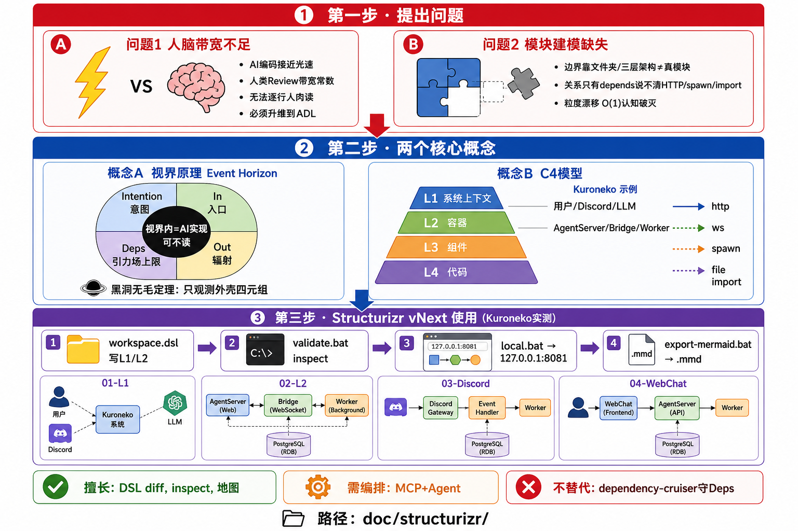
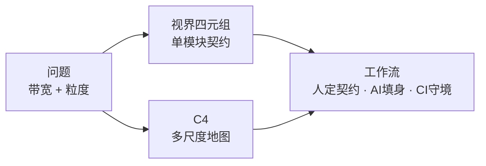

# AI 时代的人类注意力：问题 → 概念 → Structurizr 工具



---

## 第一步：提出问题

### 问题 1 — 人脑带宽不足

| 维度 | AI 辅助编码 | 人类理解 |
|------|-------------|----------|
| 速度 | 接近「光速」产出 | _review / 记忆带宽有限 |
| 后果 | 代码体积与变更频率暴涨 | 无法逐行人肉 Review |
| 结论 | 管理维度必须 **升维** 到架构描述层（ADL），而不是死磕实现细节 |

### 问题 2 — 缺少模块建模，关系与粒度不清

- **模块边界模糊**：文件夹、Controller-Service-DAO 等「行政分层」不等于可理解的模块。
- **关系类型含糊**：只能说「依赖」，说不清是 HTTP、子进程 spawn、共享目录还是 npm import。
- **粒度漂移**：业务扩大后某一层横向暴增，**O(1) 认知破灭**——看不清系统由哪些「可观测模块」组成。

> **要解决的是**：在任意局部尺度，人类面对的模块数量与每个模块的对外契约保持 **常数级（O(1)）**。

---

## 第二步：引入两个概念

### 概念 A — 模块的「视界原理」（Event Horizon）

理解模块 **不必** 进入内部实现；**只观测视界外壳** 四个维度：

| 维度 | 含义 | 类比 |
|------|------|------|
| **Intention** | 意图 / 对外不变量 | 质量 |
| **In** | 唯一合法控制流入口 | 电荷 |
| **Out** | 事件、副作用、可观测输出 | 角动量 |
| **Deps** | 允许依赖谁、依赖上限 | 引力场 |

视界 **之内**：AI 可任意填充实现，人类可不读。  
视界 **之外 + 外壳**：人类、CI、架构师 **唯一** 需要盯住的地方。

### 概念 B — C4 模型（结构化粒度）

C4 解决 **「画在什么粒度」** 的问题，与视界互补：

| 层级 | 回答的问题 | Kuroneko 示例 |
|------|------------|-----------------|
| **L1 系统上下文** | 谁在用系统？对外依赖谁？ | 用户、Discord、LLM、mem9、drive9 |
| **L2 容器** | 系统内有哪些可部署单元？ | Agent Server、Discord Bridge、Inner Worker… |
| **L3 组件** | 容器内 major 模块（可选） | OuterBrain、InnerBrainRegistry… |
| **L4 代码** | 类/文件（通常不画进架构图） | TypeScript 实现 |

**关系边应带类型**：`http` · `ws` · `spawn` · `file` · `import` — 而不是笼统的「depends on」。



---

## 第三步：Structurizr vNext 如何使用（Kuroneko 实测）

Structurizr 是 **「C4 模型 as code」** 工具：用 **DSL 文本** 写 L1/L2，浏览器看图，CI 做模型检查。

### 3.1 目录与核心文件

```text
doc/structurizr/
  workspace.dsl      # 权威架构模型（Kuroneko L1 + L2）
  local.bat            # 本地浏览器看图
  validate.bat         # 校验 DSL
  export-mermaid.bat   # 导出 .mmd
  run-war.bat          # 通用入口（需 Java 21 + .tools/structurizr.war）
  TOOLCHAIN.md         # 详细说明
```

### 3.2 本机快速使用（cmd，无需 PowerShell）

```bat
cd /d d:\kuroneko\doc\structurizr

stop-local.bat       REM 可选：释放 8081
local.bat            REM 浏览器打开 http://127.0.0.1:8081
validate.bat         REM 检查 DSL 是否合法
run-war.bat inspect -workspace workspace.dsl -severity error,warning
export-mermaid.bat   REM 生成 structurizr-*.mmd 到本目录
```

**注意**：

- `local` 必须带数据目录：脚本内使用 `java ... local .`（勿用 `"%~dp0"` 引号路径，会报错）。
- 默认端口 **8081**（避免 8080 冲突）。

### 3.3 已生成的四张视图

| 视图 | 文件（导出） |
|------|----------------|
| L1 系统上下文 | `structurizr-01-L1-SystemContext.mmd` |
| L2 全部容器 | `structurizr-02-L2-AllContainers.mmd` |
| L2 Discord 路径 | `structurizr-03-L2-Discord-path.mmd` |
| L2 WebChat 路径 | `structurizr-04-L2-WebChat-path.mmd` |

### 3.4 vNext 命令与分工（在整体闭环中的位置）

| 命令 | 用途 | 是否对照代码 |
|------|------|----------------|
| **local** | 交互看图、拖布局 | 否 |
| **validate** | DSL 语法/引用 | 否 |
| **inspect** | 模型 lint（缺 description、technology 等） | 否 |
| **export** | PlantUML / Mermaid | 否 |
| **MCP（可选）** | Agent 生成/改 DSL | 需自建 drift 流程 |

**国境守门**（Deps 是否越界）仍靠 **dependency-cruiser** 等，Structurizr **不替代**。

### 3.5 与「视界 + C4」的对应

| 概念 | Structurizr 中的落点 |
|------|----------------------|
| C4 L1/L2 | `workspace.dsl` 的 `softwareSystem` / `container` / `views` |
| 关系类型 | 边上的 `tags "http,spawn,..."` |
| Intention | 元素 `description`、文档块（`!docs` 可后续补） |
| Deps 上限 | `properties.path` + **另建** dependency-cruiser 规则 |
| 视界内实现 | **不在 DSL 里**，在 `packages/` / `apps/` 代码中 |

---

## 修订

| 日期 | 说明 |
|------|------|
| 2026-05-18 | 按「问题 → 视界 + C4 → Structurizr 用法」重排 |
| 2026-05-18 | 初版 |
