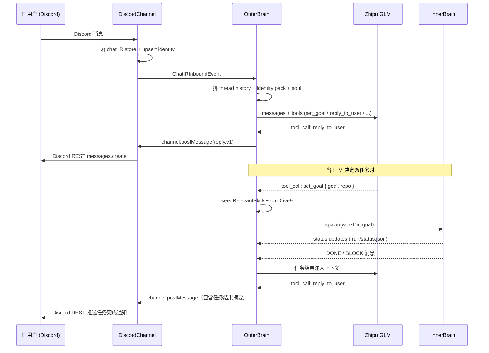

# 系统架构节点图

> 每个节点标注主要输入/输出。箭头方向 = 数据流方向。
>
> **架构准则**：所有 agent loop 的扩展须遵循 [`agent-data-state-machine.md`](./agent-data-state-machine.md)（数据即本体、进程即投影、能力 = 字段 + 转移规则）。本文档是该准则下的当前实现快照。

---

## 整体数据流

```mermaid
flowchart TD
    %% ─────────────────────────────
    %% 外部
    %% ─────────────────────────────
    User(["👤 用户\n(Discord 客户端)"])
    DiscordChannel["📡 DiscordChannel\npackages/discord-bridge\n─────────────\nimplements ChatIRChannel\nin:  Discord Gateway MESSAGE_CREATE\n     agent.postMessage\nout: ChatIRInboundEvent → OuterBrain\n     Discord REST messages.create\n     MessageRecord → threads.json"]
    ZhipuLLM["🤖 Zhipu AI (GLM)\npackages/server/src/zhipu\n─────────────\nin:  messages[], tools[]\nout: tool_call[] / text\n     reasoning_content (思考模型)"]

    OuterBrain["🧠 OuterBrain\nouter/outer-brain.ts\n─────────────\nin:  ChatIRInboundEvent\nout: StructuredReply → channel.postMessage\n     task → InnerBrainRegistry\n     memory writes → OuterMemory"]

    OuterLoop["🔄 OuterConversationLoop\nouter/outer-conversation-loop.ts\n─────────────\nin:  thread history + soul + identity pack\nout: LLM 调用 → ZhipuLLM\n     tool_call → OuterTools"]

    OuterTools["🛠 OuterTools\nouter/outer-tools.ts\n─────────────\ntools:\n  set_goal / set_kpi / view_kpi\n  reply_to_user   → ChatIRChannel.postMessage\n  list_inner_brains / send_directive\n  stop_inner_brain\n  query_knowledge → KnowledgeRetrieval\n─────────────\nin:  LLM tool_call\nout: spawn 指令 → IBRegistry\n     KPI hook onExit → KpiRegistry\n     reply → DiscordChannel"]

    KpiRegistry["📊 KpiRegistry\nouter/kpi-registry.json\n─────────────\nin:  set_kpi / burst onExit\nout: burstRunHistory, idleStreak\n     outcomeEvaluator → scheduleNextKpiBurst"]

    %% ─────────────────────────────
    %% 内脑管理
    %% ─────────────────────────────
    IBRegistry["📋 InnerBrainRegistry\nouter/inner-brain-registry.ts\n─────────────\nin:  spawn(goal, workDir)\n     stop(taskId)\nout: child process → IBWorker\n     status events → OuterBrain"]

    IBWorker["⚙️ InnerBrainWorker\npi-mono/inner-brain-worker.ts\n─────────────\nin:  OPENKURONEKO_WORK_DIR\n     OPENKURONEKO_OB_SKILL_POOL\n     DRIVE9_API_KEY\nout: .run/status.json\n     write_skill → drive9 / BrainFS\n     DONE / BLOCK 消息 → OuterBrain"]

    PiMono["🔁 Pi-mono Controller\npi-mono/run-tick.ts\n─────────────\n三阶段主循环:\n  DECOMPOSE  → 分解目标为步骤\n  EXECUTE    → 逐步执行工具\n  ATTRIBUTE  → 归因写 K/S/P\n─────────────\nin:  goal.md, skills seed, tools\nout: tool calls, status snapshots"]

    %% ─────────────────────────────
    %% 内脑工具集
    %% ─────────────────────────────
    ExecTools["🔧 Executor 工具集\n─────────────\nread_file / write_file / edit_file\nshell_exec / shell_exec_bg\nweb_search\nquery_available_skills → Drive9Provider\nget_skill_content\nrun_agent / stop_agent\nregister_deliverable"]

    AttrTools["📝 Attributor 工具集\n─────────────\nwrite_skill → BrainFS + drive9\nwrite_knowledge → BrainFS\nwrite_constraint → BrainFS"]

    %% ─────────────────────────────
    %% 记忆层
    %% ─────────────────────────────
    OuterMemory["💾 OuterMemoryStore\nouter/outer-memory.ts\n─────────────\nin:  addChatMessage(agentSid, msg)\n     upsertTask(agentSid, task)\nout: mem9 写入 (async)\n     任务列表 (内存缓存, 同步读)"]

    Mem9["☁️ mem9\nmem9.ai\n─────────────\n命名空间:\n  {sid}:chat   → 对话日志\n  {sid}:tasks  → 任务记录\n─────────────\nin:  store(content, agentId)\nout: search(query, agentId) → Memory[]\n注意: LLM 会图谱化 content"]

    %% ─────────────────────────────
    %% 技能层
    %% ─────────────────────────────
    AgentPool["🏊 AgentPool\nouter/agent-pool.ts\n─────────────\nseedRelevantSkillsFromDrive9:\n  in:  goal, workDir\n  out: drive9 grep → 本地 .brain/skills/\nmergeWorkDirSkillsToDrive9:\n  in:  workDir (任务完成后)\n  out: → drive9 /skills/shared/"]

    Drive9Store["📦 SkillDrive9Store\ndrive9/skill-drive9-store.ts\n─────────────\nin:  storeShared(SkillRecord)\n     searchShared(query)\nout: drive9 写文件 / grep 结果\n文件: /skills/shared/{id}.md"]

    Drive9Provider["🔍 Drive9SkillProvider\nskills/drive9-provider.ts\n─────────────\nin:  search(query)  [内脑运行中]\nout: SkillEntry[] + 原文缓存\n     → query_available_skills 工具"]

    Drive9["☁️ drive9\ndrive9.ai  /v1/fs/\n─────────────\n路径:\n  /skills/shared/{id}.md\n  /knowledge/{sid}/{id}.md (计划)\n  /constraints/{sid}/{id}.md (计划)\n─────────────\nin:  PUT 写文件 (原文不改写)\nout: GET 读文件\n     grep 语义搜索 (vector+BM25)\n     支持跨语言语义匹配"]

    BrainFS["📁 BrainFS (本地)\nopenkuroneko/brain/brain-fs.ts\n─────────────\n路径: workDir/.brain/\n  skills/{category}/{id}.md\n  knowledge/\n  constraints/\n  skills.md (索引)\n─────────────\nin:  write_skill / write_knowledge\nout: 本地文件读取 (内脑直接访问)"]

    RepoStore["🗄 RepositoryStore\nrepository/ + archive/\n─────────────\nin:  commit(session)\nout: retrieve(query) → K/S/P\n实现: 本地文件系统\n路径: data/{agent}/outer/"]

    KnowledgeRetrieval["🔎 KnowledgeRetrieval\nouter/knowledge-retrieval.ts\n─────────────\nin:  query\nout: K/S/P 片段 → 外脑上下文注入"]

    %% ─────────────────────────────
    %% 边
    %% ─────────────────────────────
    User -->|"Discord 消息"| DiscordChannel
    DiscordChannel -->|"ChatIRInboundEvent"| OuterBrain
    OuterBrain -->|"thread + identity"| OuterLoop
    OuterLoop -->|"messages + tools"| ZhipuLLM
    ZhipuLLM -->|"tool_call / text"| OuterLoop
    OuterLoop -->|"tool_call"| OuterTools
    OuterTools -->|"StructuredReply"| DiscordChannel
    DiscordChannel -->|"Discord REST"| User
    OuterTools -->|"spawn(goal)"| IBRegistry
    OuterTools -->|"set_kpi / attach"| KpiRegistry
    IBRegistry -->|"onExit → processBurstExitForKpi"| KpiRegistry
    KpiRegistry -->|"idle×N → meta burst"| IBRegistry
    IBRegistry -->|"child process"| IBWorker
    IBWorker -->|"goal + env"| PiMono
    PiMono -->|"executor tools"| ExecTools
    PiMono -->|"attributor tools"| AttrTools
    ExecTools -->|"search(query)"| Drive9Provider
    Drive9Provider -->|"grep(query)"| Drive9
    Drive9 -->|"SearchResult[]"| Drive9Provider
    Drive9Provider -->|"SkillEntry[] + content"| ExecTools
    AttrTools -->|"write local"| BrainFS
    AttrTools -->|"storeShared()"| Drive9Store
    Drive9Store -->|"PUT /skills/shared/"| Drive9
    IBWorker -->|"DONE/BLOCK"| OuterBrain
    OuterBrain -->|"addChatMessage\nupsertTask"| OuterMemory
    OuterMemory -->|"store(async)"| Mem9
    OuterTools -->|"set_goal 前 seed"| AgentPool
    AgentPool -->|"searchShared(goal)"| Drive9Store
    Drive9Store -->|"grep + read"| Drive9
    Drive9 -->|"文件原文"| Drive9Store
    Drive9Store -->|"SkillRecord[]"| AgentPool
    AgentPool -->|"写本地 .brain/skills/"| BrainFS
    IBWorker -->|"任务完成后 merge"| AgentPool
    AgentPool -->|"storeShared()"| Drive9Store
    OuterTools -->|"query_knowledge"| KnowledgeRetrieval
    KnowledgeRetrieval -->|"retrieve"| RepoStore
```



---

## 技能全链路（单独放大）

```mermaid
flowchart LR
    subgraph 内脑归因阶段
        A1["write_skill\n工具"] -->|"SkillRecord"| B1["BrainFS\n本地写入"]
        A1 -->|"storeShared\nfire-and-forget"| C1["SkillDrive9Store"]
    end

    subgraph 外脑 seed（内脑启动前）
        A2["execSetGoal\n(set_goal 工具)"] -->|"goal 文本"| B2["searchShared\n(drive9 grep)"]
        B2 -->|"SkillRecord[]"| C2["写 workDir\n.brain/skills/"]
    end

    subgraph 内脑运行中
        A3["query_available\n_skills 工具"] -->|"query"| B3["Drive9SkillProvider\n.search()"]
        B3 -->|"grep + read files"| D["☁️ drive9\n/skills/shared/"]
        D -->|"原文 Markdown"| B3
        B3 -->|"SkillEntry[]\n+ content cache"| A3
    end

    subgraph 外脑 merge（任务完成后）
        A4["onExit\ncallback"] -->|"读 .brain/skills/"| B4["mergeWorkDir\nSkillsToDrive9"]
        B4 -->|"storeShared\nfire-and-forget"| D
    end

    C1 --> D
```

---

## 外脑对话流（单独放大）



---

## 模块速查表

| 模块 | 文件 | 输入 | 输出 |
|------|------|------|------|
| **DiscordChannel** | `packages/discord-bridge/src/discord-channel.ts` | Discord Gateway / agent.postMessage | ChatIRInboundEvent → OuterBrain; Discord REST |
| **OuterBrain** | `outer/outer-brain.ts` | ChatIRInboundEvent | StructuredReply → channel, task spawn |
| **OuterConversationLoop** | `outer/outer-conversation-loop.ts` | thread + soul | LLM 调用结果 |
| **OuterTools** | `outer/outer-tools.ts` | LLM tool_call | IM 回复, 内脑 spawn |
| **InnerBrainRegistry** | `outer/inner-brain-registry.ts` | spawn/stop 指令 | child process |
| **InnerBrainWorker** | `pi-mono/inner-brain-worker.ts` | env vars + goal | status.json, deliverables |
| **Pi-mono Controller** | `pi-mono/run-tick.ts` | goal + tools | tool calls, K/S/P |
| **OuterMemoryStore** | `outer/outer-memory.ts` | chat/task events | mem9 写入 |
| **AgentPool** | `outer/agent-pool.ts` | goal / workDir | skill seed/merge |
| **SkillDrive9Store** | `drive9/skill-drive9-store.ts` | SkillRecord / query | drive9 读写 |
| **Drive9SkillProvider** | `skills/drive9-provider.ts` | query string | SkillEntry[] + content |
| **Drive9Client** | `drive9/drive9-client.ts` | path / query | 文件内容 / grep 结果 |
| **mem9** | `mem9/mem9-client.ts` | Memory 条目 | 语义搜索结果 |
| **drive9** | `drive9/drive9-client.ts` | Markdown 文件 | 原文 + 语义搜索 |
| **BrainFS** | `openkuroneko/brain/brain-fs.ts` | write ops | 本地 .brain/ 文件 |
| **RepositoryStore** | `repository/` + `archive/` | commit session | K/S/P 检索 |
| **KnowledgeRetrieval** | `outer/knowledge-retrieval.ts` | query | 知识片段 |
| **KpiRegistry** | `outer/kpi-registry.ts` | set_kpi, burst onExit | burstRunHistory, outcomeEvaluator |
| **KPI 闭环 ADL** | `doc/structurizr/KPI-BURST-OUTCOME-EVALUATOR.md` | — | burst 结果评估、KPI vs ad-hoc 分流 |
| **Agent 数据状态机（宪法）** | `doc/agent-data-state-machine.md` | — | 数据即本体；pendings + ChangeWatcher + git + LLM round 级幂等；扩展协议 |

---

## KPI 与 burst 结果评估（摘要）

长期目标走 **KPI + 多 burst**；权威 ADL：[`doc/structurizr/KPI-BURST-OUTCOME-EVALUATOR.md`](structurizr/KPI-BURST-OUTCOME-EVALUATOR.md)、[`KPI-CLOSED-LOOP.md`](structurizr/KPI-CLOSED-LOOP.md)。

- **Burst onExit**：`kpiBurstOutcomeEvaluator` 读 deliverables / `memory.json` / tool-logs → `burstRunHistory.outcomeEvaluation`。
- **KPI 续跑**：评估失败或 idle 达阈值 → `suggestedRetryCharter` + `scheduleNextKpiBurst` / `advance_kpi`（非 meta reflexion burst）。
- **Ad-hoc 任务**：onExit 仍走 `completionNotify` → 用户 IM；不写入 KPI registry。
- **BLOCK（HITL）**：`AWAITING` + `ask_user`；KPI burst 仍走 outcome 评估，不替代用户通知边界。

---

## 修订记录

| 日期 | 说明 |
|------|------|
| 2026-05-16 | 顶部引用 `agent-data-state-machine.md`（架构准则） |
| 2026-05-16 | 增加 KpiRegistry 节点、模块表与 KPI 摘要 |
| 2026-06-07 | KPI 摘要改为 outcomeEvaluator 路径；退役 reflexion 设计引用 |
| 2026-04-08 | 初版：整体数据流图、技能全链路、外脑对话序列、模块速查表 |
