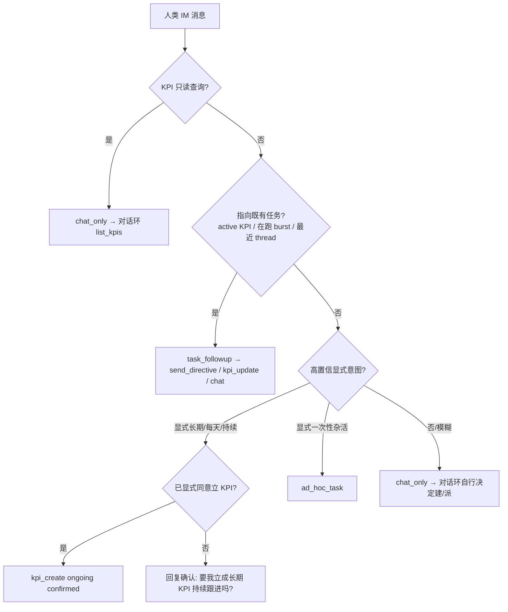

# IM 入站意图分流（ADL 权威）

> **English:** Inbound IM classification is an **advisory pre-pass**, not a hard gate. The **safe default is `chat_only`** — ambiguous messages flow to the LLM conversation loop, which owns the nuanced create/dispatch decision via tools. Only **high-confidence explicit** signals short-circuit. The pre-pass is **context-aware**: it reads active KPIs / in-flight bursts / recent thread to detect **follow-ups to existing work** and never mints a duplicate KPI. **Chat-triggered one-offs become ad-hoc tasks, not delivery KPIs.** Creating an **ongoing KPI** from chat requires **human confirmation**.

> 取代：[`KPI-ADVANCEMENT.md`](./KPI-ADVANCEMENT.md) §2「入站分流」（硬闸门 + 纯正则 + 默认偏 KPI 的旧语义）。  
> 与 `workspace.dsl` 视图 **`07-L3-Outer-Inbound-IM`** 同步。  
> 相关：[`KPI-MANAGER-LAYER.md`](./KPI-MANAGER-LAYER.md)（KPI 续派 / 失败熔断 R7）、[`INNER-BRAIN-IM-NOTIFY-BOUNDARY.md`](./INNER-BRAIN-IM-NOTIFY-BOUNDARY.md)（出站通知）。

---

## 0. 背景：旧设计为何失控

实测样本（2026-06-23 sandbox）中，两句**对既有任务的闲聊追问**各自被铸成一个 `delivery` KPI 并被心跳无限续派：

| 用户原话 | 旧行为 | 应有行为 |
|----------|--------|----------|
| 「我是说你再试一下启动刚下载的项目」 | 含 `启动` → `kpi_create`（delivery once）→ 5 burst | 跟进既有任务 → `send_directive` / chat |
| 「我看到你已经成功启动了…是这样么？」 | 含 `启动` → `kpi_create`（delivery once）→ 6 burst | 纯确认 → `chat_only` |

根因（设计层）：

1. **硬闸门短路对话** — 命中即回模板话并 `return`，LLM 永远看不到消息；误判不可恢复。
2. **纯正则当主体** — 设计本要求「LLM 结构化 + 规则兜底」，实现退化为纯正则。
3. **默认偏 KPI** — `启动/设定/新增` 等日常动词触发 create；`t.length>=8` 形同虚设。
4. **无上下文** — 看不到 active KPI / 在跑 burst / 最近对话；每句都是全新请求。
5. **`kpi_update` 死分支** — 分类器永不产出 → 每条 KPI 类消息都 create → 重复堆积。
6. **无确认** — 一句模糊话即自动建长期承诺并 spawn。
7. **delivery once 也被反复派** — IM 铸 delivery KPI，但管理器无 cadence、只看 `achieved`，模糊目标永不达成 → 无限续派。

本文重设计逐条消除 1–7。

---

## 1. 设计原则

| 原则 | 说明 |
|------|------|
| **P1 默认聊天** | 任何**模糊**消息 → `chat_only`，交 LLM 对话环。建 KPI / 派 ad-hoc 是**需要明确信号**的稀有分支，不是默认。 |
| **P2 软闸门** | 分流是**前置建议**，不是硬短路。仅**高置信显式**意图可直接路由；其余一律进对话环，由 LLM 用工具决定。 |
| **P3 上下文感知** | 分类前读 active KPI + 在跑 burst + 本 origin 最近 thread；**指向既有任务** → 跟进路径，绝不新建重复 KPI。 |
| **P4 一次性即 ad-hoc** | 聊天触发的短任务一律 `ad_hoc_task`（跑完归档，不续派）。**IM 不铸 `delivery` KPI**；KPI 专留长期/周期。 |
| **P5 长期需确认** | 从聊天建 `ongoing` KPI 必须**人类确认**（除非消息已显式「立成长期/持续/每天」）。 |
| **P6 LLM 主裁 + 正则兜底** | 高置信走确定性正则；低/中置信交 LLM（对话环工具或结构化分类），正则仅作兜底信号。 |

---

## 2. 意图模型

```typescript
type ImInboundIntent =
  | { kind: 'chat_only' }                                           // 默认；含 KPI 只读查询
  | { kind: 'task_followup'; ref: ExistingWorkRef; note: string }   // 新增：指向既有任务/KPI
  | { kind: 'ad_hoc_task'; goal: string }                           // 一次性杂活（跑完归档）
  | { kind: 'kpi_update'; kpiId: string; note: string }             // 更新既有 KPI（真正会产出）
  | { kind: 'kpi_create'; description: string; ongoing: true;       // 仅长期/周期；需确认
      confirmed: boolean };

interface ExistingWorkRef {
  kind: 'burst' | 'kpi';
  id: string;             // instanceId 或 kpiId
  matchReason: string;    // 'recent_thread' | 'deictic_followup' | 'explicit_id'
}
```

变化点（对旧模型）：

- **新增 `task_followup`**（消除 D4）；
- **`kpi_create` 收窄为 `ongoing` only + `confirmed` 字段**（消除 D6/D7：一次性走 ad-hoc）；
- **`kpi_update` 必带 `kpiId`** 且分类器真正会产出（消除 D5）。

---

## 3. 分流决策（替代旧 §2 流程图）



| 意图 | 触发 | 行为 | 禁止 |
|------|------|------|------|
| `chat_only` | 默认 / KPI 只读查询 / 模糊 | 进对话环；LLM 可用工具自行 `create_kpi`/`set_goal`/`advance_kpi` | 前置层不得替 LLM 决定建 KPI |
| `task_followup` | 指向 active KPI / 在跑 burst / 最近 thread 的追问 | `send_directive`（有在跑 burst）或 `kpi_update`（有对应 KPI）或 `chat_only` 报状态 | **新建任何 KPI / burst** |
| `ad_hoc_task` | 高置信一次性杂活 | `adHocBurstAllocator.create`（无 kpi_id，跑完归档） | 铸 delivery KPI |
| `kpi_update` | 指向既有 KPI 的补充/修订 | `kpiRegistry.update(kpiId)` + 一次 `advanceKpi` | 新建重复 KPI |
| `kpi_create` | **显式**长期/周期 **且** 已确认 | `kpiRegistry.create({ kind:'ongoing' })` + 一次 `advanceKpi` | 未确认即建；铸 delivery |

**未确认的长期意图**：不建 KPI，回一句确认问句，等用户下一条明确同意 → 再走 `kpi_create(confirmed)`。确认状态可由「上一条是确认问句 + 本条肯定回复」判定，或 LLM 在对话环内调 `create_kpi` 工具完成（P6）。

---

## 4. 软闸门：调用契约（替代硬 `return`）

`outerBrainFacade` 在对话环之前调 `inboundKpiRouter`，但语义改为：

```text
routed = routeInboundKpiOrAdHoc(deps, content)
if routed.shortCircuit:        # 仅 high-confidence 显式 ad-hoc / kpi_update / kpi_create(confirmed)
    post(routed.replyText); return
else:
    # task_followup 已执行 send_directive 等副作用，但 **不 return**
    # 把 routed.hint（候选意图 + 既有任务引用）作为提示注入对话环
    continue to conversation loop with routed.hint
```

关键差异：

- **`chat_only` / 低置信** → 不 `return`，进对话环（消除 D1）。
- **`task_followup`** → **不新建任何 KPI/burst**，进对话环让 LLM 回应（既有 burst 的 ask_user 由 `awaitingInboundResolver` 处理）。  
  *（P1 实现）* `handled=false` 软交接；自动 `send_directive` 转发到在跑 burst 为后续增强（P2/P3）。
- **仅** `ad_hoc_task` / `kpi_update` / `kpi_create(confirmed)` 这类**高置信显式**意图才 `shortCircuit + return`（`handled=true`）。

> **实现状态（2026-06-23 P1/P2 已落地）：** 收窄正则 + 默认 chat + `task_followup`（软交接）+ 上下文去重降级 `kpi_update` + IM 只产 `ongoing` KPI。`handled` 字段即「是否短路」，故 outer-brain Step 3.4 无需改动。确认闸（`confirmed` 往返）为 P3；P1 对高置信显式意图 `confirmed=true` 直接处理。

---

## 5. 上下文感知（消除重复 KPI）

`inboundKpiRouter` 在分类前组装**轻量上下文**（只读）：

| 来源 | 用途 |
|------|------|
| `kpiRegistry.listActive()` | 是否已有同 origin / 近似 description 的 active KPI（去重 + `kpi_update` 目标） |
| `innerBrainRegistry.list()`（RUNNING/AWAITING，按 originUser/originThread） | 是否有在跑 burst → `task_followup` 派 `send_directive` |
| 最近 N 条本 thread 消息 | 指代消解：「再试一下」「怎么样了」「是这样么」属追问 |

**跟进信号**（deictic / 无新显式任务）示例：`再试|再来|继续|怎么样了?|好了吗|是这样|对不对|刚才那个|那个项目`。命中且存在既有任务引用 → `task_followup`，**不进 create 分支**。

**去重**：`kpi_create` 前若已存在同 originUser + 描述相似度 ≥ 阈值的 active KPI → 降级为 `kpi_update`。

---

## 6. 正则收窄（兜底层，P6）

旧 `KPI_CREATE_SIGNAL_RE` 含 `启动/设定/新增/建立/创建` 等日常动词 → 误触发。新兜底正则只保留**显式长期/周期**标记：

```text
KPI_CREATE_EXPLICIT_RE = /持续|长期|常驻|每天|每日|定期|周期|常态|监控|简报|情报体系|任务线|立(个|一个)?KPI|长期跟进/
```

- 去掉裸 `启动/设定/新增`；`建立/创建` 仅在**同时**出现 KPI/长期/周期词时才算高置信。
- `t.length` 阈值不再作为「够长就建」依据；改为**显式信号**驱动。
- 中/低置信（仅出现单个弱信号）→ `chat_only`，由对话环 LLM 决定（P1/P2）。

---

## 7. 与 KPI 管理器边界

| 关注点 | 归属 |
|--------|------|
| IM 文本 → 意图（含上下文 + 去重 + 跟进） | 本文 `imIntentClassifier` + `inboundKpiRouter` |
| 一次性任务 burst（无 kpi_id，跑完归档） | `adHocBurstAllocator` |
| KPI 续派 / 多 burst / 失败熔断（R7） | [`KPI-MANAGER-LAYER.md`](./KPI-MANAGER-LAYER.md) §3 |
| KPI 是否 achieved/abandoned | `kpiCompletionJudge` |

**delivery KPI 不再由 IM 路径产生**；若历史/Ops 仍存在 delivery KPI，其续派由 KPI 管理器按 R1/R7 处置（见 KPI-MANAGER-LAYER）。

---

## 8. ADL 组件

| 模块 ID | 路径 | 职责 |
|---------|------|------|
| `imIntentClassifier` | `outer/inbound/im-intent-classifier.ts` | 上下文感知意图分类（chat/followup/ad-hoc/kpi_update/kpi_create）；正则兜底 + (P6) LLM |
| `inboundKpiRouter` | `outer/inbound/inbound-kpi-router.ts` | 组装只读上下文 → 分类 → 软闸门路由（shortCircuit vs hint） |
| `adHocBurstAllocator` | `outer/ad-hoc-burst-allocator.ts` | 一次性 burst（无 kpi_id） |

---

## 9. 测试计划（[`COMPONENT-TEST-MAP.md`](./COMPONENT-TEST-MAP.md)）

| 模块 | 单测 | 组件测 |
|------|------|--------|
| `imIntentClassifier` | ⏳ 默认 chat / 跟进识别 / 收窄正则 / 去重降级 | ⏳ inbound fixture |
| `inboundKpiRouter` | ⏳ 软闸门（chat 不 return；followup 派指令仍进环） | ⏳（已有 `inbound-kpi-router.component.integration.test.ts`，需扩 followup/confirm 用例） |

**关键回归用例**（复现样本）：

1. 「再试一下启动刚下载的项目」+ 存在在跑 burst → `task_followup`（`send_directive`），**不建 KPI**。
2. 「是这样么？」+ 最近 thread 有任务 → `chat_only`，**不建 KPI**。
3. 「建立台湾情报常态收集，每天中午晚上汇报」→ `kpi_create(ongoing, confirmed=false)` → 回确认问句；用户「好，立吧」→ `kpi_create(confirmed=true)`。
4. 「帮我查一下今天天气」→ `ad_hoc_task`。
5. 同 origin 已有近似 active KPI，再发类似长期请求 → `kpi_update`（不重复建）。

---

## 10. 实现分期

| 阶段 | 内容 |
|------|------|
| **P0（设计）** | 本文 + DSL 组件/视图 + catalog + test-map（structurizr-first step 1） |
| **P1** | `imIntentClassifier` 收窄正则 + 默认 chat + `task_followup`；`inboundKpiRouter` 软闸门（chat/followup 不 return） |
| **P2** | 上下文感知（active KPI / 在跑 burst / thread）+ 去重降级 `kpi_update` |
| **P3** | 长期 KPI 确认闸（确认问句 ↔ 肯定回复）；(可选) LLM 结构化分类 |

---

## 11. 变更记录

| 日期 | 说明 |
|------|------|
| 2026-06-23 | 初版：软闸门 + 默认聊天 + task_followup + 一次性即 ad-hoc + 长期需确认 + 正则收窄；取代 KPI-ADVANCEMENT §2 |
