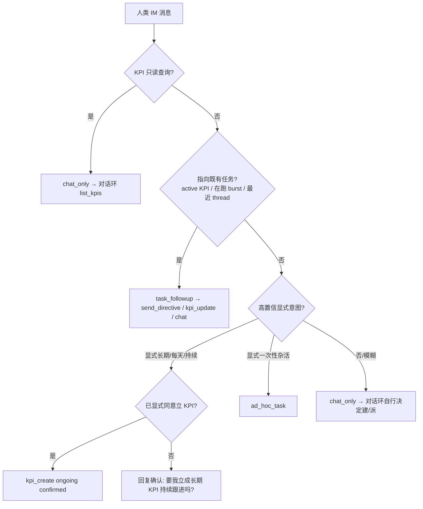

# IM 入站意图分流（ADL 权威）

> **English (方案一, 2026-06-24 — authoritative):** The inbound pre-pass **no longer dispatches anything**. It is reduced to a **read-only context assembler**: it gathers active KPIs + in-flight bursts for this origin and injects them as an **advisory block** into the conversation loop. The **conversation-loop LLM is the sole decider** of create/dispatch/follow-up, using its existing tools (`set_goal` one-shot · `set_kpi` create · `advance_kpi` · `send_directive`). It already runs with full context, so it reads "介绍一下自己" and just answers; it only calls a tool when genuinely needed. No extra LLM call, no regex hard-gate, no irrecoverable misclassification. Safety guards (KPI spawn capacity, R7 failure circuit, dispatch guard, KPI reuse/dedup) stay at the **tool-execution layer**, independent of who triggers them.

> **只读状态快指令（2026-07-21）：** `状态` / `进度` 与 `密度` / `今天` 是确定性的只读查询，可在对话 LLM 前短路回复。它们不分类业务意图、不建 KPI、不派 burst；只读取 `innerBrainRegistry`、`kpiRegistry`、autonomy policy，避免调用昂贵的 `brain-inspector` / 全量日志。详见 §4.1。

> **历史语义（已被方案一取代）：** 软闸门 + 高置信显式意图短路派发。保留 §0–§7 作为演进记录与回归用例来源；**派发契约以 §4 方案一为准**。

> 取代：[`KPI-ADVANCEMENT.md`](./KPI-ADVANCEMENT.md) §2「入站分流」（硬闸门 + 纯正则 + 默认偏 KPI 的旧语义）。  
> 与 `workspace.dsl` 视图 **`07-L3-Outer-Inbound-IM`** 同步。  
> 相关：[`KPI-MANAGER-LAYER.md`](./KPI-MANAGER-LAYER.md)（KPI 续派 / 失败熔断 R7）、[`INNER-BRAIN-IM-NOTIFY-BOUNDARY.md`](./INNER-BRAIN-IM-NOTIFY-BOUNDARY.md)（出站通知）。

---

## 0. 背景：旧设计为何失控

实测样本（2026-06-23 sandbox）中，两句**对既有任务的闲聊追问**各自被铸成一个 `delivery` KPI 并被心跳无限续派：

| 用户原话 | 旧行为 | 应有行为 |
|----------|--------|----------|
| 「我是说你再试一下启动刚下载的项目」 | 含 `启动` → `kpi_create`（delivery once）→ 5 burst | 跟进既有任务 → `send_directive` / chat |
| 「我看到你已经成功启动了…是这样么？」 | 含 `启动` → `kpi_create`（delivery once）→ 6 burst | 纯确认 → `chat_only` |

根因（设计层）：

1. **硬闸门短路对话** — 命中即回模板话并 `return`，LLM 永远看不到消息；误判不可恢复。
2. **纯正则当主体** — 设计本要求「LLM 结构化 + 规则兜底」，实现退化为纯正则。
3. **默认偏 KPI** — `启动/设定/新增` 等日常动词触发 create；`t.length>=8` 形同虚设。
4. **无上下文** — 看不到 active KPI / 在跑 burst / 最近对话；每句都是全新请求。
5. **`kpi_update` 死分支** — 分类器永不产出 → 每条 KPI 类消息都 create → 重复堆积。
6. **无确认** — 一句模糊话即自动建长期承诺并 spawn。
7. **delivery once 也被反复派** — IM 铸 delivery KPI，但无 Calendar commitment、只看 `achieved`，模糊目标永不达成 → 无限续派。

本文重设计逐条消除 1–7。

---

## 1. 设计原则

| 原则 | 说明 |
|------|------|
| **P1 默认聊天** | 任何**模糊**消息 → `chat_only`，交 LLM 对话环。建 KPI / 派 ad-hoc 是**需要明确信号**的稀有分支，不是默认。 |
| **P2 软闸门** | 分流是**前置建议**，不是硬短路。仅**高置信显式**意图可直接路由；其余一律进对话环，由 LLM 用工具决定。 |
| **P3 上下文感知** | 分类前读 active KPI + 在跑 burst + 本 origin 最近 thread；**指向既有任务** → 跟进路径，绝不新建重复 KPI。 |
| **P4 一次性即 ad-hoc** | 聊天触发的短任务一律 `ad_hoc_task`（跑完归档，不续派）。**IM 不铸 `delivery` KPI**；KPI 专留长期/周期。 |
| **P5 长期需确认** | 从聊天建 `ongoing` KPI 必须**人类确认**（除非消息已显式「立成长期/持续/每天」）。 |
| **P6 LLM 主裁 + 正则兜底** | 高置信走确定性正则；低/中置信交 LLM（对话环工具或结构化分类），正则仅作兜底信号。 |
| **P7 派发下沉对话环（方案一，2026-06-24）** | **前置层不派发任何任务/KPI**，只做只读上下文装配并注入对话环。`set_goal`/`set_kpi`/`advance_kpi`/`send_directive` 全部由**对话环 LLM** 调用。P2 软闸门里 `ad_hoc_task`/`kpi_update`/`kpi_create(confirmed)` 的「短路派发」被取消（见 §4）。 |

---

## 2. 意图模型

```typescript
type ImInboundIntent =
  | { kind: 'chat_only' }                                           // 默认；含 KPI 只读查询
  | { kind: 'task_followup'; ref: ExistingWorkRef; note: string }   // 新增：指向既有任务/KPI
  | { kind: 'ad_hoc_task'; goal: string }                           // 一次性杂活（跑完归档）
  | { kind: 'kpi_update'; kpiId: string; note: string }             // 更新既有 KPI（真正会产出）
  | { kind: 'kpi_create'; description: string; ongoing: true;       // 仅长期/周期；需确认
      confirmed: boolean };

interface ExistingWorkRef {
  kind: 'burst' | 'kpi';
  id: string;             // instanceId 或 kpiId
  matchReason: string;    // 'recent_thread' | 'deictic_followup' | 'explicit_id'
}
```

变化点（对旧模型）：

- **新增 `task_followup`**（消除 D4）；
- **`kpi_create` 收窄为 `ongoing` only + `confirmed` 字段**（消除 D6/D7：一次性走 ad-hoc）；
- **`kpi_update` 必带 `kpiId`** 且分类器真正会产出（消除 D5）。

---

## 3. 分流决策（替代旧 §2 流程图）



| 意图 | 触发 | 行为 | 禁止 |
|------|------|------|------|
| `chat_only` | 默认 / KPI 只读查询 / 模糊 | 进对话环；LLM 可用工具自行 `create_kpi`/`set_goal`/`advance_kpi` | 前置层不得替 LLM 决定建 KPI |
| `task_followup` | 指向 active KPI / 在跑 burst / 最近 thread 的追问 | `send_directive`（有在跑 burst）或 `kpi_update`（有对应 KPI）或 `chat_only` 报状态 | **新建任何 KPI / burst** |
| `ad_hoc_task` | 高置信一次性杂活：**祈使请求**（`帮我/帮忙/麻烦你/替我 + 动作`）或明确产物指代（`这张图/这个文件/这份文档/顺便`） | `adHocBurstAllocator.create`（无 kpi_id，跑完归档） | 铸 delivery KPI；**裸口语助词触发** |
| `kpi_update` | 指向既有 KPI 的补充/修订 | `kpiRegistry.update(kpiId)` + 一次 `advanceKpi` | 新建重复 KPI |
| `kpi_create` | **显式**长期/周期 **且** 已确认 | `kpiRegistry.create({ kind:'ongoing' })` + 一次 `advanceKpi` | 未确认即建；铸 delivery |

**未确认的长期意图**：不建 KPI，回一句确认问句，等用户下一条明确同意 → 再走 `kpi_create(confirmed)`。确认状态可由「上一条是确认问句 + 本条肯定回复」判定，或 LLM 在对话环内调 `create_kpi` 工具完成（P6）。

> **`ad_hoc_task` 信号精度（2026-06-23 修）：** `ad_hoc_task` 会**短路对话环**直接派发内脑实例，属强动作，**只能靠高置信祈使信号触发**。曾把裸口语助词 **`一下`** 列入信号 → 「介绍**一下**自己」「说**一下**看法」被误判成派任务（D8）。**禁止**用 `一下/帮忙看看` 等口语高频词单独触发；ad-hoc 须满足「`帮我/帮忙/麻烦你/替我` + 动作动词」或明确产物指代。模糊一概落 `chat_only`，由对话环 LLM 自行决定是否用工具。

---

## 4. 方案一：派发下沉对话环（调用契约，权威）

**决策（2026-06-24）：** 取消前置层一切「短路派发」。`outerBrainFacade` Step 3.4 不再调用会产生副作用的分流；改为只读上下文装配 + 注入对话环。**派发由对话环 LLM 用工具完成。**

```text
# Step 3.4（方案一后）：只读、零副作用、绝不 return
ctx = assembleInboundContext(deps, originUser, threadId)
    activeKpis = kpiRegistry.listActive(createdBy=originUser)   # 去重提示
    liveBursts = innerRegistry.live(originThread|originUser)    # 追问/指令目标
inboundHint = renderAdvisoryBlock(ctx)        # 注入 fullContext 给对话环

# Step 5：对话环 LLM 看到 inboundHint + 全历史，自行决定：
#   - 「介绍一下自己」「怎么样了?」「是这样么?」 → 直接回答，不调工具
#   - 真要派一次性杂活            → set_goal(...)
#   - 真要建长期 KPI             → set_kpi(kind='ongoing') [+ advance_kpi]
#   - 补充/修订既有 KPI          → advance_kpi(kpiId) / 在描述里说明
#   - 追问在跑 burst             → send_directive(instanceId, ...)
```

关键差异（对旧软闸门）：

- **前置层不再 `dispatchAdHocBurst` / `kpiRegistry.create` / `advanceKpi`**——这些副作用全部移交对话环工具。
- **不再有 `handled=true` 短路**：所有人类消息都进对话环（除既有的 KPI 只读查询仍可由 LLM 用 `list_kpis` 答）。
- **`task_followup` 转 `send_directive`** 也由 LLM 决定（它在 `inboundHint` 里看到「有在跑 burst ib-x」）。
- **去重**不靠前置分类器：`inboundHint` 列出 active KPIs，LLM 倾向 `advance_kpi`/在原 KPI 上补充而非新建；`set_kpi`/`set_goal` 工具层另有 KPI 复用/spawn 容量/R7 兜底（§7）。
- **无 LLM key 时**：不派发（Step 4 已有降级回复）。派发本就需要语言理解，前置正则派发的「不依赖 key」并非真实收益。

**`inboundHint` 建议格式（注入 fullContext 顶部）：**

```text
【入站上下文（只读，供你决策；不强制动作）】
- 本人 active KPI：{kpiId} {desc 摘要} …（无则「无」）
- 在跑/等待 burst：{instanceId} {goal 摘要} status={RUNNING|AWAITING} …（无则「无」）
- 提示：模糊/寒暄/自我介绍直接回答；确需长期跟进才 set_kpi；一次性杂活用 set_goal；
        追问在跑任务用 send_directive；切忌为闲聊新建 KPI 或重复已存在的 KPI。
```

> **分类器去向：** `imIntentClassifier` 退出派发关键路径，**不再决定动作**。可选保留为 `inboundHint` 的弱提示来源（`isKpiQueryIntent` 等），由 `UTLRA_INBOUND_CLASSIFIER_HINT=0` 关闭。回归用例（§9）转为「对话环 LLM 在该上下文下应如何动作」的期望，前置层只断言**零副作用 + 注入了正确上下文**。

### 4.1 只读状态快指令（当前进度 / 24h 任务密度）

状态查询不是派发决策，不需要 LLM。`agentStatusChatCommand` 在 participation policy 之后、awaiting resolver 与 conversation loop 之前识别**整句命令**：

| 命令 | 输出 | 数据源 |
|---|---|---|
| `状态` / `进度` / `/status` / `/progress` | active KPI、RUNNING/AWAITING、最近完成/失败、可用容量 | registry + KPI + `hasAvailableCapacity` |
| `密度` / `今天` / `/density` / `/today` | 过去 24h 执行槽位时长、等待时长、槽位利用率、完成/失败数、最活跃 KPI | registry 的 `startedAt` / `finishedAt` / status |

约束：

1. 只匹配 trim 后的整句命令，普通句子如「今天写什么」仍进入对话环；
2. 快照只读 registry 与 policy；禁止读取 `brain-inspector`、pi logs、milestones 或 workspace 全目录；
3. `RUNNING` 区间从 `startedAt` 算至当前时刻；终态算至 `finishedAt`（缺失时用当前时刻并标为估算）；
4. AWAITING 单独统计等待时长，不计入执行槽位密度；
5. 执行密度 = 24h 内任务执行时长之和 ÷ (`windowMs × maxRunningInnerBrains`)；上限 100%；
6. 快指令只回复当前 channel/thread，不改变 KPI、pending、Calendar 或数字员工循环状态。

---

## 5. 上下文感知（消除重复 KPI）

`inboundKpiRouter` 在分类前组装**轻量上下文**（只读）：

| 来源 | 用途 |
|------|------|
| `kpiRegistry.listActive()` | 是否已有同 origin / 近似 description 的 active KPI（去重 + `kpi_update` 目标） |
| `innerBrainRegistry.list()`（RUNNING/AWAITING，按 originUser/originThread） | 是否有在跑 burst → `task_followup` 派 `send_directive` |
| 最近 N 条本 thread 消息 | 指代消解：「再试一下」「怎么样了」「是这样么」属追问 |

**跟进信号**（deictic / 无新显式任务）示例：`再试|再来|继续|怎么样了?|好了吗|是这样|对不对|刚才那个|那个项目`。命中且存在既有任务引用 → `task_followup`，**不进 create 分支**。

**去重**：`kpi_create` 前若已存在同 originUser + 描述相似度 ≥ 阈值的 active KPI → 降级为 `kpi_update`。

---

## 6. 正则收窄（兜底层，P6）

旧 `KPI_CREATE_SIGNAL_RE` 含 `启动/设定/新增/建立/创建` 等日常动词 → 误触发。新兜底正则只保留**显式长期/周期**标记：

```text
KPI_CREATE_EXPLICIT_RE = /持续|长期|常驻|每天|每日|定期|周期|常态|监控|简报|情报体系|任务线|立(个|一个)?KPI|长期跟进/
```

- 去掉裸 `启动/设定/新增`；`建立/创建` 仅在**同时**出现 KPI/长期/周期词时才算高置信。
- `t.length` 阈值不再作为「够长就建」依据；改为**显式信号**驱动。
- 中/低置信（仅出现单个弱信号）→ `chat_only`，由对话环 LLM 决定（P1/P2）。

---

## 7. 与 KPI 管理器边界

| 关注点 | 归属 |
|--------|------|
| IM 文本 → 意图（含上下文 + 去重 + 跟进） | 本文 `imIntentClassifier` + `inboundKpiRouter` |
| 一次性任务 burst（无 kpi_id，跑完归档） | `adHocBurstAllocator` |
| KPI 续派 / 多 burst / 失败熔断（R7） | [`KPI-MANAGER-LAYER.md`](./KPI-MANAGER-LAYER.md) §3 |
| KPI 是否 achieved/abandoned | `kpiCompletionJudge` |

**delivery KPI 不再由 IM 路径产生**；若历史/Ops 仍存在 delivery KPI，其续派由 KPI 管理器按 R1/R7 处置（见 KPI-MANAGER-LAYER）。

---

## 8. ADL 组件

| 模块 ID | 路径 | 职责（方案一后） |
|---------|------|------|
| `inboundContextAssembler` | `outer/inbound/inbound-kpi-router.ts` `assembleInboundContext` + `renderInboundHint` | **只读**装配 active KPIs + live bursts → 生成 `inboundHint`；**零副作用** |
| `agentStatusChatCommand` | `outer/inbound/agent-status-chat-command.ts` + `outer/agent-activity-snapshot.ts` | 整句状态命令 → 轻量当前进度 / 24h 密度回复；**零副作用、无 LLM** |
| `imIntentClassifier` | `outer/inbound/im-intent-classifier.ts` | 退出派发关键路径；可选作 `inboundHint` 弱提示（`isKpiQueryIntent` 等），不决定动作 |
| 对话环工具 | `outer/outer-tools.ts` `OUTER_TOOL_DEFS` | `set_goal`/`set_kpi`/`advance_kpi`/`send_directive` — **唯一派发入口** |
| `adHocBurstAllocator` | `outer/ad-hoc-burst-allocator.ts` | 一次性 burst（无 kpi_id），由 `set_goal` 工具调用 |

---

## 9. 测试计划（[`COMPONENT-TEST-MAP.md`](./COMPONENT-TEST-MAP.md)）

| 模块 | 单测 | 组件测 |
|------|------|--------|
| `imIntentClassifier` | ✅ `im-intent-classifier.test.ts`（默认 chat / 跟进 / 收窄正则 / 去重降级 / D8）—退出关键路径后仅作模块/弱提示 | — |
| `inboundContextAssembler` | — | ✅ `inbound-kpi-router.component.integration.test.ts`（只读上下文 + hint + **零副作用**）+ `outer-brain-inbound-kpi-router.integration.test.ts`（前置不派发 → 流入对话环，无 key 降级） |
| `agentStatusChatCommand` | ✅ `agent-activity-snapshot.test.ts` + `agent-status-chat-command.test.ts`（整句匹配、进度、24h 密度、AWAITING 不计执行密度）+ `inner-brain-registry.test.ts`（statusHistory） | ✅ `outer-brain-inbound.integration.test.ts`（无 LLM 也能命令短路；普通聊天不拦截） |

**关键回归用例**（复现样本）：

1. 「再试一下启动刚下载的项目」+ 存在在跑 burst → `task_followup`（`send_directive`），**不建 KPI**。
2. 「是这样么？」+ 最近 thread 有任务 → `chat_only`，**不建 KPI**。
3. 「建立台湾情报常态收集，每天中午晚上汇报」→ `kpi_create(ongoing, confirmed=false)` → 回确认问句；用户「好，立吧」→ `kpi_create(confirmed=true)`。
4. 「帮我查一下今天天气」→ `ad_hoc_task`。
5. 同 origin 已有近似 active KPI，再发类似长期请求 → `kpi_update`（不重复建）。
6. **（D8 回归）**「你们分别介绍一下自己」「分别自我介绍」「说一下你的看法」→ `chat_only`，**不得**派 `ad_hoc_task`（裸 `一下` 不再是 ad-hoc 信号）。

---

## 10. 实现分期

| 阶段 | 内容 |
|------|------|
| **P0（设计）** | 本文 + DSL 组件/视图 + catalog + test-map（structurizr-first step 1） |
| **P1** | `imIntentClassifier` 收窄正则 + 默认 chat + `task_followup`；`inboundKpiRouter` 软闸门（chat/followup 不 return） |
| **P2** | 上下文感知（active KPI / 在跑 burst / thread）+ 去重降级 `kpi_update` |
| **P3** | 长期 KPI 确认闸（确认问句 ↔ 肯定回复）；(可选) LLM 结构化分类 |
| **P4（方案一，2026-06-24）** | 取消前置短路派发：`inboundKpiRouter` → 只读 `assembleInboundContext` + `renderInboundHint`；`set_goal`/`set_kpi`/`advance_kpi`/`send_directive` 由对话环 LLM 调用；分类器退出关键路径 |

---

## 11. 变更记录

| 日期 | 说明 |
|------|------|
| 2026-06-23 | 初版：软闸门 + 默认聊天 + task_followup + 一次性即 ad-hoc + 长期需确认 + 正则收窄；取代 KPI-ADVANCEMENT §2 |
| 2026-06-23 | 修 D8：`ADHOC_SIGNAL_RE` 剔除裸 `一下`（误把「介绍一下自己」派成 ad-hoc 任务）；ad-hoc 须高置信祈使（`帮我/帮忙/麻烦你/替我`+动作）或产物指代 |
| 2026-06-24 | **方案一（P4）**：取消前置层短路派发，派发决策下沉对话环 LLM 工具；`inboundKpiRouter` 降为只读上下文装配 + `inboundHint`；分类器退出关键路径（§4 为权威契约，§0–§3 留作演进/回归来源） |
| 2026-07-21 | 新增只读状态快指令：`状态/进度` 查询当前快照，`密度/今天` 查询 24h 执行槽位利用率；无 LLM、无副作用、禁止走 brain-inspector。 |
