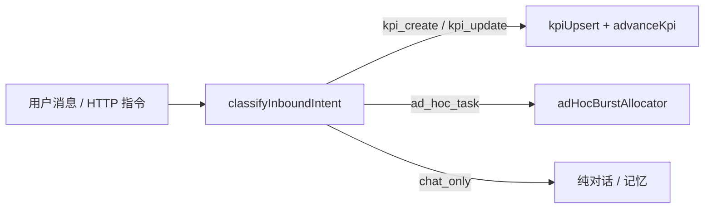

# KPI 推进与 Burst 调度（历史）

> **⚠️ 历史文档，非现行调度权威。**
> - 2026-06-07：被 [`KPI-MANAGER-LAYER.md`](./KPI-MANAGER-LAYER.md) 取代（扁平 KPI、多 burst、无 sub-KPI / canonical）。
> - 2026-07-21：自主推进再被 [`DIGITAL-EMPLOYEE-AUTONOMY.md`](./DIGITAL-EMPLOYEE-AUTONOMY.md) 取代（容量驱动 + Calendar + SelfWorkPolicy；心跳仅 watchdog）。
>
> 文中 `cadence` / `strategyPlanner` / `focusOrder` / 心跳即时派 / 长 `wait_timer` 等均为历史方案，**不得按本文实现**。

> **English (historical):** Outer brain **owns long-horizon sustainability**. Inner brain stays **sprint-shaped** (LLM closure bias). Chat inbound is classified (**KPI vs ad-hoc**); heartbeat **traverses KPI tree** and **advances** leaf KPIs whose slot is idle. Sub-KPIs are **split on first advancement**; each leaf has an independent **reused burst instance** and **run history**.

> 与 `workspace.dsl` 视图 **`10b-L3-Outer-KPI`**、**`11-L3-Outer-Autonomy`**、**`07-L3-Outer-Inbound-IM`** 同步。  
> 取代/修订：[`KPI-CLOSED-LOOP.md`](./KPI-CLOSED-LOOP.md) §「外脑 set_goal 派 burst」为默认路径；[`INNER-BRAIN-SINGLE-INSTANCE.md`](./INNER-BRAIN-SINGLE-INSTANCE.md) 粒度升为 **per leaf sub-KPI**；[`INNER-BRAIN-AWAITING-LIFECYCLE.md`](./INNER-BRAIN-AWAITING-LIFECYCLE.md) §ongoing 例外见本文 §5。

---

## 1. 设计原则

| 原则 | 说明 |
|------|------|
| **P1 内脑冲刺** | 每轮 EXECUTE 只靠近目标一小步；里程碑完成 → DONE 是**正常**行为，不是缺陷 |
| **P2 外脑续航（历史）** | 旧：按 cadence 再派 sprint。**现行**：`employeeCalendar` 管业务定时；`digitalEmployeeLoop` 有容量即找活 |
| **P3 双通道入站** | IM 内容**先分类**：KPI 走登记 + 推进；一次性杂活走 **ad-hoc burst**（无 `kpi_id`） |
| **P4 子 KPI 首拆** | 父 KPI 创建时**不**预拆子树；**第一次** `advanceKpi` 时完成子 KPI 拆解 |
| **P5 槽位语义（历史）** | 旧：DONE/AWAITING 视为可再派。**现行**：RUNNING 才占执行容量；ask_user 只挡依赖项 |
| **P6 复用不新建** | 同一 leaf sub-KPI 的多轮 sprint **复用** canonical `instanceId` + `workDir`，只追加 **run 历史** |

---

## 2. 入站分流（IM / HTTP）

> **⚠️ 已由 [`IM-INBOUND-INTENT-ROUTING.md`](./IM-INBOUND-INTENT-ROUTING.md) 取代**（2026-06-23）：本节描述的「硬闸门短路 + 纯正则 + 默认偏 KPI + 一次性铸 delivery KPI」语义存在结构性缺陷（误判不可恢复、闲聊追问被铸 KPI 后无限续派）。新设计：**软闸门 + 默认 chat_only + task_followup 跟进识别 + 一次性即 ad-hoc + 长期 KPI 需确认**。以下保留历史细节供对照。



| 意图 | 行为 | 禁止 |
|------|------|------|
| `kpi_create` / `kpi_update` | 写入 `kpiRegistry`（父 KPI）→ **一次** `kpiAdvancer.advance(parentOrLeaf)` | 外脑 LLM **不得** `set_goal(kpi_id)` 绕过推进器 |
| `ad_hoc_task` | `adHocBurstAllocator.create({ goal })`：新 instance、**无** `kpi_id`、做完归档 | 把长期任务塞进 ad-hoc |
| `chat_only` | 回复 / 记忆；不派 burst；**含 KPI 只读查询**（汇报/列出/查看当前 KPI → `list_kpis`） | — |

**分类器**：`imIntentClassifier`（LLM 结构化输出 + 规则兜底）。  
长期/周期/监督/「每天」「持续」/「建立…」等 → KPI create；「汇报/查看**当前** KPI」→ **chat_only**（禁止误建 KPI）；「帮我查一下」「改这张图」→ ad-hoc。

实现落点：`outer/inbound/im-intent-classifier.ts` → `outer-conversation-loop` 在 tool 环之前调用。

---

## 3. KPI 树与子 KPI 首拆

### 3.1 记录模型（扩展 `KpiRecord`）

```typescript
type KpiCadence =
  | { type: 'once' }
  | { type: 'interval'; everyMs: number }
  | { type: 'cron'; expr: string; tz: string }
  | { type: 'continuous'; minGapMs: number };

interface KpiRecord {
  kpiId: string;
  parentKpiId?: string;
  children?: string[];           // 父节点维护；仅 leaf 可 dispatch
  isLeaf: boolean;               // 父节点 false；首拆后子节点 true
  kind: 'delivery' | 'ongoing';
  cadence: KpiCadence;
  status: 'active' | 'paused' | 'achieved' | 'abandoned';
  description: string;
  charter?: string;              // 战略层 / 推进器写入的「下一发 sprint 章程」
  nextDueAt?: string;
  canonicalInstanceId?: string;  // 本 leaf 的复用 burst（见 §4）
  burstRunHistory: BurstRunRecord[]; // 见 §6
  bursts: string[];              // 兼容：canonical instanceId 列表（length ≤ 1 per leaf）
  // burstRunHistory, momentum, consecutiveIdleBursts, …
}
```

### 3.2 首拆时机

```text
1. IM 识别为 KPI → create 父 KPI（isLeaf=false, children=[]）
2. kpiAdvancer.advance(parentId) 首次被调用
3. subKpiDecomposer(parent) → LLM/规则 产出 N 个 leaf 子 KPI + cadence
4. 父 KPI 保持 active，isLeaf=false，不再直接 dispatch
5. 对每个新 leaf：若 isCadenceDue → 立即 advance(leaf)
```

**示例**（台湾情报）：

```text
父 kpi-tw「台湾六维情报体系」
├── 子 kpi-tw-collect   interval 3h   ongoing
└── 子 kpi-tw-brief     cron 12,21 CST   ongoing
```

子 KPI 拆解输入：父 `description` + 用户 `notes` +（可选）战略 `charter`；输出写入 registry 并持久化。

模块：`outer/kpi/sub-kpi-decomposer.ts`

---

## 4. Burst 复用机制（per leaf sub-KPI）

| 轮次 | 行为 |
|------|------|
| **首次** advance(leaf) | `generateInstanceId()` → register → `canonicalInstanceId` 写入 KPI → spawn |
| **后续** advance(leaf) | **不**新 register；`patchCanonicalForContinuation` + 新 `goal`/`charter` → spawn 同一 instance |
| **preempt**（AWAITING 被外脑抢槽） | stop worker → 当前 run 记 `PREEMPTED` → 清 timer pending（保留 ask_user）→ 再 spawn |

规则对齐 [`INNER-BRAIN-SINGLE-INSTANCE.md`](./INNER-BRAIN-SINGLE-INSTANCE.md) R1–R5，但 **canonical 绑定 leaf `kpiId`**，不再绑定父 KPI。

**并行**：不同 leaf sub-KPI **可同时**各有一个 RUNNING burst；同一 leaf **至多一个** RUNNING（`BLOCKED`/`ask_user` 见 §5）。

模块：`outer/kpi/burst-reuse.ts`（`findCanonicalForLeaf`、`patchAndRespawn`）

---

## 5. 槽位空闲判定（ongoing LOOP 核心）

### 5.1 今日 vs 目标

| registry.status | 今日 `LIVE_KPI_BURST_STATUSES` | **ongoing leaf 新语义** |
|-----------------|--------------------------------|-------------------------|
| RUNNING | 占槽 | 占槽 |
| BLOCKED | 占槽 | 占槽（需外脑介入） |
| AWAITING | 占槽 | **空闲**（可推进）※ |
| DONE | 不占槽 | **空闲** |

※ **例外**：`brainAsyncSnapshot.hasAskUserPending === true` → **仍占槽**（等人类，不抢派）。

### 5.2 `isKpiSlotIdle(leafKpi, registry, workDir)`

```typescript
// 伪代码
if (!leafKpi.isLeaf || leafKpi.status !== 'active') return false;
const rec = registry.get(leafKpi.canonicalInstanceId);
if (!rec) return true;  // 从未派过
if (rec.status === 'RUNNING' || rec.status === 'BLOCKED') return false;
if (rec.status === 'DONE') return isCadenceDue(leafKpi);
if (rec.status === 'AWAITING') {
  const snap = buildBrainAsyncSnapshot(rec.workDir);
  if (snap.hasAskUserPending) return false;
  return isCadenceDue(leafKpi);  // timer 等待不算占槽
}
return false;
```

### 5.3 再派时 AWAITING 的抢占

`ongoing` 叶子到期且 registry=AWAITING（仅 timer pending）：

1. `preemptBurst(instanceId)` — SIGTERM / registry reconcile  
2. append `BurstRunRecord { exitStatus: 'PREEMPTED' }`  
3. `advanceKpi` 写入新 charter → respawn  

**内脑不再承担长周期节拍**；`wait_timer` 仅用于 **单次 sprint 内**短等待（限速、短 retry），不用于「睡到 21:00 汇报」。

修订：[`brain-async-snapshot.ts`](../packages/server/src/outer/brain-async-snapshot.ts) 对外脑 prompt；删除「ongoing 靠内脑 timer 续跑」指引。

---

## 6. Burst 执行历史（外脑可读）

外脑推进下一发 sprint 前必须能读到 **同一 burst instance 内的多轮执行史**。

### 6.1 `BurstRunRecord`（存 `kpi.burstRunHistory[]`）

```typescript
interface BurstRunRecord {
  runId: string;
  instanceId: string;
  kpiId: string;
  startedAt: string;
  finishedAt: string;
  exitStatus: 'DONE' | 'AWAITING' | 'ERROR' | 'PREEMPTED' | 'ABORTED';
  charter: string;              // 本轮下发给内脑的章程摘要
  ticks: number;
  deliverableCount: number;
  outcomeEvaluation?: BurstOutcomeEvaluation; // 见 KPI-BURST-OUTCOME-EVALUATOR.md
  toolLogSpan?: { from: string; to: string }; // inner/tool-logs 日期文件 + 行号范围
}
```

### 6.2 组装来源（只读聚合，非新真相源）

| 来源 | 用途 |
|------|------|
| `TaskRecord` + onExit | 时间、ticks、exitStatus |
| `kpiBurstOutcomeEvaluator` | `outcomeEvaluation`（successConfirmed、failureReasons、charter 建议） |
| `inner/tool-logs/<ws>/` | 工具调用轨迹（[`TASK-RUN-OBSERVABILITY.md`](./TASK-RUN-OBSERVABILITY.md)） |
| `.brain/memory.json` | `node_results` / `last_failure`（过程报告） |
| `register_deliverable` 计数 | deliverableCount |

模块：`outer/kpi/burst-run-history.ts` — `appendBurstRunOnExit`、`formatBurstRunDigest(kpiId, n)`  
消费方：`kpiAdvancer`（写下一发 charter）、`strategyPlanner`、`view_kpi` / `read_inner_status` 扩展字段。

---

## 7. KPI 推进器（心跳主循环）

### 7.1 `kpiAdvancer.tick(ctx)`

```text
for leaf in traverseLeafKpis(focusOrder, momentum):
  if !isKpiSlotIdle(leaf): continue
  if !isCadenceDue(leaf): continue
  if leaf.consecutiveIdleBursts >= threshold: pivotCharterViaOutcomeEvaluator(leaf); continue
  dispatchKpiSprint(leaf)   // burst-reuse + charter + spawn
```

触发点：

- **心跳** idle 路径（`autonomyPipeline` 在战略阶段之后）  
- **`burst_exit`** 回调尾（同 tick 可再 advance 其它 leaf）  
- **IM** `kpi_create` / `kpi_update` 后立刻 `advance` 一次  

### 7.2 与战略层边界

| 模块 | 职责 |
|------|------|
| `strategyPlanner` | WHY/HOW、`focusOrder`、父 KPI `paused`、`charter` 建议、子 KPI 合并/暂停建议 |
| `kpiAdvancer` | **何时派**、**派哪 leaf**、**复用 instance**、写 run 历史 |
| `kpiBurstHooks` | onExit：trail、momentum、idle streak；**不**决定 ongoing 是否续派（交给 advancer） |

### 7.3 新心跳顺序（修订 [`OUTER-HEARTBEAT-OVERSIGHT.md`](./OUTER-HEARTBEAT-OVERSIGHT.md) §0）

```text
0. 死亡检测
0b. kpiCompletionJudge.sweep
1. resourceProbe + autonomyJudge
2. strategyPlanner（REFLECT+DESIGN）
3. kpiAdvancer.tick(focusOrder)          ← 主派遣
4. adHocQueue.flush()
5. staleBurstReaper
6. 完全 idle → casual_chat
```

**弱化**：`autonomyTaskDispatcher` 内 LLM 自由 `set_goal` 推进 KPI；改为只处理 ad-hoc 队列与闲聊。

---

## 8. Ad-hoc 一次性任务

```typescript
interface AdHocTask {
  taskId: string;
  goal: string;
  originThread?: string;
  originUser: string;
  status: 'pending' | 'running' | 'done';
  instanceId?: string;
}
```

- 不占 KPI 槽位；占 `maxRunningInnerBrains`  
- 无 `burstRunHistory` 进 KPI；可选 `data/ad-hoc-tasks.json` 审计  
- 完成后 DONE，不续派  

模块：`outer/ad-hoc-burst-allocator.ts`

---

## 9. ADL 组件

| 模块 ID | 路径 | 职责 |
|---------|------|------|
| `imIntentClassifier` | `outer/inbound/im-intent-classifier.ts` | IM → kpi / ad_hoc / chat |
| `subKpiDecomposer` | `outer/kpi/sub-kpi-decomposer.ts` | 首次 advance 拆 leaf + cadence |
| `kpiCadence` | **已删除**（2026-06-07）；**现行**业务定时 = `employeeCalendar`（见 DIGITAL-EMPLOYEE-AUTONOMY.md） |
| `kpiSlotIdle` | `outer/kpi/kpi-slot-idle.ts` | ongoing DONE/AWAITING 槽位判定 |
| `burstReuse` | `outer/kpi/burst-reuse.ts` | canonical 复用 + preempt |
| `burstRunHistory` | `outer/kpi/burst-run-history.ts` | run 记录聚合与 digest |
| `kpiAdvancer` | `outer/kpi/kpi-advancer.ts` | 心跳遍历 + dispatch |
| `adHocBurstAllocator` | `outer/ad-hoc-burst-allocator.ts` | 一次性 burst |

---

## 10. 测试计划（[`COMPONENT-TEST-MAP.md`](./COMPONENT-TEST-MAP.md)）

| 模块 | 单测 | 组件测 |
|------|------|--------|
| `imIntentClassifier` | ⏳ | ⏳ inbound IM fixture |
| `subKpiDecomposer` | ⏳ FakeLLM | — |
| `kpiCadence` | ⏳ cron/interval | — |
| `kpiSlotIdle` | ⏳ DONE/AWAITING/ask_user | — |
| `burstReuse` | ⏳ 续跑 + preempt | ⏳ spawn mock |
| `burstRunHistory` | ⏳ append + digest | — |
| `kpiAdvancer` | ⏳ tick 遍历 | ⏳ heartbeat integration |
| `adHocBurstAllocator` | ⏳ | ⏳ |

---

## 11. 迁移与兼容

| 项 | 处理 |
|----|------|
| 现有 flat `KpiRecord` | `_normalize` 补 `isLeaf:true`、`burstRunHistory:[]`、`cadence:{type:'once'}` |
| `set_goal(kpi_id)` | 废弃为 KPI 推进路径；保留运维 API 转调 `kpiAdvancer.advance` |
| `UTLRA_KPI_AUTO_NEXT_BURST` | ongoing 由 advancer 替代；delivery 可保留至迁移完成 |
| shiro 类多 workspace | 合并到 leaf canonical + 历史 run 记 PREEMPTED/ABORTED |

---

## 12. 修订记录

| 日期 | 说明 |
|------|------|
| 2026-06-07 | 初版：IM 双通道、首拆子 KPI、burst 复用、ongoing 槽位 DONE/AWAITING=空闲、burstRunHistory |
| 2026-06-07 | 实现：`kpiAdvancer` 接线心跳；`advance_kpi` 工具；`set_goal(kpi_id)` 封禁；Ops API 改 `advanceKpi` |
