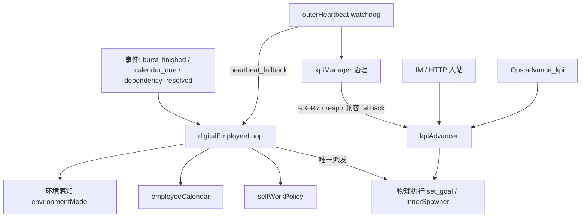

# KPI 管理器（ADL 权威）

> **English:** **KPI Manager** owns KPI truth, multi-burst hygiene, AWAITING review, and R3–R7. **Strategy Planner is removed.** Day-to-day work-finding is owned by [`DIGITAL-EMPLOYEE-AUTONOMY.md`](./DIGITAL-EMPLOYEE-AUTONOMY.md) (`digitalEmployeeLoop` / Calendar / SelfWorkPolicy). Physical spawn remains `set_goal` → `innerSpawner`.

> 取代：[`KPI-ADVANCEMENT.md`](./KPI-ADVANCEMENT.md) 中的 leaf/首拆/单 burst 复用语义；[`STRATEGY-PLANNING-LAYER.md`](./STRATEGY-PLANNING-LAYER.md)（删除）；[`RESOURCE-AWARENESS-AUTONOMY.md`](./RESOURCE-AWARENESS-AUTONOMY.md) 中 dispatcher 选 KPI 的独立层。

> 与 `workspace.dsl` 视图 **`10b-L3-Outer-KPI`**、**`12-L3-Outer-Environment`**、**`14-L3-Digital-Employee-Loop`** 同步。

> **2026-07-21 调度边界修订**：自主工作的主模型改为 [`DIGITAL-EMPLOYEE-AUTONOMY.md`](./DIGITAL-EMPLOYEE-AUTONOMY.md)。`kpiManager` 保留 KPI 真相、完成判定协作、R3–R7 与 burst 卫生；“空闲时创造什么工作”移交 `selfWorkPolicy`，“何时必须执行”移交 `employeeCalendar`，“何时重新找活”移交事件驱动 `digitalEmployeeLoop`。本文仍是 KPI 治理权威，但不再把 heartbeat advance 视为最终主循环。

---

## 1. 外脑分层（数字员工主路径 + KPI 治理）



| 层 | 模块 | 职责 | 不做 |
|----|------|------|------|
| **L0 容量主循环** | `digitalEmployeeLoop` + Calendar + SelfWorkPolicy | 有容量就找活；due 优先；提案校验后唯一 `set_goal` | 不做 KPI 结案/reap |
| **L1 环境感知** | `environmentModel` | sensor + journal + policy + hardGates / capacity | 不选 KPI、不派 burst |
| **L2 KPI 治理** | `kpiManager` | KPI 真相 + burst 卫生 + R3–R7 + 兼容 advance | 不直接 fork；不是日常找活主引擎 |
| **L3 物理执行** | `outerToolExecutor.set_goal` | workspace 创建、peer 挂载、spawn worker | 不做 KPI 策略 |

**删除：** `strategyPlanner`、`strategyStore`（宏观 REFLECT+DESIGN / focusOrder）。KPI 治理由 `kpiManager` 负责；空闲找活由 `selfWorkPolicy` 提案；业务定时由 `employeeCalendar` 负责（见 [`DIGITAL-EMPLOYEE-AUTONOMY.md`](./DIGITAL-EMPLOYEE-AUTONOMY.md)）。

---

## 2. KPI 数据模型（简化）

### 2.1 取消子 KPI

- **不再** `decomposeParentKpiIfNeeded` / `isLeaf` / 父节点首拆。
- 每个 `KpiRecord` 即一个可执行 KPI（扁平或保留 `parentKpiId` 仅作分组展示，**不参与调度**）。
- 调度单位：**KPI id**，不是 leaf。

### 2.2 多 burst / 无 canonical 限制

| 旧语义 | 新语义 |
|--------|--------|
| 每 leaf KPI ≤ 1 canonical `instanceId` | 每 KPI **可有多条** active burst（并行 sprint） |
| `findCanonicalBurstForKpi` 强制复用 workspace | **默认每次新 burst 新 workspace**；续跑仅 `changeWatcher` / 显式 restart |
| `set_goal` 禁止同 KPI 并行 | **允许**在资源许可时同 KPI 多 burst |
| `KpiRecord.bursts[]` length ≤ 1 per leaf | `bursts[]` = 该 KPI 关联的全部 instanceId（含并行） |

### 2.3 调度：KPI 不拥有 cadence；数字员工拥有日程与容量

- **保持删除** `kpi-cadence.ts` / `isCadenceDue` / `nextDueAt` KPI 调度路径（2026-06-07）；不得复活第二套 KPI cron。
- **P0 当前兼容路径**：idle heartbeat + `evaluateKpiAdvanceEligibility` → `advanceKpi`，仅作为 [`DIGITAL-EMPLOYEE-AUTONOMY.md`](./DIGITAL-EMPLOYEE-AUTONOMY.md) P1 落地前的 fallback。
- **目标续派时机**：burst 释放容量、日程到期、依赖满足等事件 → `digitalEmployeeLoop` → `hasAvailableCapacity` → Calendar / SelfWorkPolicy → `set_goal`。
- **业务定时**：由外脑 `employeeCalendar` 持久化；到期前不占 worker 槽。`wait_timer` 仅用于 burst 内短 retry/限速，禁止长睡到下次业务执行点。
- **节流**：环境 hardGates + 单 trigger 派发上限 + 提案去重/冲突检测；heartbeat interval 不再是正常续航的天然上限。

### 2.4 burst 互访（解除隔离）

- 同 KPI 下所有 burst workspace **默认互相可读**（`collectPeerWorkspaceIds` 按 `kpiId` 聚合全部 sibling）。
- **取消**「仅 handoff 摘要、禁止读正文」的强隔离；peer 工具可读 sibling `.brain` / 产出目录（仍受 workDir guard，禁止写 sibling）。
- spawn / restart 时刷新 peer 列表，使新 burst 可见已有 burst。

---

## 3. KPI 管理器职责

**路径（规划）：** `packages/server/src/outer/kpi/kpi-manager.ts`（吸收 `kpi-advancer`、`stale-burst-reaper`、`kpi-dispatch-guard` 编排逻辑）

**默认原则：** active KPI 是数字员工的长期职责，不等于始终存在 RUNNING burst。KPI 管理器扫描状态并负责治理；`digitalEmployeeLoop` 在有可用容量时优先履行到期日程，否则由 `selfWorkPolicy` 围绕 active KPI 产生可验收工作。

### 3.1 决策规则（P0）

| # | 条件 | 动作 |
|---|------|------|
| **R1** | burst 终态（DONE/ERROR 等）且 KPI 未 `achieved` | 释放容量并触发 `digitalEmployeeLoop`；不得无条件复制上一 charter |
| **R2** | 有 burst `RUNNING`，仍有系统容量，且提案与在途交付物不冲突 | 可新开独立工作 burst；`maxParallelBurstsPerKpi` 仅作防御上限 |
| **R3** | burst `AWAITING` | 审查 awaiting 原因；等待只阻塞依赖项并释放员工容量；不合理等待 → stop / ABORTED |
| **R4** | `ask_user` 未响应 | 保留该依赖；允许同 KPI 的独立工作；超时后升级/换不依赖答案的方向，禁止把整个 KPI 默认为忙 |
| **R5** | 僵尸 burst（长期 AWAITING/RUNNING 无进展） | 合并原 `staleBurstReaper`：`ABORTED` + archive + action-log |
| **R6** | 环境 busy（hardGates，读 `EnvironmentSnapshot.facets`） | 不 spawn；可继续 R3/R5 清理 |
| **R7** | 同路线连续失败 ≥ 阈值（路线 = burst goal 签名） | 优先熔断该路线（`blockedRoutes`，KPI 保持 active，SelfWorkPolicy 换独立方向）；多路线合计连败或路线不可识别 → KPI `paused` + IM |

**R7 失败熔断（路线级）— ✅ 2026-07-21 P2 实现（原 KPI 级 2026-06-23）：**

- 计数源：`analyzeConsecutiveFailureRoutes(kpi, registry)` —— 该 KPI 的 burst 按 `startedAt` 倒序，末尾连续 `ERROR`/`ABORTED` 按**路线签名**（goal 压空白 + lowercase + 截断）分组；`RUNNING`/`BLOCKED` 跳过不计不打断；遇 `DONE`/`AWAITING`/`STOPPED` 即清零，窗口自愈无需持久化熔断状态。
- 分流（`selectFailureCircuit`，心跳每 tick 续派前执行）：
  - **单路线连败 ≥ 阈值** → `routeBlocked`：仅 action-log（reason=`kpi_route_circuit`），KPI 保持 active、不 IM；路线签名经 `listBlockedRoutes` 注入 `SelfWorkContext.blockedRoutes`，提案命中即 `route_blocked` 拒绝，SelfWorkPolicy 换独立方向。
  - **多路线（≥2 条）合计连败 ≥ 阈值，或 burst 无 goal 无法分路线** → 系统性 `tripped`：`kpi.status='paused'` + `pauseReason` + IM 通知 + action-log（reason=`kpi_failure_circuit`）。恢复由人工/Ops `resume`。
- 双重保险：`evaluateKpiAdvanceEligibility({ maxConsecutiveFailures })` 保留 KPI 级 gate，防止兼容 advance 路径绕过。
- 阈值：`DEFAULT_MAX_CONSECUTIVE_FAILURES = 3`，可经 `KpiManagerDeps.maxConsecutiveFailures` 覆盖。
- 与 R3/R5 区别：R3/R5 处理**单 burst**异常态（AWAITING/僵尸）；R7 处理**路线/KPI 级**重复失败。
- 落点：`outer/kpi/kpi-failure-circuit.ts` + `kpi-burst-state.analyzeConsecutiveFailureRoutes`；测试 `kpi-failure-circuit.test.ts`（路线/系统性分流）+ `kpi-burst-state.test.ts`（路线分析 + eligibility gate）+ `self-work-policy.test.ts`（route_blocked 拒绝）。

**delivery / 一次性语义（与 [`IM-INBOUND-INTENT-ROUTING.md`](./IM-INBOUND-INTENT-ROUTING.md) P4 对齐）：**

- **IM 路径不再铸 `delivery` KPI**；聊天触发的一次性任务走 `adHocBurstAllocator`（跑完归档，天然只跑一次，不进 KPI 续派）。
- 若历史/Ops 仍存在 `kind:'delivery'` KPI：首个 burst 终态（DONE）即由 `kpiCompletionJudge` 判 `achieved`，**不 R1 续派**；失败则受 R7 熔断约束，不无限重试。

**R3 合理性（deterministic P0，LLM P1）：**

- timer：`execute_at` 已过期 > grace → 可 preempt（现有 advancer preempt 逻辑迁入）
- ask_user：超过 `maxAwaitingMs` / 无 IM 回复 → R4
- dyflow `DESIGN` 空转 streak / `AWAITING` 无 pending → 不合理，重开
- `wait_timer` 用于 sprint 内短等待；**禁止**长睡代替外脑续派

### 3.2 与 KPI Completion Judge 边界

- **kpiManager**：在途 burst 编排、spawn/stop。
- **kpiCompletionJudge**：KPI 是否 `achieved` / `abandoned`（心跳 sweep，读 deliverable + 描述）。

---

## 4. 心跳 tick 顺序（watchdog，非主找活）

```
1. 死亡检测
2. kpiCompletionJudge.sweep
3. environmentModel.collect（监督快照）
4. kpiManager.tick — R3–R7 / stale reap；兼容期可含 advance fallback
5. employeeCalendar missed / overdue 检查
6. digitalEmployeeLoop.trigger(heartbeat_fallback) — 补漏，须经与事件路径相同门控
7. （可选）legacy heartbeat LLM — 禁止成为第二派发真相
```

**删除 tick 内：** `runStrategyPhase` / `strategyPlanner` / 原 `autonomyTaskDispatcher` KPI 选路。
**日常找活不在心跳内完成**：由 burst/calendar/dependency 事件触发 `digitalEmployeeLoop`。

**保留：** `casualChatDispatcher`（`dispatchCasualChat`）— 仅 idle proactive IM 闲聊。

---

## 5. 物理 spawn 契约（不变）

- 唯一 spawn API：`executeOuterTool('set_goal', { goal, kpi_id?, allowKpiSetGoal: true })`（KPI 路径由 kpiManager 调用）。
- IM ad-hoc：无 `kpi_id` 的一次性 burst。
- AWAITING 唤醒：`changeWatcher` → `spawnAndAttachWorker`（同 instance，非 R1 新 sprint）。

### 5.1 charter 写入纪律（✅ 2026-06-23 修复嵌套膨胀）

- `buildKpiSprintGoal(kpi)` 渲染模板：`# KPI sprint … ## 本轮章程\n{charter || description} …`。
- **`dispatchKpiSprint` 派发后只更新 `lastBurstAt`，禁止把渲染后的 `goal` 写回 `kpi.charter`**。  
  旧 bug（`kpi-advancer.ts` `charter: kpi.charter ?? goal.slice(0,500)`）会让下轮 `buildKpiSprintGoal` 把整段模板再包一层 → `goal.md` 多重嵌套（`## 本轮章程\n# KPI sprint…## 本轮章程…`）。
- `charter` 只允许由「干净的下轮章程」写入：Ops `advance_kpi(charter)`、`kpi-api-dispatch`、`outcomeEvaluator.suggestedRetryCharter`。
- 回归测试：`kpi-advancer.test.ts`「多轮 dispatch 不把渲染 goal 写回 charter」。

---

## 6. DyFlow 与 registry 状态

DyFlow FSM（`dyflow-state.json`）：`DESIGN | RUN | ATTRIBUTE | AWAITING | DONE | ERROR | STOPPED`。

**无 legacy `DECOMPOSE` / planning 相位。**

| DyFlow mode | Registry 期望（worker 退出后） |
|-------------|-------------------------------|
| `AWAITING` + pendings | `AWAITING` |
| `DONE` | `DONE` |
| `ERROR` | `ERROR` |
| `DESIGN/RUN/ATTRIBUTE`（worker 运行中） | `RUNNING` |

**外脑读状态：** `buildBrainAsyncSnapshot` 必须读 `dyflow-state.json`（不能只读 `controller-state.json`），否则 KPI 管理器误判 AWAITING/DONE。

---

## 7. 模块迁移表

| 现模块 | 归宿 |
|--------|------|
| `kpiAdvancer` | 并入 `kpiManager.tick`（advance 子过程） |
| `staleBurstReaper` | 并入 `kpiManager.reapStaleBursts` |
| `kpi-dispatch-guard` | 简化或删除（多 burst 允许） |
| `inner-brain-kpi-reuse` / `burst-reuse` | 删除 canonical 复用；保留 burst 列表查询 |
| `sub-kpi-decomposer` | **删除** |
| `strategyPlanner` / `strategyStore` | **删除** |
| `autonomyTaskDispatcher` KPI 分支 | **已删除**；KPI 找活 → `digitalEmployeeLoop` + `selfWorkPolicy`；闲聊 → `casualChatDispatcher`；兼容 fallback → `kpiManager.tick` |
| `autonomyJudge` + `autonomyPolicyStore` | 并入 `environment/`（见 ENVIRONMENT-MODEL.md） |
| `kpi-spawn-capacity` | `environment/kpi-spawn-capacity.ts` — kpiManager / kpiAdvancer 读 facets 评估 spawn 槽位 |

---

## 8. 实现分期

| 阶段 | 内容 |
|------|------|
| **P0** | 本文 + `workspace.dsl`；`kpiManager` 心跳接线；strategy phase 删除 | ✅ 2026-06-07 |
| **P1** | 扁平 KPI + 多 burst 并行 + peer 互访 + R3/R4 awaiting review | ✅ 2026-06-07 |
| **P2** | 死代码清理（subKpiDecomposer/burstReuse/canonical）；`maxParallelBurstsPerKpi`；legacy heartbeat 禁 kpi_id | ✅ 2026-06-07 |
| **P3** | AWAITING LLM 审查；autonomyJudge 并入 environment/；删除 strategy/*；pipeline 接线 `awaitingReviewLlm` | ✅ 2026-06-07 |

---

## 9. 测试

| 类型 | 文件 |
|------|------|
| unit | `kpi-manager.test.ts`（R1–R6 表驱动） |
| unit | `brain-async-snapshot.test.ts`（dyflow AWAITING） |
| integration | `kpiManager.component.integration.test.ts` |
| 删除 | `strategy-planner*.test.ts`、`sub-kpi-decomposer.test.ts`（P1 后） |

---

## 10. 变更记录

| 日期 | 说明 |
|------|------|
| 2026-06-07 | P3：staleBurstReaper 迁入 kpi/；删除 strategy/*；environment/ 收 autonomyJudge+policy；R3 LLM 复审 |
| 2026-06-07 | P1：扁平 KPI + 多 burst + R3/R4 awaiting review |
