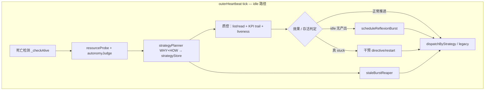

# 外脑心跳：内脑质控与方向把控（ADL）

> **English:** **Outer heartbeat** is not only「闲了找活派」. Each tick it **supervises** inner brains: **acceptance** of burst effectiveness toward KPI, and **liveness / stuck / restart** decisions at the outer layer. Milestone-level validation stays inside **Attributor**; burst/KPI-level oversight is heartbeat's job.

与 [`RESOURCE-AWARENESS-AUTONOMY.md`](./RESOURCE-AWARENESS-AUTONOMY.md)（调度管道）、[`STRATEGY-PLANNING-LAYER.md`](./STRATEGY-PLANNING-LAYER.md)（**宏观战略 WHY+HOW**，不受本文影响）、[`KPI-CLOSED-LOOP.md`](./KPI-CLOSED-LOOP.md)（reflexion 闭环）互补。

---

## 0. 心跳 tick 三层（勿混、勿替代）

质控是**新增的一层**，**不取代** [`STRATEGY-PLANNING-LAYER.md`](./STRATEGY-PLANNING-LAYER.md) 的宏观战略。完整 idle tick 顺序：

```text
0. 死亡检测
0b. kpiCompletionJudge.sweep（KPI 完成判定，在派活前）
1. resourceProbe + autonomyJudge（硬闸门）
2. 【宏观战略】strategyPlanner REFLECT+DESIGN → strategyStore   ← WHY + HOW，跨 KPI
3. 【质控】验收 burst 效果 + KPI 完成态 + liveness / stuck
4. staleBurstReaper（战略 cull，依赖 §2 产出）
5. dispatchByStrategy / legacy runHeartbeat
```

| 层 | 问什么 | 典型产出 |
|----|--------|----------|
| **宏观战略** | **WHY** 还推哪些 KPI？信念是否过期？**HOW** 优先顺序与下一角度？ | `StrategyArtifact.theory`、`focusOrder`、`cullDirectives` |
| **质控（本文）** | 在途 burst **做得怎么样**？**KPI 是否应 achieved**？是否卡死？ | sweep、achieve_kpi、restart、idle streak |
| **派遣** | 按战略写 goal 正文 spawn | `set_goal` |

**原则 O0（用户强调）**：战略思考必须同时包含 **WHY**（值不值得做、为何现在做、 lessons 是否推翻假设）与 **HOW**（focusOrder、下一 burst 角度）；**不能**因加了质控就退化成只看 liveness/deliverable 的战术补丁。

---

## 1. 质控双职责（战术层，不替代战略）

| 职责 | 心跳在问什么 | 典型动作 |
|------|--------------|----------|
| **A 验收内脑工作效果** | 这轮 burst 是否在向 KPI/长期目标**实质靠近**？产出是否可信？是否在空转？ | 读 `list_inner_brains` / `read_inner_status`、deliverables、reflexionTrail；`kpi_stuck_reflexion`；换角度 `set_goal`；`post_to_im` 汇报硬阻塞 |
| **A′ KPI 完成判定** | **KPI 目标是否已达成**（非仅 burst post_complete）？ | [`KPI-COMPLETION-JUDGE.md`](./KPI-COMPLETION-JUDGE.md)：`sweep` / `view_kpi` / `achieve_kpi` |
| **B 卡死与重启把控** | 实例是否还活着？tick 是否停滞？AWAITING 是否该继续等？是否该 reap / restart？ | `_checkAlive`、registry `liveness`、idle streak、（P1）`staleBurstReaper`、（P1）EXECUTE kill→resume、`POST …/restart` |

**原则 O1**：心跳是外脑对内的**质控层**；内脑 DyFlow 自管节点级成功/失败，不替代 KPI/burst 级验收。

**原则 O2**：验收 ≠ 每 tick 逼内脑完成整 KPI（DyFlow baseNode「猛猛干」+ Designer replan，见 [`DYFLOW-INNER-EXECUTOR.md`](./DYFLOW-INNER-EXECUTOR.md)）；验收 = 判断「靠近是否真实、是否值得继续等 / 换方向 / 干预」。

**原则 O3**：卡死判定要区分 **正常等待**（AWAITING + `is_async_waiting`）与 **真 stuck**（RUNNING 无 tick、pid dead、外脑行为日志长期不变、idle streak 无产出）。

---

## 2. 分层验收（勿混）

```text
milestone 契约     ← Attributor（内脑 ATTRIBUTE）
burst 产出/反思    ← kpiBurstHooks + reflexionTrail（burst 结束）
KPI 是否达成       ← kpiCompletionJudge + achieve_kpi（见 KPI-COMPLETION-JUDGE.md）
KPI 是否推进       ← 心跳 + kpi-dispatch-guard +（P1）strategyPlanner
agent 是否还活着   ← 心跳 _checkAlive + registry liveness
```

| 层 | 谁验收 | 信号 |
|----|--------|------|
| Milestone | Attributor | execution-context、契约「必交付物」、CONTROL |
| Burst | onExit → reflexion | `.brain/reflexion.json`、deliverables 增量 |
| KPI 达成 | kpiCompletionJudge + 心跳 LLM | `suggestKpiAction=achieved`、sweep、`achieve_kpi(evidence)` |
| KPI 推进中 | 心跳 tick / autonomy | `consecutiveIdleBursts`、`reflexionTrail`、performanceBlock |
| 实例存活 | 心跳 + API | `last_tick_at`、`liveness`、`pid_alive`、DEATH-DETECT |

---

## 3. 心跳 tick 质控流程（在战略阶段**之后**，与 dispatch **之前**）



现有实现里 **V + A 的部分逻辑**分散在：`kpi-dispatch-guard`、`buildHeartbeatSystemPrompt`、legacy LLM 心跳、`performanceGoalEngine.reviewGoalsForHeartbeat`。本文档把它们**显式归位**为心跳职责，便于后续收敛到统一「oversight phase」。

---

## 4. 卡死 / 重启：信号与动作矩阵

| 信号 | 来源 | 当前行为 | 目标行为（演进） |
|------|------|----------|------------------|
| 外脑 action-log N tick 无变化 | `_checkAlive` | `console.error` 警告 | ⏳ 联动 IM 告警 / 强制 strategy 重评估 |
| RUNNING 且 `last_tick_at` > 5min | `list_inner_brains` `liveness=stuck` | 暴露给 LLM / Dashboard | ⏳ 心跳自动 `send_directive` 或 `/restart`（见 todo exec-kill-resume） |
| RUNNING 且 `pid_alive=false` | registry + spawner | startupResume 扫到 | ✅ 启动时 markStale + resume；运行中 ⏳ 心跳触发 |
| KPI `consecutiveIdleBursts ≥ 阈值` | kpiRegistry | `kpi_stuck_reflexion` → meta burst | ✅ |
| AWAITING 战略上不该再等 | — | — | ⏳ `staleBurstReaper`（[`STRATEGY-PLANNING-LAYER.md`](./STRATEGY-PLANNING-LAYER.md)） |
| 自动 resume 达上限 | `resumeCount` | 停自动 resume | ✅ 用户手动 `POST /api/inner-brains/:id/restart` |

相关 todo：[`doc/todo/inner-brain-exec-kill-resume-stuck.md`](../todo/inner-brain-exec-kill-resume-stuck.md)。

---

## 5. 与 DyFlow RUN 的关系

DyFlow 内脑每 tick 在 DESIGN/RUN 间切换、baseNode 多轮自修（[`DYFLOW-INNER-EXECUTOR.md`](./DYFLOW-INNER-EXECUTOR.md)）时：

- 心跳**不应**因「单 burst 内 deliverable 少」就判失败；
- 心跳应看 **跨 tick 趋势**：ticks 是否增长、deliverables 是否缓慢累积、reflexion 是否指出方向错误；
- idle streak 无产出 → 优先 **反思 burst**，而非立刻 kill（除非 liveness=dead/stuck 且非 AWAITING）。

---

## 6. ADL 组件

| 模块 | 质控相关 |
|------|----------|
| **outerHeartbeat** | tick 编排宿主；死亡检测；注入 oversight 上下文给 LLM / autonomy |
| **kpiCompletionJudge** | 心跳 sweep + digest；[`KPI-COMPLETION-JUDGE.md`](./KPI-COMPLETION-JUDGE.md) |
| **kpiBurstHooks** | burst onExit → trail；idle streak；onExit autoAchieved |
| **kpi-dispatch-guard** |  sprint 中不并行派活；stuck → reflexion |
| **list_inner_brains / read_inner_status** | 验收与存活信号的唯一外脑读口 |
| **staleBurstReaper**（P1） | 战略上 cull AWAITING / 僵尸 burst |
| **innerBrainStartupResume** | 外脑进程重启恢复 RUNNING |

---

## 7. 修订

| 日期 | 说明 |
|------|------|
| 2026-06-02 | 初版：心跳双职责（验收效果 + 卡死/restart 把控）；与增量 EXECUTE 对齐 |
| 2026-06-02 | §0：明确三层 tick；质控不替代宏观战略 WHY+HOW |
| 2026-06-02 | A′ KPI 完成判定；workspace.dsl 边 + rules |
