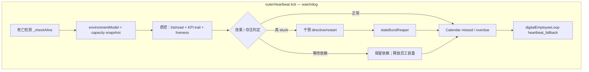

# 外脑心跳：数字员工监督与恢复兜底（ADL）

> **English:** Outer heartbeat is the digital employee's **manager check-in and watchdog**, not the main engine that keeps work moving. It supervises burst/KPI effectiveness, liveness, stuck/restart, missed calendar commitments, and recovers lost dispatch events. Normal continuation is event-driven by `digitalEmployeeLoop`; milestone validation stays inside the inner brain.

与 [`DIGITAL-EMPLOYEE-AUTONOMY.md`](./DIGITAL-EMPLOYEE-AUTONOMY.md)（容量驱动自主工作）、[`ENVIRONMENT-MODEL.md`](./ENVIRONMENT-MODEL.md)（感知）、[`KPI-MANAGER-LAYER.md`](./KPI-MANAGER-LAYER.md)（KPI 治理）、[`KPI-COMPLETION-JUDGE.md`](./KPI-COMPLETION-JUDGE.md)（完成判定）互补。旧 [`STRATEGY-PLANNING-LAYER.md`](./STRATEGY-PLANNING-LAYER.md) 已删除实现，仅供历史对照。

---

## 0. 心跳 tick 边界（勿混、勿替代）

正常工作交接不等心跳：burst exit / calendar due / dependency resolved 直接触发 `digitalEmployeeLoop`。心跳只运行监督与补漏：

```text
0. 死亡检测
0b. kpiCompletionJudge.sweep（KPI 完成判定，在派活前）
1. environmentModel.collect + hasAvailableCapacity（监督快照）
2. 【质控】验收 burst 效果 + KPI 完成态 + liveness / stuck
3. kpiManager：R3–R7、stale reap、失败/成本/安全监督
4. employeeCalendar：missed / 长时间 due 检查
5. digitalEmployeeLoop.trigger(heartbeat_fallback)（仅补漏）
6. 可选 legacy heartbeat LLM（不得成为第二派发真相）
```

| 层 | 问什么 | 典型产出 |
|----|--------|----------|
| **环境/容量** | 员工是否还有可用执行能力？ | `EnvironmentSnapshot`、`hasAvailableCapacity` |
| **质控（本文）** | 在途工作做得怎样？KPI 是否结案？是否卡死或失约？ | sweep、restart、reap、missed 告警 |
| **自主提案** | 空闲容量现在做什么最有价值？ | `SelfWorkProposal`（不在 heartbeat 内独占产生） |
| **派遣** | 到期承诺或合法提案如何执行？ | `digitalEmployeeLoop` → 唯一 `set_goal` |

**原则 O0**：心跳监督不能替代自主工作的价值判断。WHY/HOW 由可测试的 `SelfWorkPolicy` 在需要填充容量时提出；heartbeat 只提供监督信号和 fallback trigger。

---

## 1. 质控双职责（战术层，不替代价值判断）

| 职责 | 心跳在问什么 | 典型动作 |
|------|--------------|----------|
| **A 验收内脑工作效果** | 这轮 burst 是否在向 KPI/长期目标**实质靠近**？产出是否可信？是否在空转？ | 读 `list_inner_brains` / `read_inner_status`、deliverables、`burstRunHistory.outcomeEvaluation`；`stuck_retry` / pivot charter；`advance_kpi`；`post_to_im` 汇报硬阻塞 |
| **A′ KPI 完成判定** | **KPI 目标是否已达成**（非仅 burst post_complete）？ | [`KPI-COMPLETION-JUDGE.md`](./KPI-COMPLETION-JUDGE.md)：`sweep` / `view_kpi` / `achieve_kpi` |
| **B 卡死与重启把控** | 实例是否还活着？tick 是否停滞？AWAITING 是否该继续等？是否该 reap / restart？ | `_checkAlive`、registry `liveness`、idle streak、（P1）`staleBurstReaper`、（P1）EXECUTE kill→resume、`POST …/restart` |

**原则 O1**：心跳是外脑对内的**质控层**；内脑 DyFlow 自管节点级成功/失败，不替代 KPI/burst 级验收。

**原则 O2**：验收 ≠ 每 tick 逼内脑完成整 KPI（DyFlow baseNode「猛猛干」+ Designer replan，见 [`DYFLOW-INNER-EXECUTOR.md`](./DYFLOW-INNER-EXECUTOR.md)）；验收 = 判断「靠近是否真实、是否值得继续等 / 换方向 / 干预」。

**原则 O3**：卡死判定要区分 **正常等待**（AWAITING + `is_async_waiting`）与 **真 stuck**（RUNNING 无 tick、pid dead、外脑行为日志长期不变、idle streak 无产出）。

---

## 2. 分层验收（勿混）

```text
milestone 契约     ← Attributor（内脑 ATTRIBUTE）
burst 产出/评估    ← kpiBurstHooks + outcomeEvaluator（burst 结束）
KPI 是否达成       ← kpiCompletionJudge + achieve_kpi（见 KPI-COMPLETION-JUDGE.md）
KPI 是否治理       ← kpiManager R3–R7 + kpiCompletionJudge
下一份工作是什么   ← digitalEmployeeLoop + Calendar / SelfWorkPolicy
agent 是否还活着   ← 心跳 _checkAlive + registry liveness
```

| 层 | 谁验收 | 信号 |
|----|--------|------|
| Milestone | Attributor | execution-context、契约「必交付物」、CONTROL |
| Burst | onExit → outcomeEvaluator | `burstRunHistory`、deliverables 增量、`memory.json` fact_records |
| KPI 达成 | kpiCompletionJudge + 心跳 LLM | `suggestKpiAction=achieved`、sweep、`achieve_kpi(evidence)` |
| KPI 推进中 | 心跳 tick / autonomy | `consecutiveIdleBursts`、`burstRunHistory`、performanceBlock |
| 实例存活 | 心跳 + API | `last_tick_at`、`liveness`、`pid_alive`、DEATH-DETECT |

---

## 3. 心跳 tick 质控流程（watchdog 路径）



`heartbeat_fallback` 必须经过与事件主路径相同的 single-flight、capacity、Calendar 优先级、提案校验和幂等逻辑，禁止直接复制旧的 `set_goal` 路径。

---

## 4. 卡死 / 重启：信号与动作矩阵

| 信号 | 来源 | 当前行为 | 目标行为（演进） |
|------|------|----------|------------------|
| 外脑 action-log N tick 无变化 | `_checkAlive` | `console.error` 警告 | ⏳ 联动 IM 告警 / SelfWorkPolicy 换向输入 |
| RUNNING 且 `last_tick_at` > 5min | `list_inner_brains` `liveness=stuck` | 暴露给 LLM / Dashboard | ⏳ 心跳自动 `send_directive` 或 `/restart`（见 todo exec-kill-resume） |
| RUNNING 且 `pid_alive=false` | registry + spawner | startupResume 扫到 | ✅ 启动时 markStale + resume；运行中 ⏳ 心跳触发 |
| KPI / 路线连续无产出 ≥ 阈值 | kpiRegistry + self-work outcome | P0 保留 KPI 级兜底；P2 熔断重复路线并让 SelfWorkPolicy 换独立方向 | ⏳ |
| AWAITING 治理上不该再等 | — | — | ⏳ `staleBurstReaper`（[`KPI-MANAGER-LAYER.md`](./KPI-MANAGER-LAYER.md) R3–R7） |
| 自动 resume 达上限 | `resumeCount` | 停自动 resume | ✅ 用户手动 `POST /api/inner-brains/:id/restart` |

相关 todo：[`doc/todo/inner-brain-exec-kill-resume-stuck.md`](../todo/inner-brain-exec-kill-resume-stuck.md)。

---

## 5. 与 DyFlow RUN 的关系

DyFlow 内脑每 tick 在 DESIGN/RUN 间切换、baseNode 多轮自修（[`DYFLOW-INNER-EXECUTOR.md`](./DYFLOW-INNER-EXECUTOR.md)）时：

- 心跳**不应**因「单 burst 内 deliverable 少」就判失败；
- 心跳应看 **跨 tick 趋势**：ticks 是否增长、deliverables 是否缓慢累积、`outcomeEvaluation` 是否指出方向错误；
- idle streak 无产出 → 优先 **outcome 换 charter 续跑**，而非立刻 kill（除非 liveness=dead/stuck 且非 AWAITING）。

---

## 6. ADL 组件

| 模块 | 质控相关 |
|------|----------|
| **outerHeartbeat** | watchdog 编排宿主；死亡检测、监督、missed 扫描、fallback trigger |
| **kpiCompletionJudge** | 心跳 sweep + digest；[`KPI-COMPLETION-JUDGE.md`](./KPI-COMPLETION-JUDGE.md) |
| **digitalEmployeeLoop**（✅ P1） | 正常事件驱动主循环；heartbeat 只能调用同一 trigger 入口 |
| **employeeCalendar**（✅ P0/P1） | missed / overdue 暴露给 heartbeat；正常 due 自身触发主循环 |
| **selfWorkPolicy**（🟡） | conservative + 校验已落；多策略/A-B 待落；不常驻 heartbeat |
| **list_inner_brains / read_inner_status** | 验收与存活信号的唯一外脑读口 |
| **staleBurstReaper** | R5 清理 AWAITING / 僵尸 burst |

---

## 7. 修订

| 日期 | 说明 |
|------|------|
| 2026-06-02 | 初版：心跳双职责（验收效果 + 卡死/restart 把控）；与增量 EXECUTE 对齐 |
| 2026-06-02 | §0：明确三层 tick；质控不替代宏观战略 WHY+HOW |
| 2026-06-02 | A′ KPI 完成判定；workspace.dsl 边 + rules |
| 2026-07-21 | 数字员工修订：heartbeat 降为 watchdog/fallback；正常续派由 burst/calendar/dependency 事件触发。 |
