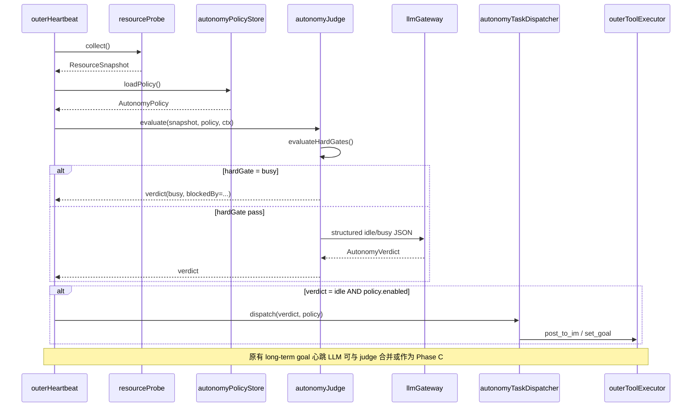
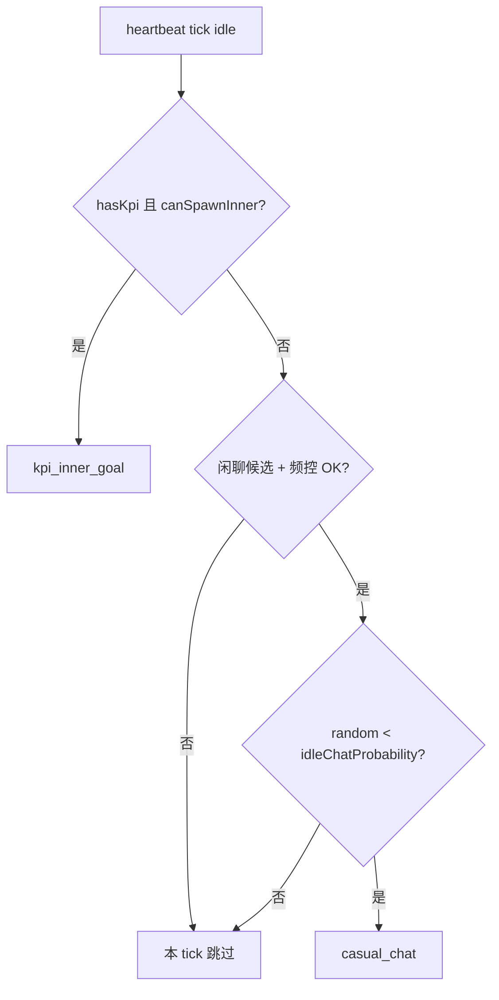

# 资源感知与心跳自主调度（ADL · P0 形态）

> **后继文档（P1 起）**：
> - 环境模型（替代 `resourceProbe` 扁平 snapshot）：[`ENVIRONMENT-MODEL.md`](./ENVIRONMENT-MODEL.md)
> - 战略规划层（dispatcher 退化为按 strategy 派遣 + 杀僵尸）：[`STRATEGY-PLANNING-LAYER.md`](./STRATEGY-PLANNING-LAYER.md)
>
> 本文为 P0 形态留档；模块边界与触发器演进在后继 ADL 中说明。

> 与 `workspace.dsl` 视图 **`11-L3-Outer-Autonomy`**、`components/agent-server.dsl` 同步。  
> 实现待办：[`doc/todo/resource-awareness-autonomy.md`](../todo/resource-awareness-autonomy.md)  
> **心跳质控职责**（验收内脑效果、卡死/restart 把控）见 [`OUTER-HEARTBEAT-OVERSIGHT.md`](./OUTER-HEARTBEAT-OVERSIGHT.md)——本文档只覆盖 **闲忙判定 → 自主派活** 管道。

## 1. 动机

现有 **`outerHeartbeat`**（`outer/outer-heartbeat.ts`）每 N 分钟用 LLM 对照长期目标决定是否 `post_to_im` / `set_goal`，上下文主要是：

- 内脑 `status.json` 摘要  
- mem9 daily-log / tasks  
- `PerformanceGoalEngine.reviewGoalsForHeartbeat` 块  

**缺失**：外脑进程级负载（内脑数量、LLM 并发、token 消耗、入站队列深度等）没有结构化采集；「是否比较闲」也没有可持久化、可聊天修改的策略；自主行动与 KPI 闭环、群聊频控之间缺少统一闸门。

本设计在 **不替换** 现有心跳的前提下，增加 **资源感知 → 闲忙判定 → 自主任务分发** 三段式管道。

---

## 2. 与现有模块的边界

| 现有模块 | 关系 | 说明 |
|----------|------|------|
| **outerHeartbeat** | **编排宿主** | 每 tick：`resourceProbe` → `autonomyJudge` →（若 idle）`autonomyTaskDispatcher`；原有 long-term goal LLM 环保留，可合并为同一 tick 的 Phase B |
| **participationPolicy** | **硬闸门（闲聊路径）** | 自主 `casual_chat` 仍须过同步冷却/频控；不替代 SPEAK/SILENT |
| **kpiRegistry / kpiBurstHooks** | **KPI 路径数据源** | `kpi_inner_goal` 读 registry + `burstRunHistory`；idle 换向由 outcomeEvaluator / `kpiAdvancer` 驱动；本模块是 **外脑心跳侧的「主动找事做」** |
| **performanceGoalEngine** | **KPI 路径数据源** | 长期绩效目标审阅结果可注入 judge；`set_goal` 可带 `performance_goal_id` |
| **innerBrainRegistry** | **resourceProbe 输入** | RUNNING / AWAITING / BLOCKED 计数 |
| **threadOrchestrator** | **resourceProbe 输入** | 各 thread 排队深度 |
| **llmGateway** | **metrics 来源 + judge/dispatcher LLM** | 需在 gateway 层挂 **in-flight 计数** 与 **usage 滚动窗口** |

**勿混**：KPI 闭环的 burst outcome 评估见 [`KPI-BURST-OUTCOME-EVALUATOR.md`](./KPI-BURST-OUTCOME-EVALUATOR.md)、[`KPI-CLOSED-LOOP.md`](./KPI-CLOSED-LOOP.md)；本模块是 **外脑空闲时的补充自主行为**，两者可并存但 **共享 spawn 硬闸门**（例如 RUNNING≥1 且 async waiting 时不派新 goal）。

---

## 3. L3 模块划分

| 模块 ID | 职责 | 规划路径 | In → Out |
|---------|------|----------|----------|
| **llmUsageTracker** | LLM 调用计量 | `outer/llm-usage-tracker.ts` | 每次 `llmRawChatCompletion` 完成 → 滚动 token 和 in-flight |
| **resourceProbe** | **资源感知** | `outer/resource-probe.ts` | deps 快照 → `ResourceSnapshot` |
| **autonomyPolicyStore** | **闲忙规则持久化** | `outer/autonomy-policy-store.ts` | CRUD JSON + rubric markdown |
| **autonomyJudge** | **闲忙判定** | `outer/autonomy-judge.ts` | snapshot + policy → `AutonomyVerdict` |
| **autonomyTaskDispatcher** | **自主任务分发** | `outer/autonomy-task-dispatcher.ts` | verdict(idle) + policy → 执行 `casual_chat` / `kpi_inner_goal` |
| **outerHeartbeat** | 定时 tick（已有） | `outer/outer-heartbeat.ts` | 注入上述模块；死亡检测不变 |
| **performanceGoalEngine** | 绩效目标（已有） | `performance-goals/engine.ts` | 供 judge / kpi 路径读取 |

---

## 4. 心跳增强流程（单 tick）



**Phase 顺序（建议 P0）**：

1. 死亡检测（现有 `_checkAlive`）  
2. `resourceProbe.collect()`  
3. `autonomyJudge.evaluate()` — 硬闸门同步；软判定 LLM  
4. 若 `idle` → `autonomyTaskDispatcher.dispatch()`  
5. 现有 `runHeartbeat()` long-term goal 环（可读取 verdict 作为 user 段前缀，避免重复派活）

---

## 5. ResourceSnapshot（资源快照）

```typescript
interface ResourceSnapshot {
  capturedAt: string; // ISO
  agentId: string;

  innerBrains: {
    running: number;
    awaiting: number;
    blocked: number;
    asyncWaiting: number; // brainAsyncSnapshot 聚合
  };

  llm: {
    inFlight: number;
    tokensLast1h: { prompt: number; completion: number; total: number };
    tokensLast24h: { prompt: number; completion: number; total: number };
    callsLast1h: number;
  };

  inbound: {
    orchestratorQueuedTotal: number;
    outerLoopActiveThreads: number; // 外脑对话环占用
  };

  im: {
    lastProactiveSpeakAt: string | null;
    proactiveCount5min: number;
  };

  process: {
    heapUsedMb: number;
    rssMb: number;
    loadAvg1m: number | null; // Node os.loadavg，Windows 可为 null
  };
}
```

采集原则：**只读、O(n) 有界**（registry 列表 + 内存计数器），禁止在 probe 里调 LLM。

---

## 6. AutonomyPolicy（可配置闲忙规则）

持久化：`{DATA_ROOT}/autonomy/policy.json`  
自然语言 rubric：`{DATA_ROOT}/autonomy/policy-rubric.md`（供 LLM 软判定；可由聊天工具整段替换）

```typescript
interface AutonomyPolicy {
  version: 1;
  enabled: boolean;

  /** 同步硬闸门：任一命中 → 直接 busy，不调 judge LLM */
  hardGates: {
    maxRunningInnerBrains: number;      // 默认 1
    maxAwaitingInnerBrains: number;     // 默认 3
    maxLlmInFlight: number;             // 默认 2
    maxTokensPerHour: number | null;    // null = 不限制
    minMsSinceLastAutonomousAction: number; // 默认 900_000 (15min)
    blockIfOrchestratorQueuedAbove: number; // 默认 2
    blockIfOuterLoopActive: boolean;    // 默认 true
  };

  /** 注入 judge LLM 的阈值说明（非执行逻辑，仅提示） */
  softHints: {
    preferIdleWhenRunningInnerBrains: number; // 默认 0
    tokenBudgetSoftCapPerHour: number | null;
  };

  /** 自主任务类型（key = handler.id；仅 enabled / cooldown，**不参与分支抽签**） */
  taskTypes: Record<string, AutonomyTaskTypeConfig>;

  updatedAt: string;
  updatedBy: 'chat' | 'env' | 'system';
}

interface AutonomyTaskTypeConfig {
  enabled: boolean;
  cooldownMs: number;   // 该类型上次执行后的冷却
  maxPerDay: number;    // 可选上限
}
```

### 6.1 聊天修改（与 participation / memory block 同构）

外脑对话工具（经 `outerToolExecutor`）：

| 工具 | 作用 |
|------|------|
| `read_autonomy_policy` | 返回 policy JSON 摘要 + rubric 预览 |
| `update_autonomy_policy` | 部分 patch（hardGates、taskTypes、enabled） |
| `update_autonomy_rubric` | 替换 `policy-rubric.md` 全文（「什么叫比较闲」） |

用户说「我现在算闲的标准是……」→ 外脑调 `update_autonomy_rubric`；说「内脑超过 2 个就别自主行动」→ patch `hardGates.maxRunningInnerBrains`。

### 6.2 人物性格（闲聊概率）

与 `soul.md`（自然语言人格）并列，**结构化性格**放在：

`{DATA_ROOT}/outer/personality.json`

```typescript
interface AgentPersonality {
  version: 1;
  /** 进入闲聊分支的 Bernoulli 概率 p ∈ [0,1]；默认 0.1 */
  idleChatProbability: number;
  updatedAt: string;
  updatedBy: 'chat' | 'env' | 'system' | 'default';
}
```

| 字段 | 含义 |
|------|------|
| `idleChatProbability` | **仅当**走闲聊候选路径时掷骰：`Math.random() < p` 才 `post_to_im` |

- **Kuroneko / Shiro / Gin** 各 agent 独立 `DATA_ROOT`，概率可不同（话痨 vs 寡言）。  
- 聊天可改：「你闲时可以多说点话」→ `update_personality({ idleChatProbability: 0.35 })`（与 `update_autonomy_policy` 并列工具）。  
- `soul.md` 仍管 **怎么说**；`personality.json` 管 **多常主动开口**（定时器分支用）。

**Dashboard（P2）**：可选只读面板 + Lab，仿 `participation-lab`。

---

## 7. AutonomyVerdict（闲忙判定结果）

```typescript
type WorkloadLevel = 'idle' | 'busy' | 'unknown';

interface AutonomyVerdict {
  level: WorkloadLevel;
  confidence: number; // 0-1；P0 硬闸门通过时可固定 1
  reasons: string[];
  blockedByHardGate?: string;
  judgedAt: string;
}
```

**闲忙判定（P0 极简）**：

1. **Hard gates only**：对照 `policy.hardGates` + `ResourceSnapshot` → `idle` | `busy`  
2. **Soft LLM**（P2 可选）：rubric 自然语言微调「算不算闲」；**不参与选 KPI vs 闲聊**

`busy` 时 **不 dispatch**。分支选择在 §8.3 **纯规则**，不用 LLM 抽签。

---

## 8. 自主任务类型

### 8.0 扩展模型：Handler 注册表（推荐，P0 即采用）

**不要**在 dispatcher 里写死 `switch (type)` 且 **不要**纯随机——未来任务变多时会难维护，随机也会忽略 judge 与上下文。

采用与 **`outerToolExecutor` / structurizr manifest** 同构的 **轻量注册表**：

```typescript
/** 代码侧：每新增一种自主任务 = 注册一个 handler（不热插拔、不动态 load） */
interface AutonomyTaskHandler {
  id: string;                    // 稳定 id，如 'casual_chat'
  label: string;                 // 给人 / Dashboard 看
  description: string;           // 给 judge LLM 看：「这类任务适合什么时候做」
  defaultConfig: AutonomyTaskTypeConfig;

  /** 同步：该类型此刻能不能跑（除 policy.enabled/cooldown 外） */
  isEligible(ctx: AutonomyDispatchContext): { ok: boolean; reason?: string };

  execute(ctx: AutonomyDispatchContext): Promise<AutonomyDispatchResult>;
}

// autonomy-task-handlers.ts — 唯一注册点
export const AUTONOMY_TASK_HANDLERS: AutonomyTaskHandler[] = [
  casualChatHandler,
  kpiInnerGoalHandler,
  // 未来：research_digestHandler, mem9_reconcileHandler, …
];
```

**策略侧**（`policy.json`）只存 **开关与冷却**，不存分支权重：

```json
"taskTypes": {
  "casual_chat": { "enabled": true, "cooldownMs": 3600000, "maxPerDay": 8 },
  "kpi_inner_goal": { "enabled": true, "cooldownMs": 7200000, "maxPerDay": 3 }
}
```

### 8.3 任务选择算法（P0：优先级阶梯 + 性格概率）

每 tick **最多 dispatch 一种**任务。**不用 LLM 选分支**，规则如下：

```text
前提：verdict.level === 'idle' && policy.enabled

1. hasKpi = kpiRegistry 存在「可推进」的 KPI
   （active + 非 paused；具体条件见 kpi-registry 读 API）

2. canSpawnInner =
   hardGates 未挡 spawn（running/awaiting/llm 未超限）
   && 无 is_async_waiting
   && kpi_inner_goal handler.isEligible

3. 【KPI 分支 — 优先】
   if hasKpi && canSpawnInner && !onCooldown('kpi_inner_goal')
   → dispatch kpi_inner_goal（LLM 仅用于 **写 goal 正文**，不用于选分支）
   → return

4. 【闲聊分支 — 候选】
   进入候选当且仅当：!hasKpi || !canSpawnInner
   （没有 KPI 可推，或资源已满 / 不能再 spawn）

   if casual_chat enabled && !onCooldown('casual_chat') && imAvailable
      && participation 频控通过
   → if Math.random() < personality.idleChatProbability
        dispatch casual_chat（LLM 仅用于 **写 1–2 句正文**）
   → else log skip_chat_roll

5. 否则本 tick 不动作
```



| 设计点 | 说明 |
|--------|------|
| KPI 优先 | 有 KPI 且资源允许 → **总是**内脑分支，不掷闲聊骰 |
| 无 KPI 或资源满 | 才考虑闲聊；**概率由 personality 配置** |
| Handler 注册表 | 仍保留（§8.0），便于加第 3 种任务；**选择逻辑在 dispatcher 一处** |
| 非纯随机 | 只有闲聊在候选池内掷骰；KPI 路径 deterministic |

**「有 KPI」定义（P0）**：`kpi-registry.json` 里至少一条 `status=active` 且当前 burst 链未 `achieved`。performanceGoal 可作为 P1 扩展输入，但不改变分支优先级。

### 8.1 `casual_chat`（触发闲聊）

**意图**：在 IM 里发起 **有实质内容、克制** 的主动发言（不是刷存在感）。

流程：

1. 检查 `taskTypes.casual_chat` enabled + cooldown  
2. `participationPolicy` 同步规则（群聊冷却、5min 频控）— **与 inbound 共用 `participation-state`**  
3. 轻量 LLM 生成 1–2 句 `text`（system 注入 `soul.md`）  
4. `post_to_im` → 记录 `lastAutonomousActionAt` + `casual_chat` 计数  

**硬约束**：无 IM 渠道时跳过；空 thread 时沿用 `UTLRA_OUTER_HEARTBEAT_THREAD_ID`。

### 8.2 `kpi_inner_goal`（KPI 分析 → 内脑目标）

**意图**：根据 **kpiRegistry** 与 **performanceGoalEngine** 选一个方向，**设计一条内脑 goal**，`set_goal` 派发。

**KPI 全力冲刺（串行）**：同 KPI 已有 `RUNNING` / `AWAITING` / `BLOCKED` 在途 burst 时：

- `evaluateKpiAutonomyDispatch` → `kpi_burst_in_flight`，**不**再并行 `set_goal`
- `dispatchAutonomyTasks` → `kpi_sprint_in_progress`，**不** fall through 到闲聊
- `runAutonomyPipeline` → `skippedLegacyHeartbeat=true`，**跳过** legacy LLM 心跳（避免 LLM 误派）
- `set_goal`（非 IM 用户直派）→ 硬拒绝同 KPI 在途 burst

上一 burst 结束（`DONE`/`STOPPED`/`ERROR`）且 idle streak 未达反思阈值后，才续派下一角度。

流程：

1. 检查 enabled + cooldown；**无**同 KPI 在途 burst（`findLiveBurstForKpi`）  
2. LLM 输入：活跃 KPI 列表、最近 `burstRunHistory` / outcome 摘要、performance goal scorecards  
3. 输出：`goal` markdown + 可选 `kpi_id` / `performance_goal_id`  
4. `set_goal` → registry + spawn  

与 KPI meta burst 区别：meta burst 是 **registry idleStreak 触发的反思 burst**；本路径是 **外脑心跳认为「闲」时的主动规划**，goal 内容由 judge/dispatcher LLM 现场生成。

---

## 9. 持久化与审计

| 路径 | 内容 |
|------|------|
| `data/autonomy/policy.json` | 结构化规则 |
| `data/autonomy/policy-rubric.md` | 闲忙自然语言标准（P2 soft judge） |
| `data/outer/personality.json` | **`idleChatProbability` 等性格参数** |
| `data/outer/soul.md` | 自然语言人格（已有） |
| `data/autonomy/action-log.jsonl` | 每次 dispatch：branch、roll、taskType、结果、snapshot 摘要 |

---

## 10. 环境变量

| 变量 | 默认 | 说明 |
|------|------|------|
| `UTLRA_AUTONOMY_ENABLED` | `1` | 总开关（policy.enabled 仍生效） |
| `UTLRA_AUTONOMY_JUDGE_ENABLED` | `0` | P0 默认 **关** soft LLM；仅 hard gates |
| `UTLRA_PERSONALITY_IDLE_CHAT_P` | — | 覆盖 `personality.json` 默认值（可选） |
| `UTLRA_LLM_USAGE_TRACK_WINDOW_MS` | `86400000` | usage 滚动窗口上限 |
| `UTLRA_OUTER_HEARTBEAT_*` | （现有） | 心跳间隔仍用现有变量 |

首次启动：若 policy 文件不存在，从 env + 内置 default 写入 `policy.json`。

---

## 11. 测试策略

| 层级 | 范围 |
|------|------|
| unit | `resource-probe.test.ts`（mock registry/tracker）；`autonomy-judge.test.ts`（hard gates 表驱动）；`autonomy-task-dispatcher.test.ts`（mock tools） |
| integration | `autonomy-heartbeat.component.integration.test.ts`：mock LLM → idle → dispatch 一次 |
| prompt | `autonomy-judge.prompt.test.ts`：rubric 变更后 verdict 稳定性 |

---

## 12. 实现分期

| 阶段 | 交付 |
|------|------|
| **P0** | `llmUsageTracker`；`resourceProbe`；`personality.json`；hard gates；**dispatcher 阶梯 + 闲聊概率**；`action-log.jsonl` |
| **P1** | 聊天 tools（policy / personality / rubric）；`kpi_inner_goal` goal 生成 LLM；集成测 |
| **P2** | soft LLM 闲忙 rubric；Dashboard Lab；更多 handler |

---

## 13. Structurizr 视图

- **`11-L3-Outer-Autonomy`**：`outerHeartbeat` → `resourceProbe` → `autonomyJudge`（hard gates）→ `autonomyTaskDispatcher`（KPI 优先 + `agentPersonality`）→ `outerToolExecutor` / `participationPolicy` / `kpiRegistry`

修订记录见 `modules-catalog.md`。
