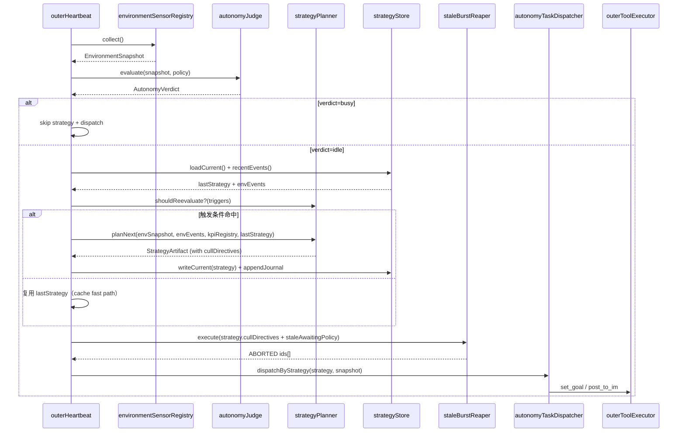
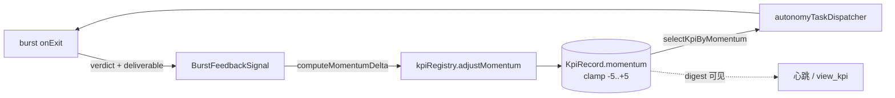

# 战略规划层

> **⚠️ 已由 [`KPI-MANAGER-LAYER.md`](./KPI-MANAGER-LAYER.md) 取代**（2026-06-07）：`strategyPlanner` / `strategyStore` / `dispatchByStrategy` 已删除；KPI 编排改由 `kpiManager` 负责。本文保留历史设计供对照。

> **English (historical):** A layer between **heartbeat** and **task dispatch**: REFLECT on past bursts → DESIGN forward strategy → REAP stale bursts → DISPATCH next burst.

> 与 `workspace.dsl` 视图 **`13-L3-Outer-Strategy`** 同步。

## 1. 动机

[`RESOURCE-AWARENESS-AUTONOMY.md`](./RESOURCE-AWARENESS-AUTONOMY.md) §8.3 当前心跳：

```text
probe → judge(闲忙硬闸门) → dispatcher(KPI优先 / 闲聊概率) → set_goal/post_to_im
```

`autonomyTaskDispatcher` 当前**既选 KPI 又写 goal**，等价于"无记忆地"每 tick 重新挑一条 KPI。反思链路只覆盖：

| 层 | 反思机制 | 视野 |
|----|----------|------|
| 内脑 | `attributor`（per-RUN）+ `record_fact` | burst 内写 `memory.json` |
| KPI | `kpiBurstOutcomeEvaluator` + `burstRunHistory` | 单 KPI 跨 burst 结果史 |
| **缺：跨 KPI 战略层** | — | **跨 KPI、跨 burst：方向对不对？某 KPI 是不是该 paused？长期 AWAITING 还要不要等？** |

**核心症状**（用户痛点）：

1. dispatcher 每 tick 无记忆挑 KPI，agent 行为"零散"
2. 历史 AWAITING 任务一直不会自动死——[`INNER-BRAIN-AWAITING-LIFECYCLE.md`](./INNER-BRAIN-AWAITING-LIFECYCLE.md) 解决"该醒怎么醒"，但 **没人解决"不该继续怎么死"**
3. 用户视角：现在没人能解释"agent 当前战略是什么"

## 2. 与既有模块的边界

| 既有模块 | 关系 | 改动 |
|----------|------|------|
| `outerHeartbeat` | **编排宿主 + 质控层** | tick 流程插入 STRATEGY 阶段；质控职责见 [`OUTER-HEARTBEAT-OVERSIGHT.md`](./OUTER-HEARTBEAT-OVERSIGHT.md)；现有 `runHeartbeat()` long-term goal 环作为 cache fast path 仍生效 |
| `autonomyJudge` | **闲忙硬闸门** | 不变（gate 还是 gate） |
| `autonomyTaskDispatcher` | **KPI 优先 + 闲聊概率** | **退化**：读 strategy.focusOrder → 写 goal → spawn；**不再自由选 KPI** |
| `kpiRegistry` | KPI 元数据 + `burstRunHistory` | 不变（仍是 KPI 真相源） |
| `performanceGoalEngine` | 长期绩效目标 | 不变；作为 strategy 输入 |
| `environmentSensorRegistry` / `environmentJournal` | 环境模型 | strategy 主消费者 |
| `innerBrainRegistry` | 内脑任务表 | `staleBurstReaper` 写入 ABORTED 状态 |
| `awaitingInboundResolver` / `registryLifecycleReconcile` | AWAITING 醒来对账 | **互补**：本层管"该死怎么死" |
| `kpiBurstHooks` | per-KPI onExit 评估 | `outcomeEvaluation` → `burstRunHistory` |

**勿混**：

- `burstRunHistory.outcomeEvaluation` = **per-burst 程序化评估**（不会问"换个 KPI 推进吗？"）
- `strategyPlanner.reflect` = **跨 KPI 元反思**（看了 KPI 累加后，决定整体方向）
- [`OUTER-HEARTBEAT-OVERSIGHT.md`](./OUTER-HEARTBEAT-OVERSIGHT.md) 质控 = **在途 burst 做得怎样 / 是否卡死**；**不**写 `strategyStore`，**不**决定跨 KPI focusOrder

## 2b. WHY + HOW（用户强调）

战略层 LLM **禁止**只产出「下一 burst 怎么写 goal」的 HOW；每次 REFLECT+DESIGN（或 legacy 心跳等价思考）须显式覆盖：

| 维度 | 必答问题 | 落盘字段 |
|------|----------|----------|
| **WHY** | 这些 KPI **为何**仍 active？哪条 **belief/假设** 被最近 burst **outcome** 支持或推翻？某 KPI 是否应 **paused** 或 **achieved** 及理由？与 **长期目标 / performanceGoal** 是否仍一致？ | `theory`、`whyNow`、`pausedKpis[].reason`、`recentLessons`；达成则 `achieve_kpi` 或 sweep |
| **HOW** | 在 WHY 成立前提下，**focusOrder** 为何如此？下一 burst **什么角度**？哪些 AWAITING **战略上**该 cull？ | `focusOrder`、`nextExpectation`、`cullDirectives` |

**REFLECT** 偏 WHY（ lessons 、信念校验、pause 决策）；**DESIGN** 偏 HOW（顺序、角度、cull 指令）。P0 可合并为一次 LLM call，但 prompt/schema **两段必填**，缺 WHY 叙事则 reject artifact。

Legacy 心跳（`runHeartbeat`、strategy 未落地前）：同样须先 WHY 再 HOW，再 `set_goal`——不可跳过「值不值得推」直接派活。

## 3. L3 模块划分（三件套）

| 模块 ID | 职责 | 规划路径 | In → Out |
|---------|------|----------|----------|
| **strategyStore** | `current.json` + `journal.jsonl` 读写；strategy 真相源 | `outer/strategy/strategy-store.ts` | CRUD + append journal |
| **strategyPlanner** | REFLECT + DESIGN（实施可合并一次 LLM call，概念两阶段） | `outer/strategy/strategy-planner.ts` | input → `StrategyArtifact` |
| **staleBurstReaper** | 执行 cullDirectives + 静态超时兜底 | `outer/strategy/stale-burst-reaper.ts` | strategy + registry → ABORTED |

`outerHeartbeat` 仍是单体编排器，新加 phase；不引入新调度器避免双源 tick。

## 4. 单 tick 流程（新）



**phase 顺序硬约束**：reaper **必须在 dispatch 之前**——杀掉的 slot 同 tick 内可被新 burst 用上，避免"释放-等下一 tick"的浪费。

## 5. StrategyArtifact

```typescript
interface StrategyArtifact {
  version: 1;
  agentId: string;
  updatedAt: string;

  /** 当前承认在推的 KPI；必须是 kpiRegistry.active 的子集 */
  activeKpis: string[];

  /** 优先级；dispatcher 必须按此挑 */
  focusOrder: string[];

  /** 战略软建议 paused（registry 显式 paused/archived 优先） */
  pausedKpis: { id: string; reason: string }[];

  /** 短叙事：WHY — 当前战略假设与取舍（给人/审计/下一轮 reflect） */
  theory: string;

  /** WHY 补句：为何**现在**推这些 KPI（可选但 P0 prompt 必填） */
  whyNow: string;

  /** WHY — 上一段 strategy 期间观察到的关键 lesson */
  recentLessons: { burstId: string; takeaway: string }[];

  /** HOW — 对下一 burst 的预期；下次 reflect 对照是否兑现 */
  nextExpectation: string;

  /** REFLECT 显式杀指令（语义层，非超时） */
  cullDirectives: {
    burstInstanceId: string;
    reason: 'kpi_paused' | 'kpi_archived' | 'strategy_shift' | 'belief_expired';
    grace: 'now' | 'warn_in_im_then_kill';
    note?: string;
  }[];

  /** 静态规则兜底，不依赖 LLM */
  staleAwaitingPolicy: {
    maxAwaitingMs: number;                  // 默认 7d，硬上限
    requireProgressSignalAfterMs: number;   // 默认 3d，触发 reflect 复审
  };

  /** 何时强制重评估 */
  reEvaluateAfter: {
    onBurstExits: number;             // 默认 1（每次 burst 完成都重审）
    onMs: number;                     // 默认 6h
    onEvents: ('user_message' | 'kpi_blocked' | 'burst_replan_limit' | 'env_event_threshold')[];
  };
}
```

## 6. 重评估触发器（关键：避免每 tick 都战略）

| 条件 | 行为 |
|------|------|
| 无 strategy 文件 | 走完整 REFLECT + DESIGN |
| burst COMPLETE / BLOCK / REPLAN_LIMIT 后第一次 tick | 走完整 REFLECT + DESIGN |
| `reEvaluateAfter.onMs` 命中 | 走完整 REFLECT + DESIGN |
| 用户 IM 给了新指令（trigger from `outerBrainFacade`） | 走完整 REFLECT + DESIGN |
| `envEvents` 含未消费且 `kind=threshold_crossed` 的事件 | 走完整 REFLECT + DESIGN |
| 其他 | **只跑 DISPATCH（读 cache）+ 静态兜底 reaper** |

把"每心跳重新规划"压成"**事件驱动重规划 + 默认沿用**"——LLM 调用从"每 tick 写 goal 正文一次"变成最坏"重审 tick + 写 goal 正文两次"。

## 7. STRATEGY-REFLECT 输入契约

```typescript
interface StrategyReflectInput {
  // 环境（来自 environmentSensorRegistry / environmentJournal）
  envCurrent: EnvironmentSnapshot;
  envEvents: EnvironmentEvent[];          // 仅 consumedByStrategyAt 为空
  envHourly: Record<string, HourlyAggregate[]>;

  // KPI 真相
  kpis: KpiRecord[];                      // active + paused
  kpiOutcomeDigest: Record<string, OutcomeTrailDigest>;

  // 最近 burst 行为
  recentBursts: {
    instanceId: string;
    kpiId?: string;
    state: 'DONE' | 'BLOCK' | 'AWAITING' | 'ABORTED';
    durationMs: number;
    abortReason?: string;
    outcomeSummary?: string;
  }[];

  // 上一份战略
  lastStrategy: StrategyArtifact | null;

  // 长期绩效目标
  performanceScorecards: PerformanceGoalScorecard[];

  // 静态资源闸门状态（来自 autonomyPolicyStore）
  hardGatesStatus: { gateId: string; ok: boolean; observed: number }[];
}
```

## 8. 单向依赖：strategy = registry 的派生投影

| 字段 | 与 `kpiRegistry` 的关系 |
|------|--------------------------|
| `activeKpis` | 必须 ⊆ registry 中 `status=active` |
| `pausedKpis` | 软建议；registry 显式 `paused/archived` 优先 |
| `focusOrder` | dispatcher 用；registry 不读 |

**唯一写权**：只有 `strategyPlanner.plan()` 能写 `strategyStore`。dispatcher、reaper、judge **只读** strategy。

**冲突解析**：dispatcher 把 strategy.focusOrder 与 `registry.list({ active })` 取**交集**（取 strategy 顺序）；为空则跳过 dispatch（不掷闲聊骰，避免战略与 KPI 漂移时乱跑）。

## 9. `staleBurstReaper`（杀僵尸）

### 9.1 职责

| 来源 | 行为 |
|------|------|
| `strategy.cullDirectives` 显式列出 | 按 grace 执行 ABORTED |
| `strategy.staleAwaitingPolicy.maxAwaitingMs` 超时 | 静态兜底 ABORTED（不依赖 LLM） |
| `requireProgressSignalAfterMs` 超时 | 不直接杀；置位 `needsStrategyReview=true`，下 tick 强制走 REFLECT |

### 9.2 与既有 reconcile 的边界

| 情况 | 谁处理 |
|------|--------|
| 进程死、registry RUNNING | `registryLifecycleReconcile` |
| 入站匹配、AWAITING → 唤醒 | `awaitingInboundResolver` + `changeWatcher` |
| RUNNING 但失联 N 分钟 | `registryLifecycleReconcile` |
| **AWAITING 信念过期 / 战略变更** | **`staleBurstReaper`** ← 新 |
| **AWAITING 超 maxAwaitingMs（兜底）** | **`staleBurstReaper`** ← 新 |

无重叠。

### 9.3 杀死即"有 archive 的状态迁移"，不是 `rm`

```text
staleBurstReaper.execute(directive)
  ├─ peekPendingMatch(burstId) via awaitingInboundResolver  // 即将醒来 → 跳过本 tick
  ├─ SIGTERM worker（让 safeArchive 跑一次）
  ├─ 等 graceMs（默认 5s）→ 仍活则 SIGKILL
  ├─ archiveStore.commit(workDir, kpiId)                   // 归档工作区快照
  └─ innerBrainRegistry.update(id, {
       status: 'ABORTED',
       abortReason: directive.reason,
       abortedBy: 'strategy_reflect' | 'stale_awaiting_timeout',
       abortedAt: now()
     })
```

`grace='warn_in_im_then_kill'` 时先 IM 通知"我准备放弃 task X，因为……"，等 `gracePeriodMs`（默认 30min），无人反对再杀。

### 9.4 用户可见性

- `data/autonomy/action-log.jsonl` 追加 `{ kind: 'cull_burst', burstId, reason, reaper: 'strategy' | 'timeout' }`
- Dashboard 战略面板显示 cull 历史
- IM 通知（grace 模式）

## 10. dispatcher 退化形态

```typescript
// before（当前 §8.3）
function dispatch(verdict, policy) {
  if (hasKpi && canSpawn) return spawnKpiInnerGoal(pickKpi());  // 自由选
  if (random < idleChatProb) return casualChat();
}

// after
function dispatchByStrategy(strategy, snapshot) {
  if (!strategy) return; // strategy 缺失 → 不动作（首启动会被 planner 触发）
  for (const kpiId of strategy.focusOrder) {
    if (!isStillActive(kpiId)) continue;            // registry 显式 paused/archived
    if (!canSpawnInner(snapshot)) break;            // 资源闸门
    if (onCooldown(kpiId)) continue;
    return spawnKpiInnerGoal(kpiId, strategy.theory);  // LLM 仅写 goal 正文
  }
  // 所有 active KPI 都不可推 → 进入闲聊候选（保留性格概率）
  if (casualChatEligible() && Math.random() < personality.idleChatProbability) {
    return casualChat();
  }
}
```

## 11. 持久化路径

```text
DATA_ROOT/strategy/
  current.json                # 最新 StrategyArtifact（覆盖）
  journal.jsonl               # 每次 plan 的入参摘要 + 产出 + 触发原因（按月轮转）
```

`journal.jsonl` 单行包含：`triggers[]`、`activeKpisBefore/After`、`focusOrderBefore/After`、`cullDirectivesEmitted`、`durationMs`。

## 12. 禁止 / 守门

| 禁止 | 守门 |
|------|------|
| dispatcher 自由选 KPI | dispatcher 不 import `kpiRegistry.list({active})` 直接挑选；只读 strategy.focusOrder |
| reaper 静默 `rm` | 必须经 ABORTED 状态迁移 + archive |
| reaper 杀正在 resolve 的 AWAITING | 执行前调 `awaitingInboundResolver.peekPendingMatch` |
| 双源真相 | strategy ⊆ registry 的派生投影；写权独占 strategyPlanner |
| 每 tick 重战略 | 触发器命中才走 REFLECT；否则读 cache |
| LLM 战略叙事化 | typed schema 必填；缺字段时 reject artifact，回退到 lastStrategy |
| 只写 HOW 不写 WHY | `theory` + `whyNow` 必填；仅 focusOrder/goal 角度 → reject |
| 质控替代战略 | oversight 不 import strategyStore 写权；见 OUTER-HEARTBEAT-OVERSIGHT §0 |

## 13. 实施分期

| 阶段 | 交付 | 行为变化 |
|------|------|----------|
| **P0 🟡** | `strategyStore` + `strategyPlanner.plan()`（合并 reflect/design 单 LLM call）+ dispatcher 退化为读 strategy；`staleBurstReaper` 静态超时兜底 | dispatcher 不再自由选 KPI；7d AWAITING 自动死 |

> **P0 落地状态（2026-06-06）**：`outer/strategy/` 八模块 + `runStrategyPhase` 编排已实现并接入 live 心跳（gated），单测全绿（store/trigger/artifact/planner/dispatch/reaper/live-adapter/run-phase，52 例）：
> - `strategyPlanner.planNext` 合并 REFLECT+DESIGN 单 LLM call（caller 注入，FakeLLM 可测）；WHY+HOW 缺失或解析失败 → **reject 回退** lastStrategy / 最小安全 artifact（按 momentum 排 active）。
> - `staleBurstReaper`：静态超时兜底（`maxAwaitingMs`）+ `cullDirectives(grace='now')`；`peekPendingMatch` 跳过即将醒来者；`killProcess`/`archive` 注入；经 `ABORTED` 状态迁移（`TaskStatus` 已加 `ABORTED` + `abortReason/abortedBy/abortedAt`）。`grace='warn_in_im_then_kill'` 留 P1。
> - **已接 live 心跳（常开，无 flag）**：`outer/strategy/live-adapter.ts` 把注入点接到真实 `kpiRegistry`/`innerBrainRegistry`/真 LLM(`llmRawChatCompletion`)/`process.kill`/`action-log`；`autonomyPipeline` 在 `verdict=idle` 时**始终**跑 `runLiveStrategyPhase`（plan + reap），并把 `strategy.focusOrder` + `strategyMode` 注入 `autonomyTaskDispatcher`——dispatcher 的 `pickActiveKpi` 改按 focusOrder∩active 选；交集空 → `strategy_no_focus`（不掷闲聊）。`UTLRA_STRATEGY_LAYER_ENABLED` 开关已移除（2026-06-07）。
> - **待办（P1）**：`grace='warn_in_im_then_kill'` IM 预警流程、Dashboard 战略面板、`reflect/design` 拆双 call、`userMessageSinceLast` 触发源接 `outerBrainFacade`、planner→真实 archive 接线。
| **P1** | `cullDirectives` LLM 输出落地；reaper grace 模式（warn_in_im）+ Dashboard 战略面板 | 战略层主动 cull |
| **P2** | reflect/design 拆为两次 LLM call（先 lessons 再 forward）；触发器细化（env_event_threshold）；与 `performanceGoalEngine` 双向反馈 | 决策质量提升 |

## 14. Structurizr 视图

- **`13-L3-Outer-Strategy`**：`outerHeartbeat` → `environmentSensorRegistry` / `autonomyJudge` → `strategyPlanner` ↔ `strategyStore` → `staleBurstReaper`（→ `innerBrainRegistry` ABORTED + `archiveStore`）→ `autonomyTaskDispatcher` → `outerToolExecutor`

## 15. 测试策略

| 层级 | 范围 |
|------|------|
| unit | `strategy-store.test.ts`（CRUD + journal append）；`strategy-trigger.test.ts`（重评估触发器表）；`stale-burst-reaper.test.ts`（peek、SIGTERM/KILL、状态迁移） |
| integration | `strategyPlanner.component.integration.test.ts`：FakeLLM → 输入 mock 环境 → 产出合法 artifact；`staleBurstReaper.component.integration.test.ts`：超时 burst → ABORTED + archive；`autonomyTaskDispatcher.component.integration.test.ts`（更新）：focusOrder 决定 spawn 顺序 |
| prompt | `strategy-planner.prompt.test.ts`：相同输入下 artifact schema 稳定 |

测试与组件映射见 [`COMPONENT-TEST-MAP.md`](./COMPONENT-TEST-MAP.md)。

## 16. 反馈调节（多巴胺回路 · P0-interim）

> **English:** A lightweight **feedback regulation** ("dopamine") loop on the *existing* dispatcher, **before** the full `strategyPlanner` lands. Each KPI carries a scalar `momentum`; burst outcomes raise it (productive → keep pushing) or lower it (idle/failed → back off). The dispatcher orders candidate KPIs by `momentum` instead of always picking the newest. This is the **quantified, code-level** complement to the LLM-narrative `recentLessons` / `focusOrder` (§5); when `strategyPlanner` lands, `focusOrder` becomes the authority and `momentum` feeds it as one input.

> **定位**：用户口中的「多巴胺系统」= **给外脑战略层引入反馈调节**。战略层三件套（`strategyPlanner` 等）目前零代码，因此先在**现有 `autonomyTaskDispatcher` + `kpiBurstHooks`** 上落一个**最小可量化的正/负反馈回路**，不引入新调度器。

### 16.1 闭环



### 16.2 信号 → 增量（`kpi-feedback.ts` 纯函数）

```typescript
interface BurstFeedbackSignal {
  verdict: 'success' | 'partial' | 'failed' | null;
  deliverableCount: number;
  isAwaiting: boolean;
  exitedWithError: boolean;
}
```

| 情形 | Δmomentum | 含义 |
|------|-----------|------|
| `isAwaiting` | `0` | 等外部，不奖不罚（与 idle streak 口径一致） |
| `exitedWithError` | `-2` | 进程级失败，强负反馈 |
| `verdict=success` 且 deliverable>0 | `+2` | 高奖赏：有效推进 |
| `verdict=success` 且 deliverable=0 | `+1` | 轻奖赏 |
| `verdict=partial` 且 deliverable>0 | `+1` | 轻奖赏 |
| `verdict=partial` 且 deliverable=0 | `0` | 中性 |
| `verdict=failed` | `-2` | 强负反馈 |
| outcome 未确认 且 deliverable>0 | `+1` | 有产出即弱奖赏（partial） |
| outcome 未确认 且 deliverable=0 | `-1` | 空转弱惩罚 |

`momentum` 经 `clampMomentum` 限制在 `[-5, +5]`；deterministic（同输入同输出，单测可断言）。

### 16.3 调节行为

- **选 KPI**：`selectKpiByMomentum(activeKpis)` — momentum 降序，平手按 `createdAt` 新者优先。dispatcher 的 `kpi_inner_goal` / `casual_chat defer` 一律用它，**取代**原先固定的 `list({active})[0]`。
- **正反馈延续**：连续有效推进的 KPI momentum 高 → 持续优先派活。
- **负反馈退避**：连续 idle/failed 的 KPI momentum 跌 → 让位给更有产出的 KPI；idle 达阈值由 outcomeEvaluator 换 charter 续跑（`stuck_retry`）。
- **可见性**：`formatKpiDigest` 增 `momentum` 行；心跳 / `view_kpi` 可读，便于人/战略层审计。

### 16.4 与既有机制的边界

| 机制 | 角色 | 与 momentum 关系 |
|------|------|-------------------|
| `consecutiveIdleBursts` | 卡死检测（触发 pivot charter） | 互补；idle 既加 streak 又扣 momentum |
| `burstRunHistory` | per-KPI 执行史 + outcome | momentum 是其**标量投影** |
| `recentLessons` / `focusOrder`（§5） | 战略层 LLM 叙事调度 | **未来**：`strategyPlanner` 落地后 `focusOrder` 为权威，momentum 作为输入量之一 |
| outcome 换向续跑（`UTLRA_KPI_AUTO_NEXT_BURST`） | 评估失败自动 `scheduleNextKpiBurst` | 与 `kpiAdvancer` 节拍互补 |

### 16.5 守门

| 禁止 | 守门 |
|------|------|
| momentum 依赖 random / LLM | `computeMomentumDelta` 纯函数 + 单测 deterministic |
| momentum 无界增长 | `clampMomentum` 硬上下限 ±5 |
| ongoing KPI 被 momentum 顶成 achieved | momentum 只影响**派活顺序**，不进完成判定（见 [`KPI-COMPLETION-JUDGE.md`](./KPI-COMPLETION-JUDGE.md) §3b） |

## 17. 修订

| 日期 | 说明 |
|------|------|
| 2026-06-01 | 初版 ADL：strategyStore + strategyPlanner + staleBurstReaper；dispatcher 退化为按 strategy 派遣；解决 AWAITING 历史僵尸 |
| 2026-06-02 | §2b WHY+HOW 必填；`whyNow` 字段；与 OUTER-HEARTBEAT-OVERSIGHT 边界 |
| 2026-06-06 | §16 反馈调节（多巴胺回路）：`kpi-feedback.ts` + `KpiRecord.momentum` + dispatcher 按 momentum 选 KPI（P0-interim，先于 strategyPlanner） |
| 2026-06-06 | P0 代码落地：`outer/strategy/` 七模块（store/trigger/artifact/planner/dispatch/reaper/facade）+ `runStrategyPhase` 编排；`TaskStatus` 加 `ABORTED`；6 套单测 43 例全绿；依赖的环境模型 P0 已先行落地 |
| 2026-06-06 | P0 接 live 心跳（gated 默认关）：`live-adapter.ts`（真 registry/LLM/process.kill/action-log）+ `autonomyPipeline` 在 idle 时跑 `runLiveStrategyPhase` 并把 `focusOrder`/`strategyMode` 注入 dispatcher（`pickActiveKpi` 按 focusOrder∩active 选）；`UTLRA_STRATEGY_LAYER_ENABLED` 关时零行为差；新增 live-adapter/run-phase/dispatch-focusorder 测，strategy 套共 52 例全绿 |
| 2026-06-07 | 移除 `UTLRA_STRATEGY_LAYER_ENABLED` 开关（`isStrategyLayerEnabled` 删除）：战略层在 `verdict=idle` 时常开。副作用：idle tick 会先跑一次 strategy 规划（受 `shouldReevaluate` 触发门控）；同步更新 KPI-sprint 组件测断言 |
