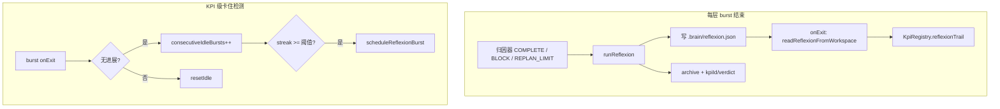

# KPI 与 Reflexion 机制设计

> **⚠️ 已退役（2026-06-07）**  
> Per-burst `reflexion.json`、`reflexionTrail`、`scheduleReflexionBurst` 已由外脑 **`kpiBurstOutcomeEvaluator`** 替代。  
> **权威 ADL**：[`doc/structurizr/KPI-BURST-OUTCOME-EVALUATOR.md`](../../../doc/structurizr/KPI-BURST-OUTCOME-EVALUATOR.md)、[`KPI-CLOSED-LOOP.md`](../../../doc/structurizr/KPI-CLOSED-LOOP.md)、[`KPI-ADVANCEMENT.md`](../../../doc/structurizr/KPI-ADVANCEMENT.md)。  
> 下文保留作历史参考，**勿按此实现**。

> ~~**实现状态（2026-05-19）**~~：已由 DyFlow + outcome 评估路径取代。

---

## 1. 目标

| 概念 | 含义 |
|------|------|
| **KPI** | 长期、开放式目标（多手段、多 burst），由外脑 `set_kpi` 注册，持久化于 `data/kpi-registry.json` |
| **Burst** | 一次内脑子进程跑 `pi-auto`（`set_goal` 派发），可挂 `kpi_id` |
| **Per-burst reflexion** | 每个 burst 结束前 LLM 复盘 → `.brain/reflexion.json` + 知识库 session |
| **Meta reflexion burst** | 连续 N 次「无 KPI 实质进展」后自动派发的短 burst，只做卡点分析，不执行 KPI 本身 |

外脑对话提示中的「反思链会自动跑」**以本文档改造完成为准**；改造完成前需外脑主动 `view_kpi` / 再 `set_goal`。

---

## 2. 两条链路（勿混）



| 链路 | 触发 | 产出 | 消费者 |
|------|------|------|--------|
| Per-burst reflexion | 每次 `safeArchive`（COMPLETE / BLOCK / REPLAN_LIMIT） | `reflexion.json`、archive session | 下一轮 decomposer、`reflexionTrail` |
| Meta reflexion burst | `idle` 退出且连续 N 次无进展（默认 3） | 新 burst（`isReflexionBurst=true`） | 人类/外脑读 trail 后再派真任务 |

---

## 3. Human-in-the-loop（BLOCK）与 KPI 的关系

### 3.1 归因器

`attributor.ts` 规定：需登录、缺 key、需人类提供数据/文件时 → **BLOCK**（不用 REPLAN）。

### 3.2 运行时

1. BLOCK → `writeBlockOutput` → `mode=BLOCKED` → 同 tick 内 `safeArchive(..., 'BLOCK', ...)`
2. 后续 tick：无 `input` / `[BLOCK解封]` directive → `hadWork=false` → 子进程 **idle 退出**
3. `onExit` → `processBurstExitForKpi`（与是否 BLOCK 无关，只要进程退出）

### 3.3 与「反思没跑」的常见误区

| 现象 | 原因 |
|------|------|
| 内脑「卡住就找人」 | BLOCK + 外脑 `send_directive` / 用户回复，**设计如此** |
| `reflexionTrail` 仍为空 | `runReflexion` 未调用 → 无 `reflexion.json` |
| idle streak 不到 3 | 中间 burst 有 `deliverableCount>0`（含探索报告）→ **resetIdle**；或外脑手动派新 burst 打断计数 |
| meta burst 从未出现 | streak < `UTLRA_KPI_STUCK_THRESHOLD`（默认 3） |

**原则**：HITL 不阻止 `onExit` hook；它改变的是「算无进展」的语义——若 BLOCK 前已登记 deliverable，当前实现会**不算**卡住。

---

## 4. 数据与文件

| 路径 | 内容 |
|------|------|
| `data/kpi-registry.json` | KPI 列表、`bursts[]`、`consecutiveIdleBursts`、`reflexionTrail[]` |
| `<workDir>/.brain/reflexion.json` | 单次 burst 结构化反思（hook 读取） |
| `~/.openkuroneko/knowledge-base/sessions/<id>/` | archive：constraints/skills/knowledge + `meta.json` + `reflexion.json` |
| `data/inner-brain-registry.json` | burst 状态；末事件 BLOCK 时 `status=BLOCKED` |

### 4.1 「无进展」判定（当前实现）

```ts
// kpi-burst-hooks.ts
isIdleNoProgress =
  exitedWithError || (stoppedBy === 'idle' && deliverableCount === 0);
```

`deliverableCount` 来自 `.run/pi-mono/deliverables.json`（`register_deliverable` 登记数）。

### 4.2 「无进展」判定（建议改造，见 §6.2）

在写完 `reflexion.json` 后：

- `verdict === 'failed'` → `recordIdle`
- `verdict === 'success' | 'partial'` 且存在 KPI 级 deliverable → `resetIdle`
- `trigger === 'BLOCK'` 且 `verdict !== 'success'` → 可配置为 **始终 recordIdle**（`UTLRA_KPI_BLOCK_COUNTS_AS_IDLE=1`）

---

## 5. 环境变量

| 变量 | 默认 | 说明 |
|------|------|------|
| `UTLRA_KPI_STUCK_THRESHOLD` | `3` | 连续无进展 burst 数，触发 meta reflexion burst |
| `UTLRA_KPI_REFLEXION_MAX_TICKS` | `20` | meta burst 的 max_ticks |
| `UTLRA_REFLEXION_TEMPERATURE` | `0.4` | `runReflexion` LLM 温度 |
| `UTLRA_KPI_BLOCK_COUNTS_AS_IDLE` | （待加）`0` | `1` 时 BLOCK 且非 success verdict 计 idle |
| `UTLRA_KPI_AUTO_NEXT_BURST` | `0` | `1` 时 **meta reflexion burst** 结束后 `scheduleNextKpiBurst`（带 trail） |

---

## 6. 改造方案（分阶段）

### Phase A — 接通 per-burst reflexion（P0）

**文件**：`controller.ts`、`reflexion.ts`（已有）

1. `createController` / `safeArchive` 增加可选 `kpiId`（来源：`process.env.INNER_KPI_ID`，由 spawner 注入）。
2. `safeArchive` 顺序：
   - `reflexion = await runReflexion({ brain, trigger, triggerReason, llm, logger })`
   - `writeReflexionJson(workDir/.brain/reflexion.json, reflexion)`
   - `await store.archive({ ..., kpiId, reflexion })`
3. `inner-brain-spawner.ts`：`env.INNER_KPI_ID = params.kpiId ?? ''`
4. 所有 `safeArchive` 调用点传入同一 `kpiId`。

**验收**：任意 KPI burst BLOCK/COMPLETE 后，工作区存在 `.brain/reflexion.json`；`kpi-registry.reflexionTrail` 在 onExit 后非空。

---

### Phase B — 补全 KnowledgeStore（P0）

**文件**：`archive/fs-store.ts`（`types.ts` 接口已定义）

1. `archive()` 写入 `meta.kpiId`、`meta.verdict`、`meta.reflexion`，并落盘 `sessions/<id>/reflexion.json`。
2. `retrieve(goal, { kpiId })`：同 KPI session **优先入选**（关键词可完全不匹配）。
3. 同 KPI 内排序：`failed` > `partial` > `success`。
4. `buildContext()`：顶部增加 `## 本 KPI 历次反思`（来自 session 的 reflexion 字段）。

**验收**：`vitest run src/openkuroneko/archive/fs-store.test.ts` 全绿。

---

### Phase C — Decomposer 读 KPI 上下文（P1）

**文件**：`decomposer.ts`、`run-tick.ts`

1. Controller 持有 `kpiId`，`runDecomposer(..., knowledgeStore, { kpiId })`。
2. `knowledgeStore.retrieve(goal, { kpiId })` 替代无 kpiId 的 retrieve。

**文件**：`outer-tools.ts` `execSetGoal`

3. 若 `resolvedKpiId`，将 `kpiRegistry.recentReflexions(kpiId, 5)` 格式化为 Markdown 追加到 goal **或** 写入 `.brain/constraints.md` 前缀（`[KPI 历次反思]`）。

**验收**：新 burst 的 decomposer 日志 / milestones 明显避开 `hardFailures` 中已列死路。

---

### Phase D — 修正 idle streak 语义（P1）

**文件**：`kpi-burst-hooks.ts`

1. 新增 `classifyBurstProgress({ stoppedBy, deliverableCount, reflexion, lastEventType })`。
2. 默认：仍以 `reflexion.verdict` 为主；deliverable 仅作辅助。
3. BLOCK + `UTLRA_KPI_BLOCK_COUNTS_AS_IDLE=1` → 强制 `recordIdle`（除非 verdict=success）。

**验收**：邮件 KPI 类「BLOCK 但有探索报告」场景，连续 3 次后 ops 可见 meta reflexion burst。

---

### Phase E — Meta burst 与 reflexion burst 闭环（P1）

**文件**：`index.ts` `scheduleReflexionBurst`、`reflexion.ts`

1. Meta burst 结束也应走 Phase A（写 reflexion.json）。
2. 修正 `scheduleReflexionBurst` goal 文案：不再声称「LLM 会自动生成 reflexion.json」，改为与 Phase A 一致。
3. `isReflexionBurst` 的 onExit：**仍**写 trail，**不**递增 idle streak（已有）。

**可选**：meta burst 完成后 `UTLRA_KPI_AUTO_NEXT_BURST=1` 时外脑模板 `set_goal`（仅 active KPI）。

---

### Phase F — HITL 与 KPI 分工（P2）

**文件**：`attributor.ts`、`outer-conversation-loop.ts`

1. 若 goal/constraints 含「禁止向用户请求 / 完全自主」→ 归因器 **不得 BLOCK**（改 REPLAN 或 CONTINUE+换路）。
2. 外脑 prompt：区分「需要人」与「KPI 自主多 burst」；BLOCK 后优先 `view_kpi` 再决定是否 `send_directive`。
3. `send_directive` 解封后：同一 burst 继续，**不**重置 idle streak（直到该 burst 退出）。

---

### Phase G — 可观测性（P2）

1. `onExit` 日志已有；补充：`kpiOutcome.reflexion?.verdict`、`idleStreak`、`reflexionBurstId`。
2. Ops Console KPI 面板：展示 `reflexionTrail` 最后 3 条、下一阈值 `3 - streak`。
3. HTTP `GET /api/kpis/:id` 返回 `reflexionTrail`（若尚未暴露）。

---

## 7. 外脑推荐工作流

1. `set_kpi` → 拿 `kpi_id`
2. `set_goal` + `kpi_id`（第一发）
3. burst 结束：
   - `view_kpi` 看 trail / idle / 最近 burst
   - 若 `BLOCKED`：`send_directive` 解封 **或** 新 `set_goal`（新 burst）
   - 若 `reflexionBurstId` 出现在日志：等 meta burst 完成再派下一发真任务
4. KPI 达成：`achieve_kpi` / `abandon_kpi`（工具已有）

---

## 8. 相关代码索引

| 模块 | 路径 |
|------|------|
| KPI 注册表 | `packages/server/src/outer/kpi-registry.ts` |
| Burst 退出 hook | `packages/server/src/outer/kpi-burst-hooks.ts` |
| Meta burst 派发 | `packages/server/src/index.ts` → `scheduleReflexionBurst` |
| Reflexion LLM | `packages/server/src/openkuroneko/controller/reflexion.ts` |
| 归档入口 | `packages/server/src/openkuroneko/controller/controller.ts` → `safeArchive` |
| BLOCK 归因 | `packages/server/src/openkuroneko/controller/attributor.ts` |
| 外脑 set_goal | `packages/server/src/outer/outer-tools.ts` |
| 知识库实现 | `packages/server/src/openkuroneko/archive/fs-store.ts` |

---

## 修订记录

| 日期 | 说明 |
|------|------|
| 2026-05-16 | 初版：双链路、BLOCK/HITL、现状缺口、Phase A–G 改造清单 |
